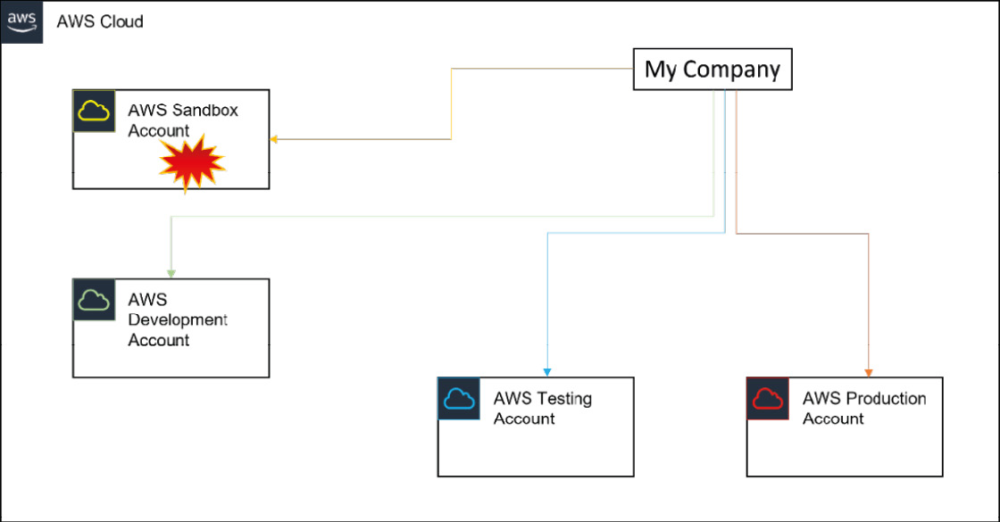
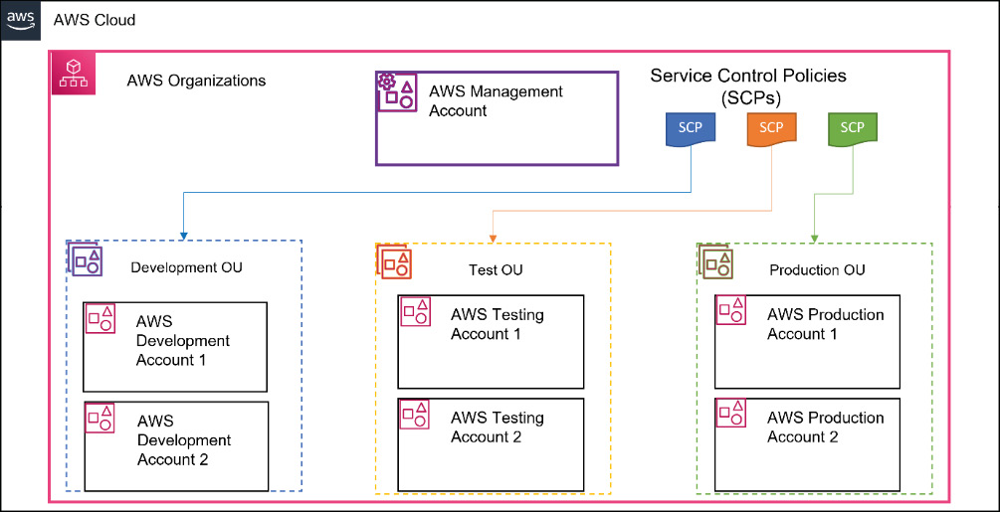
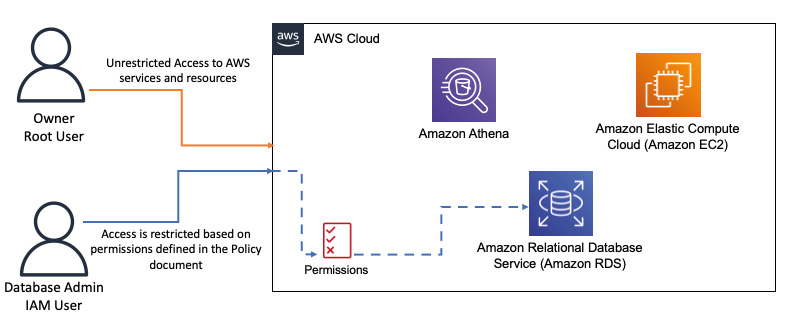
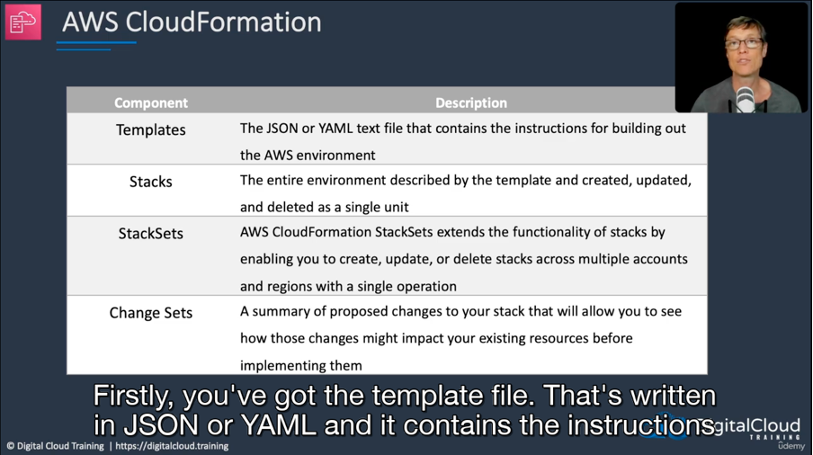

# AWS Account management - Oragnisations, OUs, SCPs
- Must have AWS account to access servces and create any resources. By default creates a `root` account.
- Recommended to have multiple accounts for serving different environments like dev, test, prod, sandbox.
- Managing multiple accounts become cumbersome so can use `AWS Organisations`. One account can become `manager` account and others become `member` accounts.
- Can have multiple dev, test, prod accounts. All can be logically grouped as `Organisation Units (OUs)` and apply policies and permissions that the members of the OU may share in the organization.
- You can apply `Service Control Policies (SCPs)`, that act as guard rails on what services can be consumed in each AWS account. Written in `JSON`. SCPs can also restrict which regions those accounts can provision resources in.
- One key trick to manage so many accounts by a single user is by using a `Gmail` email id. It allows you to have many sub user accounts which are ultimately linked to a common gmail account. This is achieved by adding a `+` letter in your email address ex. `testawsuser+management@gmail.com, testawsuser+dev@gmail.com, testawsuser+prod@gmail.com...` etc.

### Multiple AWS Accounts strategy

### OUs & SCPs

# AWS Security - Authentication and Authorisation
## AWS IAM

Components - `IAM users` | `IAM groups` | `IAM roles`

- As best practice, it is advisable not to use the root user account for your day-to-day operations. AWS recommends you create separate individual `IAM users` with enough permissions required to carry out all tasks required to fulfil their job function. AWS IAM allows you to create and configure identities for your AWS account. You can apply permissions to those identities, determining the level of access granted.
- When granting access to services, you must follow the principle of least privilege (POLP) as recommended by AWS. This ensures that those identities are provided with only the necessary access needed to carry out approved tasks and perform their job functions.

## AWS Cognito
- For access via apps. 

# AWS CLI
## Pre-requisite
First login to IAM console and create a new user. Click user and create new “security credential” like given above. Also, grant relevant permissions like ec2, s3 full access etc. 

Once done, configure this user In AWS CLI initially.
1.	`aws configure`
2.	Add above access key n secret and rest can be blank.
3.	Run any aws command like aws  s3 ls

## Common commands:
⁃	aws help
⁃	aws help ec2
⁃	aws help s3 ls - shows list of buckets
⁃	aws s3 cp testfile_via_cli.txt s3://sg02-training-bucket - copy file to given bucket
⁃	aws s3 ls s3://sg02-training-bucket - show all files in given bucket

### Other useful commands:
⁃	Cat .aws/config - check configurations
⁃	Cat .aws/credentials - check cress

### EC2 command list
`Saranshs-MacBook-Pro:~ saranshbansal$ aws ec2 help`

       o restore-snapshot-from-recycle-bin

       o restore-snapshot-tier

       o revoke-client-vpn-ingress

       o revoke-security-group-egress

       o revoke-security-group-ingress

       o run-instances

       o run-scheduled-instances

       o search-local-gateway-routes

       o search-transit-gateway-multicast-groups

       o search-transit-gateway-routes

       o send-diagnostic-interrupt

       o start-instances

       o start-network-insights-access-scope-analysis

       o start-network-insights-analysis

       o start-vpc-endpoint-service-private-dns-verification

       o stop-instances

       o terminate-client-vpn-connections

       o terminate-instances

       o unassign-ipv6-addresses

       o unassign-private-ip-addresses

       o unassign-private-nat-gateway-address

       o unmonitor-instances

       o update-security-group-rule-descriptions-egress

       o update-security-group-rule-descriptions-ingress

       o wait

       o withdraw-byoip-cidr

### S3 command list

`Saranshs-MacBook-Pro:~ saranshbansal$ aws s3 help`

The command aws s3 cp /tmp/foo/ s3://bucket/ --recursive --exclude
"ba*" will exclude /tmp/foo/bar.txt and /tmp/foo/baz.jpg:

          /tmp/foo/ba* -> /tmp/foo/.git/config      (does not match, should include)
          /tmp/foo/ba* -> /tmp/foo/.git/description (does not match, should include)
          /tmp/foo/ba* -> /tmp/foo/foo.txt          (does not match, should include)
          /tmp/foo/ba* -> /tmp/foo/bar.txt  (matches, should exclude)
          /tmp/foo/ba* -> /tmp/foo/baz.jpg  (matches, should exclude)

       Note that, by default, all files are included.  This means that
       providing only an --include filter will not change what files are
       transferred.  --include will only re-include files that have been
       excluded from an --exclude filter.  If you only want to upload files
       with a particular extension, you need to first exclude all files, then
       re-include the files with the particular extension.  This command will
       upload only files ending with .jpg:

          aws s3 cp /tmp/foo/ s3://bucket/ --recursive --exclude "*" --include "*.jpg"

       If you wanted to include both .jpg files as well as .txt files you can
       run:

          aws s3 cp /tmp/foo/ s3://bucket/ --recursive \
              --exclude "*" --include "*.jpg" --include "*.txt"

SYNOPSIS

          aws s3 <Command> [<Arg> ...]

OPTIONS
       None

AVAILABLE COMMANDS

       o cp
       o ls
       o mb
       o mv
       o presign
       o rb
       o rm
       o sync
       o website

# VPC, SGs, NACLs
VPCs are like your own data centre in AWS cloud. It provides logical isolation for a group of components from other VPCs. By default, you can create 5 VPCs per region.

VPC can span across multiple AZs. Each AZ has public and private subnets to isolate the inbound/outbound traffic. VPC consist of its own CIDR (Classless inter-domain routing) block. Each subnet has a block of IP addresses which is part of CIDR block.
Each subnet consists of resources like EC2. 

VPC Router takes care of routing within and outside AZs. It is controlled by using Route table.
Internet Gateway is attached to VPC to connect to outside internet. 

**VPC Endpoints:** To provide private connection to public AWS services

**Security groups:** Instance level firewalls

**NACL:** Subnet level firewall

**NAT Instance and Gateway:** Provide Internet connection for your EC2 instances in private subnets

### Security group vs NACL
|          SG                 |  NACL |
------------------------ | --------------------------
| Instance level firewall | Subnet level firewall|
| Allow only rules | Both Allow and Deny rules available |
| Stateful: any traffic allowed out will automatically be allowed in | Stateless: NACLs need separate outbound rules |

# Setup VPC
1.	Login to IAM account
2.	Got to VPC service
3.	Create new VPC by providing a custom range: 10.0.0.0/16
4.	Edit VPC settings and select “Enable DNS hostnames”
5.	Create public and private subnets by going to Subnet and assigning IP CIDR blocks (ex. 10.0.1.0/24 ,10.0.2.0/24…). Chose AZ as US-east-1a
6.	Create a routing tables – private subnets and public subnets called MAIN-RT. 
7.	Go to routing tables individually and associate subnets to them.
8.	Got to internet gateway > actions > attach your vpc
9.	Got back to route table > chose main route table and go to “routes”.
10.	Create new route and associate igw with destination as 0.0.0.0/0.
11.	Create a NAT gateway and associate it with a PUBLIC subnet. Allocate an Elastic IP and create it.
12.	Go to route table, select private RT, click add route, and associate a NAT gateway this time like in step 10.
13.	Create a Security Group Public-Web and add inbound and outbound rules. Keep it all traffic open for now.

# Launch EC2 instance
CLI: aws ec2 run-instances –image-id <value> --instance-type <value> --security-group-ids <value> --subnet-id <value> --key-name <value> --user-data file:// <value>
Setup your VPC with all the components. You need to create ec2 instances for all the public/private subnets as below:
 
1.	Go to EC2 dashboard and launch new instance. Grab Amazon AMI Id:
 
2.	Instance type = t2.micro
 
3.	Go back to VPC dashboard -> Security groups. Chose Public-Web security group and copy the SG id:
 
4.	Go to Subnets and copy Public 1A subnet id:
 
5.	Key name is key-pair you use in EC2. Go back to EC2 console -> Key pairs and just copy name:
 
6.	User data is a file with bunch of script to show some details in a web page. Provide the path to that file:
 

7.	Go to AWS CLI and run the command. Your new instance will launch. Rename it to Public 1A. Do the same for other public and private subnets

# EC2 Storage
## EBS
Storage service available to connect to EC2 over a network. EBS Volumes are available inside AZ. They are automatically replicated within AZ.

### Types of EBS
 
-	Performance metrics: IOPS
Instance store
 

-	Instance store is non-persistent and are physically attached to EC2 servers.
-	They offer high performance and are used for storing data temporarily which doesn’t need replication.

### EBS Snapshot (for backup)
 
-	Snapshots are created for EC2 Volumes. These are stored outside AZ in S3.
-	Because they are outside AZ, they can be re-used in some other EBS volume in another AZ.
-	They can also be used to create AMIs

# EFS (Elastic File System)
 
EFS is file based storage service located outside of AZs (unlike EBS) and can be attached to multiple EC2 instances across AZs. It is a great way to attach a shared storage location between instances across AZs. Supports very large number of instances across many AZs unlike EBS which has certain constraints. EFS > EBS!
Access to FS is via NFS (Network file system protocol) and is linux only that’s why we have mount points rather than drive letters.
Can be connected to Corporate on-prem data centre.

# EC2 User data and Metadata
### User data: 
Allows you to run some code before running instances. Limited to 16kb
 
### Metadata: 
Data about EC2 instance. By default located at http://<ip-address>/latest/meta-data/<commands>
 
## How to launch an Auto-scaling Web App on EC2
-	Open EC2 page
-	Create a new launch template with following changes:
- Name it MyEC2WebApp
- Select AMI (Amazon linux)
- Chose instance type (t2.micro)
- Chose your keypair (create new if not already)
- Under network setting, attached a subnet and security group (or create new)
-	Under “Advance network” configs, enable “Auto-assign public IP”.
-	Under “Advance details”, scroll at the very bottom to provide some user data which will be a web app using some external packages.
#!/bin/bash
yum update -y 
yum install -y httpd 
systemctl start httpd 
systemctl enable- httpd
EC2AZ-$(curt -s http://169.254.169.254/latest/meta-data/placement/availability-zone)
echo "
<hl>This Amazon EC2 instance is located in Availability Zone: AZID </h1>
 > /var/www/html/index. txt
sed "s/AZID/$EC2AZ/" /var/ww/html/index.txt > /var/www/html/index.html
-	Launch instance.
-	Click View template, open Auto-scaling group section. Create a new ASG group and name it ASG1.
-	Choose your newly created launch template and click next.
-	Choose Network settings: VPC and subnets. Only select all public subnets.
 
-	Keep clicking next till you see summary. No need to change anything else apart from those.  
-	Make sure your Security Group does have http rule enabled. Select your ASG and check.
-	If HTTP type rule is not there, edit SG and add it.
-	Go back to “Instances” section and you should have a running instance which is your web app. Select and check ip address to access it.

# AWS CloudFormation

