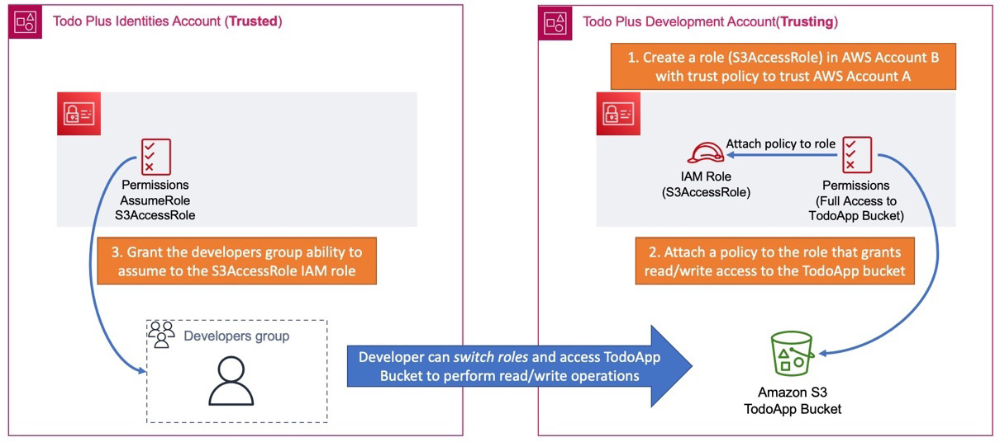

# AWS Account management - Oragnisations, OUs, SCPs
- Must have AWS account to access services and create any resources. By default creates a `root` account.
- Recommended to have multiple accounts for serving different environments like dev, test, prod, sandbox.
- Managing multiple accounts become cumbersome so can use `AWS Organisations`. One account can become `manager` account and others become `member` accounts.
- Can have multiple dev, test, prod accounts. All can be logically grouped as `Organisation Units (OUs)` and apply policies and permissions that the members of the OU may share in the organization.
- You can apply `Service Control Policies (SCPs)`, that act as guard rails on what services can be consumed in each AWS account. Written in `JSON`. SCPs can also restrict which regions those accounts can provision resources in.
- One key trick to manage so many accounts by a single user is by using a `Gmail` email id. It allows you to have many sub user accounts which are ultimately linked to a common gmail account. This is achieved by adding a `+` letter in your email address ex. `testawsuser+management@gmail.com, testawsuser+dev@gmail.com, testawsuser+prod@gmail.com...` etc.

### Multiple AWS Accounts strategy


### OUs & SCPs


# AWS Security - Authentication and Authorisation
## AWS IAM

#### Components - `IAM users` | `IAM groups` | `IAM roles` | `IAM policy`

- As best practice, it is advisable not to use the root user account for your day-to-day operations. AWS recommends you create separate individual `IAM users` with enough permissions required to carry out all tasks required to fulfil their job function. AWS IAM allows you to create and configure identities for your AWS account. You can apply permissions to those identities, determining the level of access granted.
- When granting access to services, you must follow the principle of least privilege (POLP) as recommended by AWS. This ensures that those identities are provided with only the necessary access needed to carry out approved tasks and perform their job functions. 
- **IAM roles** - An identity independent of any specific user or application with one or more policies that define a set of permissions to access services and resources on AWS. Roles can be assigned to users, aws services, 3rd party entities etc. With IAM roles, it is the STS services that handles creating and managing these temporary credentials in the background.
- **IAM policy** - A JSON document adheres to the IAM policy standard, which outlines the permissions defined by a specific IAM role. 


#### AWS IAM - Access delegation workflow
The following diagram depicts how you can establish delegated access across two AWS accounts:


As shown in the Figure, we use the example of a developer in the `Identities` Account that needs to access an `S3 bucket` (called `TodoApp`) in the `Development` Account. This is known as `cross-account access`, and the following are the primary steps involved in configuring this:

1. In the Development Account, you must configure a role with a trust policy that identifies the trusted account (in this case, the Identities Account). In this example, we named the IAM Role `IAM-User-S3-AccessRole` as per the diagram. The configuration requires you to provide the ID for Account A.

2. You will also need to configure a policy that contains the necessary permissions to perform read/write operations against the TodoApp S3 bucket in Account B.

3. Finally, in Account A, you need to configure another policy that grants the developer the ability to assume the S3AccessRole created in Account B. You do this by specifying the Account ID of Account B and the role in the policy statement. The policy will grant the sts:AssumeRole permission as per the following JSON script:

```json
{
  "Version": "2024-06-17",
  "Statement": {
    "Effect": "Allow",
    "Action": "sts:AssumeRole",
    "Resource": "arn:aws:iam::Developer-Account-ID:role/S3AccessRole"
  }
}
```

4. Once the above configuration is in place, the developers can switch roles and access the TodoApp S3 bucket in AWS Account B.

**Note: With the new IAM Identity Center Service (previously known as AWS Single Sign On), you may not need to use cross-account access extensively for IAM users. This is because the IAM Identity Center offers an alternative approach to granting your workforce users access to multiple out-of-the-box accounts in your AWS Organizations. These users can be from AWS Identity Providers as well as external providers.** 

## AWS Cognito
- For access via apps and 3rd party systems. 

# VPC, SGs, NACLs
VPCs are like your own data centre in AWS cloud. It provides logical isolation for a group of components from other VPCs. By default, you can create 5 VPCs per region.

VPC can span across multiple AZs. Each AZ has public and private subnets to isolate the inbound/outbound traffic. VPC consist of its own CIDR (Classless inter-domain routing) block. Each subnet has a block of IP addresses which is part of CIDR block.
Each subnet consists of resources like EC2. 

VPC Router takes care of routing within and outside AZs. It is controlled by using Route table.
Internet Gateway is attached to VPC to connect to outside internet. 

**VPC Endpoints:** To provide private connection to public AWS services

**Security groups:** Instance level firewalls

**NACL:** Subnet level firewall

**NAT Instance and Gateway:** Provide Internet connection for your EC2 instances in private subnets

### Security group vs NACL
| SG                                                                 | NACL                                          |
| ------------------------------------------------------------------ | --------------------------------------------- |
| Instance level firewall                                            | Subnet level firewall                         |
| Allow only rules                                                   | Both Allow and Deny rules available           |
| Stateful: any traffic allowed out will automatically be allowed in | Stateless: NACLs need separate outbound rules |

# Storage
## EBS
Storage service available to connect to EC2 over a network. EBS Volumes are available inside AZ. They are automatically replicated within AZ.

## Instance store
- Instance store is non-persistent and are physically attached to EC2 servers.
- They offer high performance and are used for storing data temporarily which doesn’t need replication.

## EBS Snapshot (for backup)
- Snapshots are created for EC2 Volumes. These are stored outside AZ in S3.
- Because they are outside AZ, they can be re-used in some other EBS volume in another AZ.
- They can also be used to create AMIs

## EFS (Elastic File System)
 
EFS is file based storage service located outside of AZs (unlike EBS) and can be attached to multiple EC2 instances across AZs. 
It is a great way to attach a shared storage location between instances across AZs. - Supports very large number of instances across many AZs unlike EBS which has certain constraints. 

- EFS > EBS!
- Access to FS is via NFS (Network file system protocol) and is linux only that’s why we have mount points rather than drive letters.
- Can be connected to Corporate on-prem data centre.