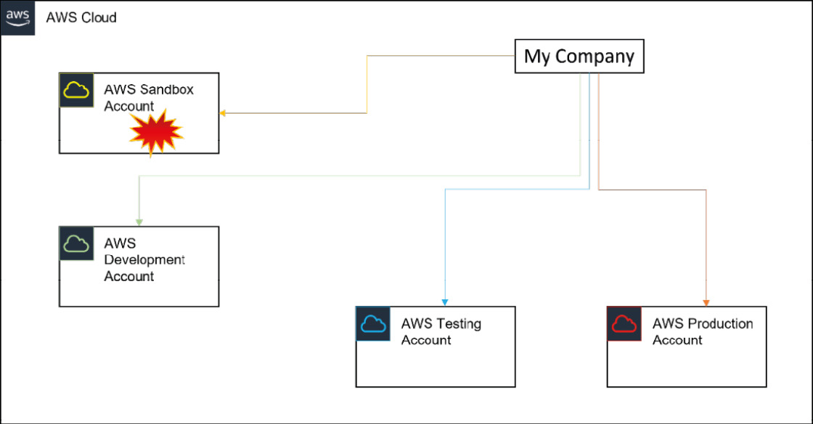
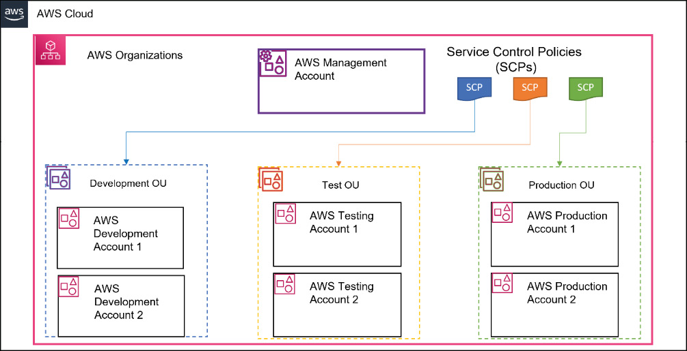
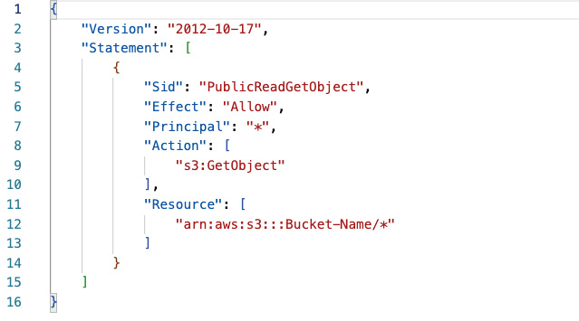

# AWS Account management - Oragnisations, OUs, SCPs
- Must have AWS account to access services and create any resources. By default creates a `root` account.
- Recommended to have multiple accounts for serving different environments like dev, test, prod, sandbox.
- Managing multiple accounts become cumbersome so can use `AWS Organisations`. One account can become `manager` account and others become `member` accounts.
- Can have multiple dev, test, prod accounts. All can be logically grouped as `Organisation Units (OUs)` and apply policies and permissions that the members of the OU may share in the organization.
- You can apply `Service Control Policies (SCPs)`, that act as guard rails on what services can be consumed in each AWS account. Written in `JSON`. SCPs can also restrict which regions those accounts can provision resources in.
- One key trick to manage so many accounts by a single user is by using a `Gmail` email id. It allows you to have many sub user accounts which are ultimately linked to a common gmail account. This is achieved by adding a `+` letter in your email address ex. `testawsuser+management@gmail.com, testawsuser+dev@gmail.com, testawsuser+prod@gmail.com...` etc.

### Multiple AWS Accounts strategy


### OUs & SCPs


# AWS Security - Authentication and Authorisation
## AWS IAM

#### Components - `IAM users` | `IAM groups` | `IAM roles` | `IAM policy`

- As best practice, it is advisable not to use the root user account for your day-to-day operations. AWS recommends you create separate individual `IAM users` with enough permissions required to carry out all tasks required to fulfil their job function. AWS IAM allows you to create and configure identities for your AWS account. You can apply permissions to those identities, determining the level of access granted.
- When granting access to services, you must follow the principle of least privilege (POLP) as recommended by AWS. This ensures that those identities are provided with only the necessary access needed to carry out approved tasks and perform their job functions. 
- **IAM roles** - An identity independent of any specific user or application with one or more policies that define a set of permissions to access services and resources on AWS. Roles can be assigned to users, aws services, 3rd party entities etc. With IAM roles, it is the STS services that handles creating and managing these temporary credentials in the background.
- **IAM policy** - A JSON document adheres to the IAM policy standard, which outlines the permissions defined by a specific IAM role. 


#### AWS IAM - Access delegation workflow
The following diagram depicts how you can establish delegated access across two AWS accounts:


As shown in the Figure, we use the example of a developer in the `Identities` Account that needs to access an `S3 bucket` (called `TodoApp`) in the `Development` Account. This is known as `cross-account access`, and the following are the primary steps involved in configuring this:

1. In the Development Account, you must configure a role with a trust policy that identifies the trusted account (in this case, the Identities Account). In this example, we named the IAM Role `IAM-User-S3-AccessRole` as per the diagram. The configuration requires you to provide the ID for Account A.

2. You will also need to configure a policy that contains the necessary permissions to perform read/write operations against the TodoApp S3 bucket in Account B.

3. Finally, in Account A, you need to configure another policy that grants the developer the ability to assume the S3AccessRole created in Account B. You do this by specifying the Account ID of Account B and the role in the policy statement. The policy will grant the sts:AssumeRole permission as per the following JSON script:

```json
{
  "Version": "2024-06-17",
  "Statement": {
    "Effect": "Allow",
    "Action": "sts:AssumeRole",
    "Resource": "arn:aws:iam::Developer-Account-ID:role/S3AccessRole"
  }
}
```

4. Once the above configuration is in place, the developers can switch roles and access the TodoApp S3 bucket in AWS Account B.

**Note: With the new IAM Identity Center Service (previously known as AWS Single Sign On), you may not need to use cross-account access extensively for IAM users. This is because the IAM Identity Center offers an alternative approach to granting your workforce users access to multiple out-of-the-box accounts in your AWS Organizations. These users can be from AWS Identity Providers as well as external providers.** 

## AWS Cognito
- For access via apps and 3rd party systems. 

# VPC, SGs, NACLs
VPCs are like your own data centre in AWS cloud. It provides logical isolation for a group of components from other VPCs. By default, you can create 5 VPCs per region.

VPC can span across multiple AZs. Each AZ has public and private subnets to isolate the inbound/outbound traffic. VPC consist of its own CIDR (Classless inter-domain routing) block. Each subnet has a block of IP addresses which is part of CIDR block.
Each subnet consists of resources like EC2. 

VPC Router takes care of routing within and outside AZs. It is controlled by using Route table.
Internet Gateway is attached to VPC to connect to outside internet. 

**VPC Endpoints:** To provide private connection to public AWS services

**Security groups:** Instance level firewalls

**NACL:** Subnet level firewall

**NAT Instance and Gateway:** Provide Internet connection for your EC2 instances in private subnets

### Security group vs NACL
| SG                                                                 | NACL                                          |
| ------------------------------------------------------------------ | --------------------------------------------- |
| Instance level firewall                                            | Subnet level firewall                         |
| Allow only rules                                                   | Both Allow and Deny rules available           |
| Stateful: any traffic allowed out will automatically be allowed in | Stateless: NACLs need separate outbound rules |

# Storage
## EBS
Storage service available to connect to EC2 over a network. EBS Volumes are available inside AZ. They are automatically replicated within AZ.

## Instance store
- Instance store is non-persistent and are physically attached to EC2 servers.
- They offer high performance and are used for storing data temporarily which doesn’t need replication.

## EBS Snapshot (for backup)
- Snapshots are created for EC2 Volumes. These are stored outside AZ in S3.
- Because they are outside AZ, they can be re-used in some other EBS volume in another AZ.
- They can also be used to create AMIs

## EFS (Elastic File System)
 
EFS is file based storage service located outside of AZs (unlike EBS) and can be attached to multiple EC2 instances across AZs. 
It is a great way to attach a shared storage location between instances across AZs. - Supports very large number of instances across many AZs unlike EBS which has certain constraints. 

- EFS > EBS!
- Access to FS is via NFS (Network file system protocol) and is linux only that’s why we have mount points rather than drive letters.
- Can be connected to Corporate on-prem data centre.

## Amazon S3
Amazon S3 is a widely used object storage solution with high levels of security, scalability, and durability.

Amazon S3 comprises of four primary concepts:

`Buckets` - act as the primary container for objects.

`Objects` - contain the actual data and metadata.

`Keys` - unique identifiers for each object within a bucket.

`Region` - denotes the geographic location where the bucket is stored.

An object is comprised of three elements: data, metadata, and a unique identifier. Metadata contains context-specific information about the object and is stored as a collection of key-value pairs. It includes essential details such as the content type, length, and last modified date. 

### Amazon S3: Types of consistency models 
#### Read-after-write Consistency
Read-after-write consistency in Amazon S3 ensures that updates made to the database are immediately available to all clients. When an item is uploaded to a bucket using a `PUT` operation, it can be read immediately after receiving a successful response, even if not all copies in all availability zones have yet received the replicas.

#### Eventual Consistency
Amazon S3 adds support for data consistency overwrite of `PUT` and `DELETE` operations. `Overwrite PUT` means replacing it with a new object bearing the same name while `Overwriting DELETE` removes the object from Amazon S3. 
The final action won’t occur during an overwrite PUT until all copies are replicated across all availability zones. Likewise, deleting an object may not immediately remove it from Amazon S3 until the deletion has fully propagated across all availability zones in the region

### Amazon S3: Storage classes
#### Amazon S3 Standard Storage Class
Amazon S3 Standard is a popular class ideal for frequently accessible data. It provides users with fast throughput performance and low latency, ensuring their frequently accessed data is quickly and readily available. This versatile storage class can be used for various purposes, such as cloud applications, big data analytics, content distribution, dynamic web pages, and mobile or gaming applications.

While the most expensive of all classes, Amazon S3 Standard storage class is ideal for hosting static websites. This is because there is no requirement to limit the number of size of retrievals you can make. As such as end users will gain access to content seamlessly comprising of HTML pages, images, and video.

#### Amazon S3-IA storage
This class is a cost-effective option designed for data accessed less frequently but where you still need instant access to the data.

Amazon S3-IA storage provides users a lower-cost storage option than Amazon S3 Standard while maintaining the same durability and low latency level.

One of the key benefits of this class is its flexible pricing model. The pricing is based on a combination of storage and retrieval fees, allowing users to save costs by storing infrequently accessed data at a lower price and paying only for retrieval when needed. This makes it an excellent option for businesses that need to store large volumes of data accessed less frequently.

#### Amazon S3 One Zone-IA
Another cost-effective class is designed for data that can be recreated easily, such as non-critical backup copies, which need to be accessed less frequently but still require instant access when needed.

Amazon S3 One Zone-IA stores data in a single availability zone only. This makes it a lower-cost option for infrequently accessed data, provided that the data can be easily regenerated or does not require high availability.

The pricing for Amazon S3 One Zone-IA is like Amazon S3-IA, with a lower cost for storage and retrieval fees, making it a cost-effective option for businesses that require a lower-cost storage option for their data.

#### Amazon S3 Intelligent-Tiering
Amazon S3 Intelligent-Tiering is a storage class designed to automatically move data between two access tiers based on changing access patterns. This storage class is ideal for businesses that require a cost-effective storage option for data that has changing access patterns and requires fast access when needed.

Amazon S3 Intelligent-Tiering offers a highly cost-effective storage option that is priced based on the amount of data stored and the number of monthly monitoring and automation requests. This makes it an excellent option for businesses that need to store large volumes of data for long periods while also requiring fast access to the data when needed.

#### Amazon S3 Glacier
Amazon S3 Glacier is a highly cost-effective storage service offered by Amazon Web Services (AWS) that is designed for long-term archival storage of data that is rarely accessed but needs to be retained for compliance, regulatory, or business purposes.

Amazon S3 Glacier is specifically designed for data accessed less than once yearly and provides high durability, low-cost storage, and flexible retrieval options. With its support for data encryption, versioning, and access controls, Amazon S3 Glacier ensures that data is always protected and secure.

One of the key benefits of this storage class is its low-cost pricing model. This storage class is priced based on the quantity of data stored, with separate fees for data retrieval and transfer. This makes it an excellent option for businesses that must store large volumes of data, such as financial or medical records, for long-term archival purposes.

### Amazon S3: Encryption options
AWS offers its customers the ability to encrypt the data that is hosted on its platform. There are two kinds of encryption technologies:

1. `Encryption in transit` which makes use of Secure Sockets Layer/Transport Layer Security (SSL/TLS), which is a cryptographic protocol that protects Internet communications.
2. `Encryption at rest` ensures that data is encrypted as it is committed to disk for long-term storage.

With `Encryption at rest`, AWS offers various options for encrypting your data as it is stored in your S3 buckets categorised into `Server-side encryption` | `Client-side encryption`.

#### Server-side encryption
Server-side encryption involves encrypting your data before saving it to disk and decrypting it as you access it from disk. AWS handles all the encryption and decryption process for you and here four key options are available:

1. **Server-Side Encryption with Amazon S3 managed keys (SSE-S3)** – This is the default option for object-level encryption. AWS has also enforced this encryption method for all new objects uploaded from January 5th, 2023, at no additional cost. This method of encryption uses AES-256-bit encryption, and AWS will create and manage the keys as well as the encryption process. When performing PUT operations, you must set the header to include `“x-amz-server-side-encryption”:”AES256”`.

2. **Server-Side Encryption with AWS KMS keys (SSE-KMS)** – If you require greater flexibility in how your encryption keys are created and managed, you can use the AWS Key Management Service (KMS) to centrally create, edit, monitor, rotate, and delete KMS keys. In addition, with this encryption option, you can restrict who can use the keys as well as maintain an audit log on usage. This helps you fulfil more restrictive compliance policies. Note that to use KMS to encrypt and decrpt your objects, you will also need the kms:GenerateDataKey and the kms:Decrypt permissions respectively. In addition, for PUT operations, you should set the header to include `“x-amz-server-side-encryption”:”awskms”`.

3. **Dual-Layer Server-Side Encryption with AWS KMS keys (DSSE-KMS)** – For organizations that require multilayer encryption features, DSSE-KMS offers two layers of objects that are uploaded to an Amazon S3 bucket. Note that the KMS keys must be in the same region as the object when requesting DSSE-KMS. Furthermore, with DSSE-KMS, the S3 checksum that’s part of the object’s metadata is stored in encrypted form. When performing PUT operations, you must ensure that the header includes `“s3:x-amz-server-side-encryption”:”aws:kms:dsse”`.

4. **Server-Side Encryption with customer-provided keys (SSE-C)** – This option enables you to create and manage your own encryption keys, which you then supply to Amazon S3 to perform all encryption and decryption operations for you. The keys are removed from memory after completing the encryption and decryption activity. Furthermore, Amazon S3 uses randomly salted Hash-based Message Authentication Code (HMAC) value of the encryption key (as opposed to retaining it) to verify additional requests. An important point to note is that to use SSE-C, you must use HTTPS since S3 will reject any requests made over HTTP.

#### Client-side encryption
Client-Side Encryption is where the customer performs the encryption of the objects locally before it is sent to AWS. This option requires the use of the Amazon S3 Encryption Client. This ensures that your unencrypted data is not exposed to AWS in any way and is often used to fulfil additional compliance requirements. If you lose the keys, you also lose access to the data, so the responsibility lies entirely with the customer.

### Amazon S3: Lifecycle management
Amazon S3 Lifecycle management allows users to define rules for a group of objects, specifying the actions that Amazon S3 should take. By combining object versioning with S3 Lifecycle, users can optimize their data preservation strategy and reduce storage costs.

Two actions can be performed with the S3 Lifecycle: `transitional` and `expiration`. 

`Transitional` actions help manage storage class transitions by transferring items to a different storage class after a specified time.

`Expiration` actions allow users to specify when objects should expire, and once an object expires, Amazon S3 automatically removes it from storage.

### Amazon S3: Data protection with resource-based policies

#### Resource-based policies
By default, S3 buckets are private; only the root user and the IAM account that created the bucket can access it. In contrast to IAM policies that determine actions for IAM users or roles, `resource-based policies` are inline policy statements attached to the resource itself. With Amazon S3, these policies are called `bucket policies`, which specify the allowed access levels against that resource and its access source.

Resource-based policies can also provide additional permission levels, including the ability to grant `anonymous access`. This feature allows users on the public internet to access your resources.

The following example illustrates how to grant anonymous public access using the `“s3: GetObject”` permission for the `“packt-aws-developer”` bucket. This allows anonymous users to access the contents of the bucket as depicted in the following screenshot:


#### Securing access with pre-signed URLs
Sometimes, knowing who the end user is may not be possible until they have requested access. Rather than following the cumbersome process of defining new principals or re-assigning your IAM policies, you can utilize another feature: pre-signed URLs.

Pre-signed URLs enable you to grant temporary credentials to allow the end user access to objects they would not usually have access to. The URLs are crafted with temporary tokens and represent the credentials of a specific AWS user who generated the URL.

These URLs allow end users to upload objects to your Amazon S3 bucket without requiring another AWS security credential. Pre-signed URLs can be configured multiple times with a specified expiration date and time.

### Amazon S3: Other features
#### Building static websites with Amazon S3
Once you have enabled static hosting, your S3 bucket will be accessible via a website endpoint URL. This URL can access your website directly, or you can configure a custom domain name using Route53. 

#### Amazon S3 Transfer Acceleration
Amazon S3 Transfer Acceleration is a bucket feature that when enabled allows end users to upload objects to the S3 bucket via a local Edge location enabling fast transfer speeds over the AWS backbone network.

An important point to note is that your bucket names must not contain any dots `(.)` and be DNS compliant. In addition, transfer Acceleration is only supported on `virtual-hosted` style requests. You must either be the bucket owner to configure transfer acceleration or assign the `s3:PutAccelerateConfiguration` to another user to delegate this capability.

#### Amazon S3 Event Notification
Amazon S3 can create a notification based on the following events that occur:

```
Object creation events
Object removal events
Object restore events
Object ACL events
Object tagging events
Reduced Redundancy Storage (for lost events)
Replication events
Lifecycle events
Intelligent-Tiering events
```

Once an event occurs in any of the above categories, a notification can be sent to destinations such as `Amazon SNS topics`, `SQS queues`, `AWS Lambda functions` or `Amazon EventBridge`.

#### Amazon S3 Select and Glacier Select
Amazon S3 Select and Glacier Select is a feature that enables you to run structured query language (SQL) to filter your data held in buckets and retrieve only a subset required. This means you can avoid downloading massive amounts of data, reducing cost and latency. You can use Amazon S3 Select on data held within CSV, JSON, or Apache Parquet file formats and objects held in compressed or encrypted files.

Some limitations to be aware of:

1. Your SQL expressions have a maximum limit of 256 KB.
2. The resulting record has a maximum length of 1 MB.
3. Nested data can only be emitted through the JSON output format.
4. Objects in the S3 Glacier Flexible Retrieval, S3 Glacier Deep Archive, or Reduced Redundancy Storage (RRS) storage classes cannot be queried. You cannot query objects in the S3 Intelligent-Tiering Archive Access tier or the S3 Intelligent-Tiering Deep Archive Access tier.

#### S3 Server Access Logs
Amazon S3 server accessing logging is a feature that, when enabled, records all requests made to an S3 bucket. This is particularly useful for auditing and analytics on usage. 

1. You must enable server access logging at the bucket level. 
2. Furthermore, you will need to create another bucket (known as the target bucket) that will act as the destination of the log data. (This is necessary as if you used the source bucket as the destination for log data then this will create an infinite loop of logs making it difficult to identify relevant log data) 
3. Both the source bucket and the target bucket must reside in the same region. 
4. You can also assign a prefix to all log data again making it easier to categorize log information from other data in the bucket.

