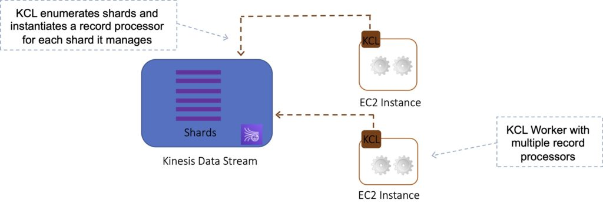

# Amazon Kinesis
Amazon Kinesis makes it easy to collect, process, and analyze real-time, streaming data so you can get timely insights and react quickly to new information. 

- Kinesis is a collection of services for processing streams of various data.
- Data is processed in `“shards”` – with each shard able to ingest `1000 records per second`.
- There is a default limit of `500 shards`, but you can request an increase to unlimited shards.
- A record consists of a partition key, sequence number, and data blob (up to 1 MB).
- **Transient data store** – default retention of 24 hours but can be configured for up to `7 days`.

There are four types of Kinesis service, and these are detailed below.

## Kinesis Video Streams
>> Kinesis Video Streams does not appear much on AWS exams.

Kinesis Video Streams makes it easy to securely stream video from connected devices to AWS for analytics, machine learning (ML), and other processing.

Durably stores, encrypts, and indexes video data streams, and allows access to data through easy-to-use APIs.

Producers provide data streams.

Stores data for 24 hours by default, up to 7 days.

Stores data in shards – 5 transaction per second for reads, up to a max read rate of 2MB per second and 1000 records per second for writes up to a max of 1MB per second.

Consumers receive and process data.

Can have multiple shards in a stream.

Supports encryption at rest with server-side encryption (KMS) with a customer master key.

## Kinesis Data Streams
Kinesis Data Streams enables you to build custom applications that process or analyze streaming data for specialized needs.

- Kinesis Data Streams enables real-time processing of streaming big data.
- Kinesis Data Streams is useful for rapidly moving data off data producers and then continuously processing the data.
- Kinesis Data Streams stores data for later processing by applications (key difference with Firehose which delivers data directly to AWS services).
- Kinesis Data Streams replicates synchronously across three AZs.

The diagram below illustrates the high-level architecture of Kinesis Data Streams.

- Producers continually push data to Kinesis Data Streams.
- Consumers process the data in real time.
- Consumers can store their results using an AWS service such as Amazon DynamoDB, Amazon Redshift, or Amazon S3.
- Kinesis Streams applications are consumers that run on EC2 instances.
- Shards are uniquely identified groups or data records in a stream.
- Records are the data units stored in a Kinesis Stream.

### Components of KDS

`Producer`

A producer creates the data that makes up the stream.
Producers can be used through the following:
- Kinesis Streams API.
- Kinesis Producer Library (KPL).
- Kinesis Agent.

`Record`

A record is the unit of data stored in a Amazon Kinesis data stream. A record is composed of a sequence number, partition key, and data blob. By default, records of a stream are accessible for up to 24 hours from the time they are added to the stream (can be raised to 7 days by enabling extended data retention).

`Data Blob`

A data blob is the data of interest your data producer adds to a data stream. The maximum size of a data blob (the data payload before Base64-encoding) within one record is 1 megabyte (MB).

`Shard`

A shard is the base throughput unit of an Amazon Kinesis data stream. One shard provides a capacity of `1MB/sec` data input and `2MB/sec` data output.

Each shard can support up to `1000 PUT records per second`.

`Stream`

A stream is composed of one or more shards. The total capacity of the stream is the sum of the capacities of its shards.

`Consumers / Amazon Kinesis Streams Applications`

Consumers are the EC2 instances that analyze the data received from a stream. Consumers are known as Amazon Kinesis Streams Applications.

`Partition Keys`

Partition keys are used to group data by shard within a stream. Kinesis Streams uses KMS master keys for encryption.

To read from or write to an encrypted stream the producer and consumer applications must have permission to access the master key.

### Resharding

Kinesis Data Streams supports resharding, which lets you adjust the number of shards in your stream to adapt to changes in the rate of data flow through the stream.

There are two types of resharding operations: `shard split` and `shard merge`.
- In a shard split, you divide a single shard into two shards.
- In a shard merge, you combine two shards into a single shard.

Splitting increases the number of shards in your stream and therefore increases the data capacity of the stream. Splitting increases the cost of your stream (you pay per-shard).

Merging reduces the number of shards in your stream and therefore decreases the data capacity—and cost—of the stream.

- When the data rate increases, add more shards to increase the size of the stream.
- Remove shards when the data rate decreases.

## Kinesis Data Firehose
Kinesis Data Firehose is the easiest way to load streaming data into data stores and analytics tools.

- Enables near real-time analytics with existing business intelligence tools and dashboards.
- `Kinesis Data Streams` can be used as the source(s) to Kinesis Data Firehose.
- You can configure Kinesis Data Firehose to transform your data before delivering it.
- With Kinesis Data Firehose you don’t need to write an application or manage resources.
- Firehose can batch, compress, and encrypt data before loading it.
- Firehose synchronously replicates data across `three AZs` as it is transported to destinations.
- Each delivery stream stores data records for up to `24 hours`.
- A source is where your streaming data is continuously generated and captured.
- A delivery stream is the underlying entity of Amazon Kinesis Data Firehose.
- A record is the data of interest your data producer sends to a delivery stream.
- The maximum size of a record (before Base64-encoding) is `1000 KB`.
- A destination is the data store where your data will be delivered.
- Server-side-encryption can be used if Kinesis Streams is used as the data source.
- Firehose can invoke an AWS Lambda function to transform incoming data before delivering it to a destination.

Firehose Destinations include:
- Amazon S3.
- Amazon Redshift.
- Amazon Elasticsearch Service.
- Splunk.

# Kinesis Client Library (KCL)
Kinesis Client Library is a Java library that helps read records from a Kinesis Stream with distributed applications sharing the read workload.

The KCL is different from the Kinesis Data Streams API that is available in the AWS SDKs.

- Kinesis Data Streams API helps you manage many aspects of Kinesis Data Streams (including creating streams, resharding, and putting and getting records).
- The KCL provides a layer of abstraction specifically for processing data in a consumer role.

The KCL acts as an intermediary between your record processing logic and Kinesis Data Streams.

When you start a KCL application, it calls the KCL to instantiate a worker. The KCL performs the following tasks:

- Connects to the stream.
- Enumerates the shards.
- Coordinates shard associations with other workers (if any).
- Instantiates a record processor for every shard it manages.
- Pulls data records from the stream.
- Pushes the records to the corresponding record processor.
- Checkpoints processed records.
- Balances shard-worker associations when the worker instance count changes.
- Balances shard-worker associations when shards are split or merged.

The KCL ensures that for every shard there is a record processor.

Manages the number of record processors relative to the number of shards & consumers.

If you have only one consumer, the KCL will create all the record processors on a single consumer.

Each shard is processed by exactly one KCL worker and has exactly one corresponding record processor, so you never need multiple instances to process one shard.

However, one worker can process any number of shards, so it’s fine if the number of shards exceeds the number of instances.

If you have two consumers it will load balance and create half the processors on one instance and half on another.

Scaling out consumers:

- With KCL, generally you should ensure that the number of instances does not exceed the number of shards (except for failure or standby purposes).
- Each shard can be read by only one KCL instance.
- You never need multiple instances to handle the processing of one shard.

However, one worker can process multiple shards.

Records are read in order at the shard level.

# SQS vs SNS vs Kinesis
## SQS

- Consumers pull data.
- Data is deleted after being consumed.
- Can have as many workers (consumers) as you need.
- No need to provision throughput.
- No ordering guarantee (except with FIFO queues).
- Individual message delay.

## SNS:

- Push data to many subscribers.
- Up to 10,000,000 subscribers.
- Data is not persisted (lost if not deleted).
- Pub/sub.
- Up to 10,000,000 topics.
- No need to provision throughput.
- Integrates with SQS for fan-out architecture pattern.

## Kinesis:

- Consumers pull data.
- As many consumers as you need.
- Possible to replay data.
- Meant for real-time big data, analytics, and ETL.
- Ordering at the shard level.
- Data expires after X days.
- Must provision throughput.
