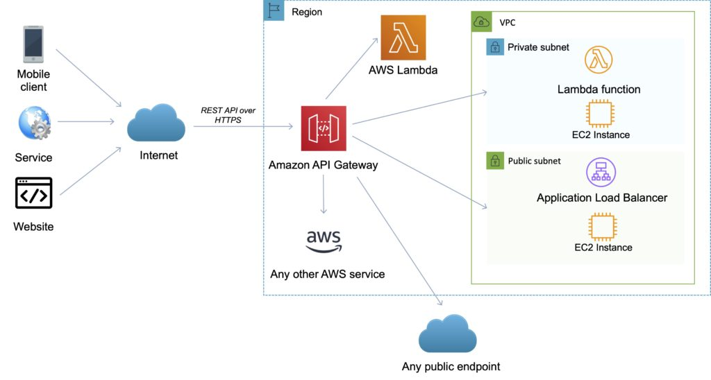
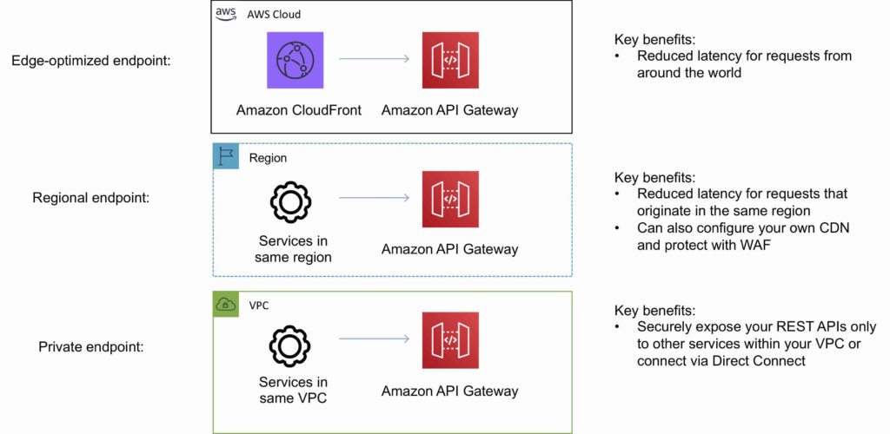
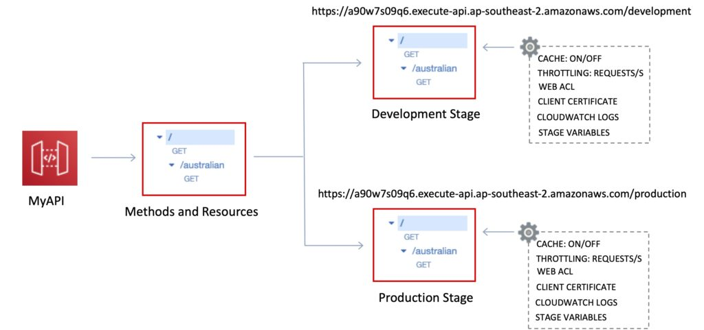
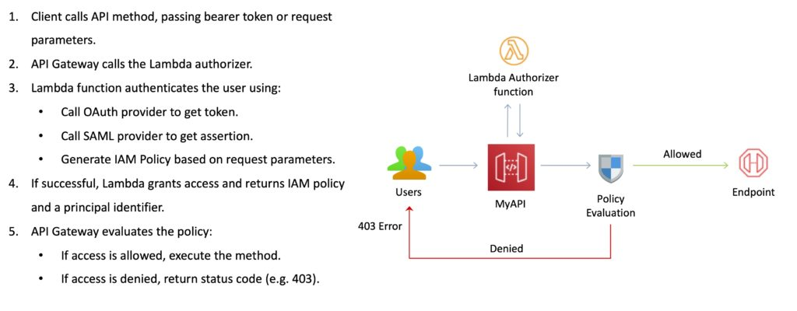
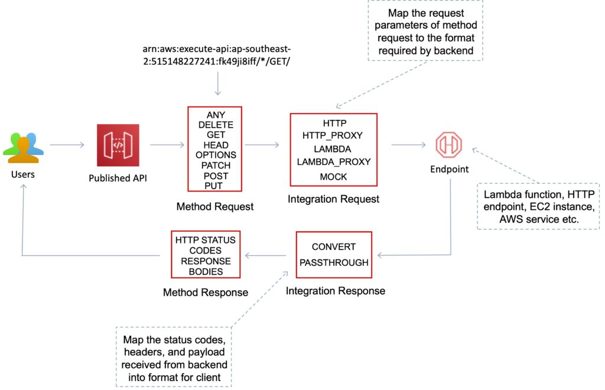

# Amazon API Gateway

AWS API Gateway is a fully managed service that makes it easy for developers to create, publish, maintain, monitor, and secure APIs at any scale. It acts as a front door for applications to access data, business logic, or functionality from your backend services, including Lambda functions, EC2 instances, or any publicly addressable web service.

API Gateway supports the following:

- Creating, deploying, and managing a REST application programming interface (API) to expose backend HTTP endpoints, AWS Lambda functions, or other AWS services.
- Creating, deploying, and managing a WebSocket API to expose AWS Lambda functions or other AWS services.
- Invoking exposed API methods through the frontend HTTP and WebSocket endpoints.
- Traffic management, authorization and access control, monitoring, and API version management.

Together with Lambda, API Gateway forms the app-facing part of the AWS serverless infrastructure.

## Key Features
The following table describes some of the core features of Amazon API Gateway.

| API Gateway Feature                               | Benefit                                                                                                                                                                                                                              |
| ------------------------------------------------- | ------------------------------------------------------------------------------------------------------------------------------------------------------------------------------------------------------------------------------------ |
| Support for RESTful APIs and WebSocket APIs       | With API Gateway, you can create RESTful APIs using either HTTP APIs or REST APIs                                                                                                                                                    |
| Private integrations with AWS ELB & AWS Cloud Map | With API Gateway, you can route requests to private resources in your VPC. Using HTTP APIs, you can build APIs for services behind private ALBs, private NLBs, and IP-based services registered in AWS Cloud Map, such as ECS tasks. |
| Metering                                          | Define plans that meter and restrict third-party developer access to APIs.                                                                                                                                                           |
| Security                                          | API Gateway provides multiple tools to authorize access to APIs and control service operation access.                                                                                                                                |
| Resiliency                                        | Manage traffic with throttling so that backend operations can withstand traffic spikes.                                                                                                                                              |
| Operations Monitoring                             | API Gateway provides a metrics dashboard to monitor calls to services.                                                                                                                                                               |
| Lifecycle Management                              | Operate multiple API versions and multiple stages for each version simultaneously so that existing applications can continue to call previous versions after new API versions are published.                                         |
| AWS Authorization                                 | Support for signature version 4 for REST APIs and WebSocket APIs, IAM access policies, and authorization with bearer tokens (e.g., JWT, SAML) using Lambda functions.                                                                |
| Caching                                           | One can add caching to API calls by provisioning an Amazon API Gateway cache and specifying its size in gigabytes. Caching allows you to cache the endpoint’s response.                                                              |

## API End Points

An API endpoint type is a hostname for an API in API Gateway that is deployed to a specific region.

The hostname is of the form `{api-id}.execute-api.{region}.amazonaws.com`.

The API endpoint type can be `edge-optimized`, `regional`, or `private`, depending on where most of your API traffic originates from.

### Edge-Optimized Endpoint
- An edge-optimized API endpoint is best for **geographically distributed clients**. API requests are routed to the nearest CloudFront Point of Presence (POP). This is the default endpoint type for API Gateway REST APIs.
- Edge-optimized APIs capitalize the names of HTTP headers (for example, Cookie).
- CloudFront sorts HTTP cookies in natural order by cookie name before forwarding the request to your origin. For more information about the way CloudFront processes cookies, see Caching Content Based on Cookies.
- Any custom domain name that you use for an edge-optimized API applies across all regions.

### Regional Endpoint
- A regional API endpoint is intended for **clients in the same region**.
- When a client running on an EC2 instance calls an API in the same region, or when an API is intended to serve a small number of clients with high demands, a regional API reduces connection overhead.
- For a regional API, any custom domain name that you use is specific to the region where the API is deployed.
- If you deploy a regional API in multiple regions, it can have the same custom domain name in all regions.
- You can use custom domains together with Amazon Route 53 to perform tasks such as latency-based routing.
- Regional API endpoints pass all header names through as-is.

### Private Endpoint
- A private API endpoint is an API endpoint that can only be accessed from your Amazon Virtual Private Cloud (VPC) using an interface VPC endpoint, which is an endpoint network interface (ENI) that you create in your VPC.
- Private API endpoints pass all header names through as-is.

## Stages and Stage variables
A stage is a logical reference to a lifecycle state of your REST or WebSocket API (for example, ‘dev’, ‘prod’, ‘beta’, ‘v2’).

API stages are identified by `API ID` and `stage name`.

Stage variables are like environment variables for API Gateway.

Stage variables can be used in:

- Lambda function ARN.
- HTTP endpoint.
- Parameter mapping templates.

Use cases for stage variables:

- Configure HTTP endpoints your stages talk to (dev, test, prod etc.).
- Pass configuration parameters to AWS Lambda through mapping templates.

Stage variables are passed to the “context” object in Lambda.

Stage variables are used with Lambda aliases.

You can create a stage variable to indicate the corresponding Lambda alias.

You can create canary deployments for any stage – choose the % of traffic the canary channel receives.

## Mapping Templates
API Gateway lets you use mapping templates to map the payload from a method request to the corresponding integration request and from an integration response to the corresponding method response.

Mapping templates can be used to: 

- Modify request / responses, Rename parameters.

- Modify body content.

- Add headers.

- Map JSON to XML for sending to backend or back to client.

- Uses `Velocity Template Language (VTL)`.

- Filter output results (remove unnecessary data).

## Usage Plans and API Keys
A usage plan specifies who can access one or more deployed API stages and methods — and how much and how fast they can access them. You can use a usage plan to configure throttling and quota limits, which are enforced on individual client API keys.

The plan uses API keys to identify API clients and meters access to the associated API stages for each key.

It also lets you configure throttling limits and quota limits that are enforced on individual client API keys.

You can use API keys together with `usage plans` or `Lambda authorizers` to control access to your APIs.

To associate the newly created key with a usage plan the `CreatUsagePlanKey` API can be called. This creates a usage plan key for adding an existing API key to a usage plan.

## Lambda Authorizers
A Lambda authorizer is an API Gateway feature that uses a Lambda function to control access to your API. When a client makes a request to one of your API’s methods, API Gateway calls your Lambda authorizer, which takes the caller’s identity as input and returns an IAM policy as output. 

There are two types of Lambda authorizers:

- A **token-based** Lambda authorizer (also called a **TOKEN authorizer**) receives the caller’s identity in a bearer token, such as a JSON Web Token (JWT) or an OAuth token.
- A **request parameter-based** Lambda authorizer (also called a **REQUEST authorizer**) receives the caller’s identity in a combination of headers, query string parameters, stageVariables, and $context variables.

It is possible to use an AWS Lambda function from an AWS account that is different from the one in which you created your Lambda authorizer function by using a **Cross-Account Lambda Authorizer**.

## Custom Domain Names
The default API endpoint name is randomly generated, difficult to recall, and not user-friendly. Custom domain names are simpler and more intuitive URLs that you can provide to your API users.

### Example
After deploying your API, you (and your customers) can invoke the API using the default base URL of the following format:

`https://api-id.execute-api.region.amazonaws.com/stage`

where `api-id` is generated by API Gateway, `region` is the AWS Region, and `stage` is specified by you when deploying the API. The `hostname` portion of the URL, `api-id.execute-api.region.amazonaws.com` refers to an API endpoint. 

With custom domain names, you can set up your API's `hostname`, and choose a base path (for example, `myservice`) to map the alternative URL to your API. For example, a more user-friendly API base URL can become:

`https://api.example.com/myservice`

### Considerations

The following considerations might impact your use of a custom domain name.

- Custom domain names are not supported for private APIs.
- You can disable the default endpoint for your API. Clients can still connect to your default endpoint, but they will receive a 403 Forbidden status code.
- A Regional custom domain name can be can be associated with REST APIs and HTTP APIs. You can use the API Gateway Version 2 APIs to create and manage Regional custom domain names for REST APIs.
- A custom domain name must be unique within a Region across all AWS accounts.
- You can migrate your custom domain name between edge-optimized and Regional endpoints.
- You must create or update your DNS provider's resource record to map to your API endpoint. Without such a mapping, API requests bound for the custom domain name cannot reach API Gateway.
- You can support an almost infinite number of domain names without exceeding the default quota by using a wildcard certificate. For more information, see Wildcard custom domain names.
- You can choose a security policy for your custom domain name. For more information, see Choose a security policy for your REST API custom domain in API Gateway.
- To configure API mappings with multiple levels, you must use a Regional custom domain name and use the TLS 1.2 security policy.

## Amazon API Gateway APIs
### API Gateway REST API
- A collection of HTTP resources and methods that are integrated with backend HTTP endpoints, Lambda functions, or other AWS services.
- This collection can be deployed in one or more stages.
- Typically, API resources are organized in a resource tree according to the application logic.
- Each API resource can expose one or more API methods that have unique HTTP verbs supported by API Gateway.

The following diagram depicts the structure of an API:

### API Gateway WebSocket API
- A collection of WebSocket routes and route keys that are integrated with backend HTTP endpoints, Lambda functions, or other AWS services.
- The collection can be deployed in one or more stages.
- API methods are invoked through frontend WebSocket connections that you can associate with a registered custom domain name.

## Caching
You can add caching to API calls by provisioning an Amazon API Gateway cache and specifying its size in gigabytes.Caching allows you to cache the endpoint’s response.Caching can reduce the number of calls to the backend and improve the latency of requests to the API.

- API Gateway caches responses for a specific amount of time (time to live or `TTL`).
- The default TTL is `300 seconds (min 0, max 3600)`.
- Caches are defined per stage.
- You can encrypt caches.
- The cache capacity is between `0.5GB to 237GB`.
- It is possible to override cache settings for specific methods.
- You can flush the entire cache (invalidate it) immediately if required.
- Clients can invalidate the cache with the header: `Cache-Control: max-age=0`.

## API throttling
API Gateway sets a limit on a steady-state rate and a burst of request submissions against all APIs in your account.

### Limits:

- By default API Gateway limits the steady-state request rate to `10,000 requests per second`.
- The maximum **concurrent requests** is `5,000 requests` across all APIs within an AWS account.
- If you go over 10,000 requests per second or 5,000 concurrent requests you will receive a `429 Too Many Requests` error response.

Upon catching such exceptions, the client can resubmit the failed requests in a way that is rate-limiting, while complying with the API Gateway throttling limits.

Amazon API Gateway provides two basic types of throttling-related settings:

- **Server-side** throttling limits are applied across all clients. These limit settings exist to prevent your API—and your account—from being overwhelmed by too many requests.
- **Per-client** throttling limits are applied to clients that use API keys associated with your usage policy as a client identifier.

API Gateway throttling-related settings are applied in the following order:

1. **Per-client per-method** throttling limits that you set for an API stage in a usage plan.
2. **Per-client** throttling limits that you set in a usage plan.
3. **Default per-method** limits and individual per-method limits that you set in API stage settings.
4. **Account-level** throttling.

## Integraton methods with API Gateway

You can integrate an `API method` in your API Gateway with a custom HTTP endpoint of your application in two ways:
- **HTTP proxy integration** (`HTTP_PROXY`): With proxy integration, the setup is simple. You only need to set the HTTP method and the HTTP endpoint URI, according to the backend requirements, if you are not concerned with content encoding or caching.
- **HTTP custom integration** (`HTTP`): With custom integration, setup is more involved. In addition to the proxy integration setup steps, you need to specify how the incoming request data is mapped to the integration request and how the resulting integration response data is mapped to the method response. API Gateway supports the following endpoint ports: `80, 443 and 1024-65535`.

You can also integrate an `API method` in your API Gateway with AWS or Lambda in two ways:
- **Lambda proxy integration** (`AWS_PROXY`): In Lambda proxy integration, the setup is simple. If your API does not require content encoding or caching, you only need to set the integration’s HTTP method to POST, the integration endpoint URI to the ARN of the Lambda function invocation action of a specific Lambda function, and the credential to an IAM role with permissions to allow API Gateway to call the Lambda function on your behalf.
- **Lambda custom integration** (`AWS`): In Lambda non-proxy (or custom) integration, in addition to the proxy integration setup steps, you also specify how the incoming request data is mapped to the integration request and how the resulting integration response data is mapped to the method response.

- Additionally, for the mock integration, the type value is `MOCK`.

## Important points

- API Gateway does not support sharing a custom domain name across `REST` and `WebSocket` APIs.
- Stage names can only contain alphanumeric characters, hyphens, and underscores. Maximum length is `128 characters`.
- The `/ping` and `/sping` paths are reserved for the service health check. Use of these for API root-level resources with custom domains will fail to produce the expected result.
- API Gateway currently limits log events to 1024 bytes. Log events larger than 1024 bytes, such as request and response bodies, will be truncated by API Gateway before submission to CloudWatch Logs.
- CloudWatch Metrics currently limits dimension names and values to 255 valid XML characters. (For more information, see the CloudWatch User Guide.) Dimension values are a function of user-defined names, including API name, label (stage) name, and resource name. When choosing these names, be careful not to exceed CloudWatch Metrics limits.
- The maximum size of a mapping template is `300 KB`.
- By using `AWS_IAM` as the method authorization type, it ensures that the API can only be accessed by IAM identities such as IAM users or IAM roles.