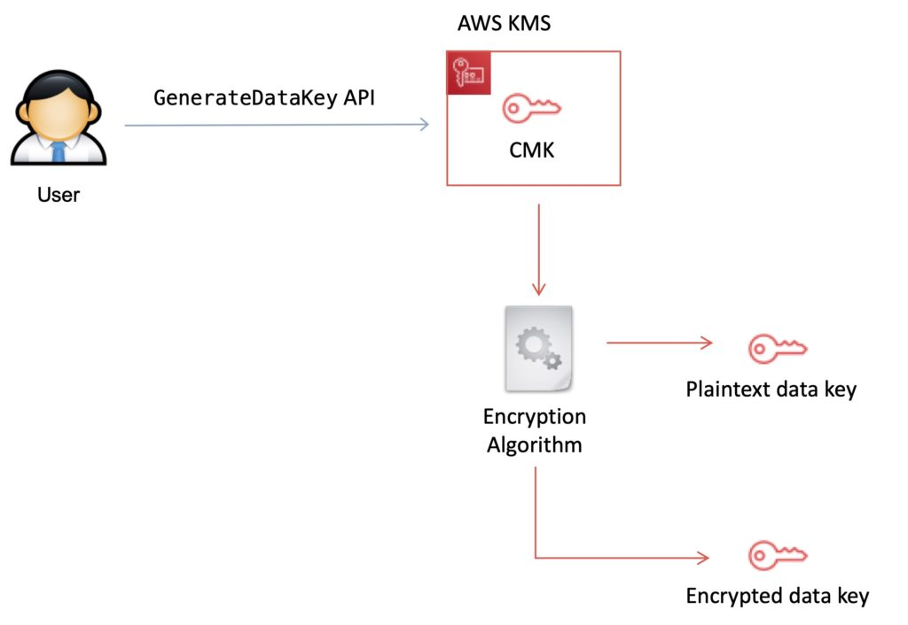

# AWS Secrets Manager
AWS Secrets Manager helps you protect secrets needed to access your applications, services, and IT resources.

- The service enables you to easily rotate, manage, and retrieve database credentials, API keys, and other secrets throughout their lifecycle.
- Users and applications retrieve secrets with a call to Secrets Manager APIs, eliminating the need to hardcode sensitive information in plain text.
- Secrets Manager offers secret rotation with built-in integration for Amazon RDS, Amazon Redshift, and Amazon DocumentDB.
- Also, the service is extensible to other types of secrets, including API keys and OAuth tokens. In addition, Secrets Manager enables you to control access to secrets using fine-grained permissions and audit secret rotation centrally for resources in the AWS Cloud, third-party services, and on-premises.
- AWS Secrets Manager encrypts secrets at rest using encryption keys that you own and store in AWS Key Management Service (KMS).
- When you retrieve a secret, Secrets Manager decrypts the secret and transmits it securely over TLS to your local environment.
- Secrets Manager does not write or cache the secret to persistent storage.
- You can control access to the secret using fine-grained AWS Identity and Access Management (IAM) policies and resource-based policies.
- You can also tag secrets individually and apply tag-based access controls.
- With AWS Secrets Manager, you can rotate secrets on a schedule or on demand by using the Secrets Manager console, AWS SDK, or AWS CLI.
- For example, to rotate a database password, you provide the database type, rotation frequency, and master database credentials when storing the password in Secrets Manager.
- Secrets Manager natively supports rotating credentials for databases hosted on Amazon RDS and Amazon DocumentDB and clusters hosted on Amazon Redshift.
- You can extend Secrets Manager to rotate other secrets by modifying sample Lambda functions.
- AWS Secrets Manager with Amazon RDS
  

- You can store and retrieve secrets using the AWS Secrets Manager console, AWS SDK, AWS CLI, or AWS CloudFormation.

- To retrieve secrets, you simply replace plaintext secrets in your applications with code to pull in those secrets programmatically using the Secrets Manager APIs. Secrets Manager provides code samples to call Secrets Manager APIs, also available on the Secrets Manager Resources page.

- You can configure Amazon Virtual Private Cloud (VPC) endpoints to keep traffic between your VPC and Secrets Manager within the AWS network.

- You can also use Secrets Manager client-side caching libraries to improve the availability and reduce the latency of using your secrets.

- AWS Secrets Manager enables you to audit and monitor secrets through integration with AWS logging, monitoring, and notification services.

## Secrets Manager vs Systems Manager Parameter Store

 | Features               | Secrets Manager                                        | SSM Parameter Store                           |
 | ---------------------- | ------------------------------------------------------ | --------------------------------------------- |
 | Automatic Key Rotation | Yes, built-in for some services, use Lambda for others | No native key rotation; can use custom Lambda |
 | Key/Value Type         | String or Binary (encrypted)                           | String, StringList, SecureString (encrypted)  |
 | Hierarchical Keys      | No                                                     | Yes                                           |
 | Price                  | Charges apply per secret                               | Free for standard, charges for advanced       |

# AWS Certificate Manager

Service: AWS Certificate Manager (ACM) helps you provision, manage, and deploy SSL/TLS certificates for your AWS-based websites and applications.

Purpose: Ensures secure communication between clients and servers by encrypting data transmitted over networks.

## Key Concepts

- SSL/TLS Certificates: Certificates used to secure network communications by encrypting data between a client and server.
- Certificate Management: ACM automates the process of obtaining, renewing, and deploying certificates, reducing manual overhead.

## Features

- Certificate Issuance: ACM provides free public and private SSL/TLS certificates.
  - Public Certificates: Used to secure websites accessible from the internet.
  - Private Certificates: Used for internal applications within an organization (requires AWS Private CA).

- Automatic Renewal: ACM automatically renews certificates before they expire, reducing the risk of service disruptions due to expired certificates.
- Certificate Deployment: Easily deploy certificates to various AWS services like Elastic Load Balancers (ELBs), Amazon
- CloudFront distributions, and APIs via API Gateway.
- Certificate Validation: Supports two methods for validating domain ownership:
    - DNS Validation: ACM provides a CNAME record to add to your DNS configuration.
    - Email Validation: ACM sends validation emails to domain registrants.

## ACM vs. AWS Private CA

- ACM: Manages public certificates and integrates with AWS services for SSL/TLS.
- AWS Private CA: For organizations needing internal certificates. ACM Private CA offers additional features for managing private certificates and their lifecycle.

## Using ACM with AWS Services

- Elastic Load Balancer (ELB): Associate ACM certificates with your ELBs to enable HTTPS traffic.
- Amazon CloudFront: Deploy ACM certificates to secure content delivery with CloudFront.
- Amazon API Gateway: Use ACM certificates to secure APIs exposed via API Gateway.
- Amazon Elastic Beanstalk: Integrate ACM certificates for secure communication with applications deployed on Elastic Beanstalk.

## Steps to Request and Deploy a Certificate

### Request a Certificate:
- Navigate to the ACM console.
- Choose "Request a certificate" and select either public or private.
- Enter domain names and select validation method.

### Validate Domain:
- Follow the instructions for DNS or email validation.
- For DNS validation, add the CNAME record to your DNS provider.
- For email validation, follow the link in the validation email.

### Deploy the Certificate:
Once validated, choose the appropriate AWS service (e.g., ELB, CloudFront) to deploy the certificate.

## Managing Certificates

- Monitoring: Use the ACM console to view certificate status and expiration dates.
- Renewal: ACM automatically handles renewal, but ensure DNS records or email settings remain valid to avoid disruptions.
- Revocation: You can manually revoke certificates from the ACM console if needed.

## Best Practices

- Use DNS Validation: Prefer DNS validation over email validation for automation and reliability.
- Monitor Expiration: Regularly check for certificate expirations and ensure automatic renewal is working.
- Minimize Exposure: Use ACM for SSL/TLS on public-facing services and AWS Private CA for internal communications.
- Secure Key Storage: ACM handles private key storage securely, reducing the risk of exposure.

## Exam Tips

- Understand Validation Methods: Be familiar with DNS and email validation processes.
- Know Deployment Scenarios: Understand how to deploy certificates with various AWS services.
- Familiarize with ACM Console: Practice navigating the ACM console and managing certificates.

# AWS KMS
AWS Key Management Store (KMS) is a managed service that enables you to easily encrypt your data.

AWS KMS provides a highly available key storage, management, and auditing solution for you to encrypt data within your own applications and control the encryption of stored data across AWS services.

AWS KMS allows you to centrally manage and securely store your keys. These are known as AWS KMS keys (formerly known as customer master keys (CMKs).

>> **Exam Tip:** KMS is for encryption at rest only (not in transit, use SSL).

>> **Exam Tip:** Encryption keys are regional.

>> **Exam Tip:** KMS differs from Secrets Manager as its purpose-built for encryption key management.

## AWS KMS Keys
A KMS key consists of:

```
Alias.
Creation date.
Description.
Key state.
Key material (either customer provided or AWS provided).
```

KMS keys are the primary resources in AWS KMS.

The KMS key includes metadata, such as the key ID, creation date, description, and key state.

The KMS key also contains the key material used to encrypt and decrypt data.

AWS KMS supports symmetric and asymmetric KMS keys.

KMS keys are created in AWS KMS. Symmetric KMS keys and the private keys of asymmetric KMS keys never leave AWS KMS unencrypted.

By default, AWS KMS creates the key material for a KMS key.

A KMS key can encrypt data up to 4KB in size.

A KMS key can generate, encrypt, and decrypt Data Encryption Keys (DEKs).

A KMS key can never be exported from KMS (CloudHSM allows this).

You set usage policies on the keys that determine which users can use them to encrypt and decrypt data and under which conditions.

You can generate KMS keys in KMS, in an AWS CloudHSM cluster, or import them from your own key management infrastructure.

KMS is tightly integrated into many AWS services like Lambda, S3, EBS, EFS, DynamoDB, SQS etc.

### AWS Managed KMS keys:
AWS managed KMS keys are KMS keys in your account that are created, managed, and used on your behalf by an AWS service that is integrated with AWS KMS.

- KMS keys are used by AWS services that interact with KMS to encrypt data.
- They can only be used by the service that created them within a particular region.
- They are created on the first time you implement encryption using that service.
- You cannot manage these KMS keys, rotate them, or change their key policies.
- You do not pay a monthly fee for AWS managed KMS keys. They can be subject to fees for use in excess of the free tier, but some AWS services cover these costs for you.

### Customer managed KMS keys:
Customer managed KMS keys are KMS keys in your AWS account that you create, own, and manage.

- You have full control over these KMS keys, including establishing and maintaining their key policies, IAM policies, and grants, enabling and disabling them, rotating their cryptographic material, adding tags, creating aliases that refer to the KMS key, and scheduling the KMS keys for deletion.
- You are able to enable and disable the key when it is no longer required.
- Customer managed KMS keys incur a monthly fee and a fee for use in excess of the free tier.

### AWS Owned KMS Keys
AWS owned KMS keys are a collection of KMS keys that an AWS service owns and manages for use in multiple AWS accounts.

Although AWS owned KMS keys are not in your AWS account, an AWS service can use its AWS owned KMS keys to protect the resources in your account.

You do not need to create or manage the AWS owned KMS keys.

However, you cannot view, use, track, or audit them.

You are not charged a monthly fee or usage fee for AWS owned KMS keys and they do not count against the AWS KMS quotas for your account.

### Data Encryption Keys
Data keys are encryption keys that you can use to encrypt data, including large amounts of data and other data encryption keys.

You can use AWS KMS keys to generate, encrypt, and decrypt data keys.

AWS KMS does not store, manage, or track your data keys, or perform cryptographic operations with data keys.

You must use and manage data keys outside of AWS KMS.

The `GenerateDataKey` API can be used to create a data encryption key using a KMS key:



## AWS KMS API’s
The following APIs are useful to know for the exam:

### Encrypt (`aws kms encrypt`):

Encrypts plaintext into ciphertext by using a customer master key (KMS key).
You can encrypt small amounts of arbitrary data, such as  a  personal identifier or database password, or other sensitive information.
You can use the Encrypt operation to move encrypted data from one AWS region to another.

### Decrypt (`aws kms decrypt`):

Decrypts ciphertext that was encrypted by an AWS KMS key using any of the following operations:
Encrypt
GenerateDataKey
GenerateDataKeyPair
GenerateDataKeyWithoutPlaintext
GenerateDataKeyPairWithoutPlaintext

### Re-encrypt (`aws kms re-encrypt`):

Decrypts ciphertext and then re-encrypts it entirely within AWS KMS.
You can use this operation to change the customer master  key  (KMS key)  under which  data  is  encrypted,  such  as when you manually rotate a KMS key or change the KMS key that protects a ciphertext.
You can also use it to re-encrypt  ciphertext  under the same KMS key, such as to change the encryption context of a ciphertext.

### Enable-key-rotation:

Enables  automatic  rotation of the key material for the specified symmetric customer master key (KMS key).
You cannot perform this operation  on a KMS key in a different AWS account.

### GenerateDataKey (`aws kms generate-data-key`):

Enables  automatic  rotation of the key material for the specified symmetric customer master key (KMS key).
You cannot perform this operation  on a KMS key in a different AWS account.

### GenerateDataKeyWithoutPlaintext (`generate-data-key-without-plaintext`):

Generates  a  unique  symmetric data key.
This operation returns a data key that is encrypted under a customer master key (KMS key) that you  specify.
To request an asymmetric data key pair, use the  GenerateDataKeyPair or  GenerateDataKeyPairWithoutPlaintext operations.

## Limits
You can create up to **1000 KMS keys per account per region**.

As both enabled and disabled KMS keys count towards the limit, AWS recommend deleting disabled keys that you no longer use.

AWS managed master keys created on your behalf for use within supported AWS services do not count against this limit.

There is no limit to the number of data keys that can be derived using a master key and used in your application or by AWS services to encrypt data on your behalf.


