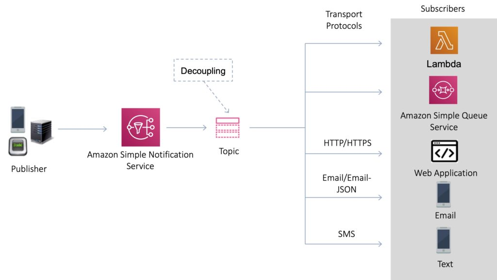
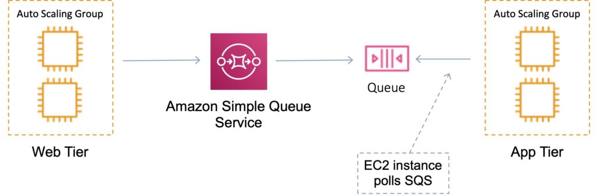
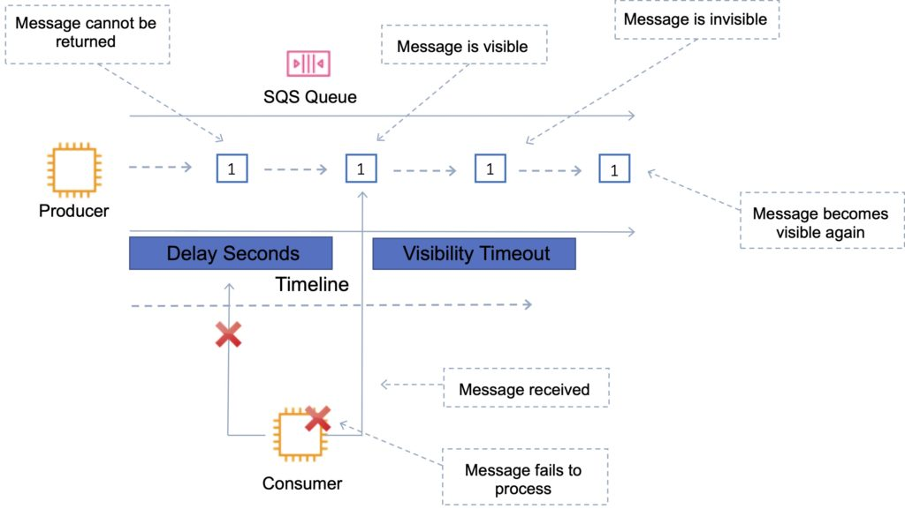
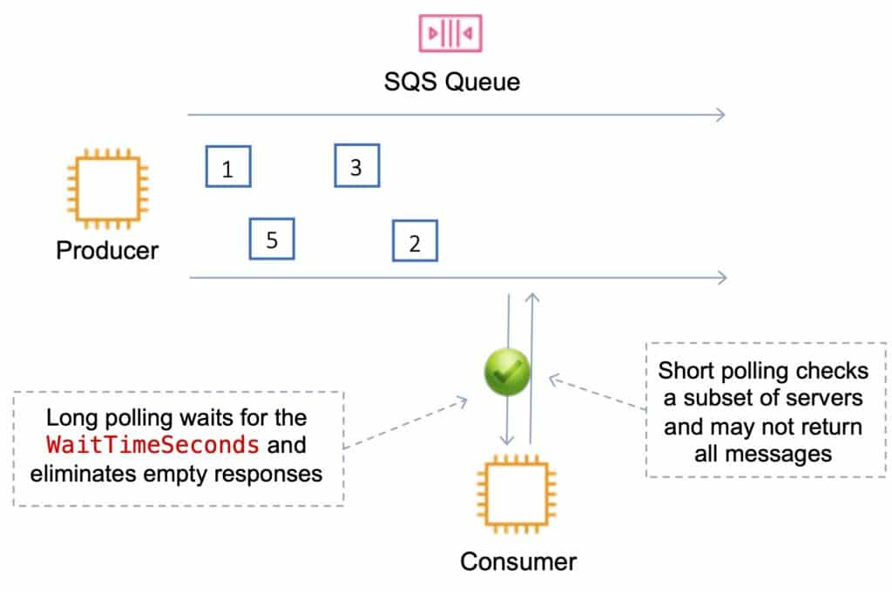

# Overview
The AWS Application Integration Services are a suite of services that can be used to enable communication between application components in a decoupled architecture. This includes microservices application, distributed systems, and serverless applications.

AWS application integration services allow you to connect apps, without needing to write custom code to enable interoperability. Decoupled applications can interoperate whilst being resilient to the failure or overload of any individual component.

The following services are involved with application integration:

| Service                           | What it does                                                               | Example use cases                                                                                                                                                                         |
| --------------------------------- | -------------------------------------------------------------------------- | ----------------------------------------------------------------------------------------------------------------------------------------------------------------------------------------- |
| Simple Queue Service (SQS)        | Messaging queue; store and forward patterns                                | Building distributed / decoupled applications                                                                                                                                             |
| Simple Notification Service (SNS) | Set up, operate, and send notifications from the cloud                     | Send email notification when CloudWatch alarm is triggered                                                                                                                                |
| Step Functions                    | Out-of-the-box coordination of AWS service components with visual workflow | Order processing workflow                                                                                                                                                                 |
| Simple Workflow Service (SWF)     | Need to support external processes or specialized execution logic          | Human-enabled workflows like an order fulfilment system or for procedural requests <br> *Note: AWS recommends that for new applications customers consider Step Functions instead of SWF* |
| Amazon MQ                         | Message broker service for Apache Active MQ and RabbitMQ                   | Need a message queue that supports industry standard APIs and protocols; migrate queues to AWS                                                                                            |
| Amazon Kinesis                    | Collect, process, and analyze streaming data.                              | Collect data from IoT devices for later processing                                                                                                                                        |

# AWS SNS
Amazon Simple Notification Service (Amazon SNS) is a fully managed messaging service for both application-to-application (A2A) and application-to-person (A2P) communication.

- SNS uses a pub-sub model whereby users or applications subscribe to SNS topics. The pub/sub functionality provides messaging for high-throughput, push-based, many-to-many use cases.
- Amazon SNS can also send notifications via SMS text message, email, SQS queues or to any HTTP endpoint.
- Amazon SNS notifications can also trigger Lambda functions.



## SNS topics
Multiple recipients can be grouped using Topics.

A topic is an “access point” for allowing recipients to dynamically subscribe for identical copies of the same notification.

One topic can support deliveries to multiple endpoint types.

All messages are stored redundantly across multiple availability zones.

## SNS Subscribers and Endpoints
When subscribing to an SNS topic the following endpoint types are supported:

- HTTP/HTTPS.
- Email/Email-JSON.
- Amazon Kinesis Data Firehose.
- Amazon SQS.
- AWS Lambda.
- Platform application endpoint (mobile push).
- SMS.

## SNS FanOut
Your publisher systems can fanout messages to many subscriber systems including Amazon SQS queues, AWS Lambda functions and HTTPS endpoints, for parallel processing, and Amazon Kinesis Data Firehose.

You can subscribe one or more Amazon SQS queues to an Amazon SNS topic from a list of topics available for the selected queue.

When you publish a message to a topic, Amazon SNS sends the message to every subscribed queue.

# AWS SQS
Amazon Simple Queue Service (SQS) is a distributed queue system that enables web service applications to quickly and reliably queue messages that one component in the application generates to be consumed by another component.



- Amazon SQS enables you to send, store, and receive messages between software components.
- An Amazon SQS queue is a temporary repository for messages that are awaiting processing.
- The SQS queue acts as a buffer between the component producing and saving data, and the component receiving the data for processing.
- The SQS queue resolves issues that arise if the producer is producing work faster than the consumer can process it, or if the producer or consumer are only intermittently connected to the network.
- Amazon SQS is pull-based, not push-based (like Amazon SNS).
- Messages are up to `256KB` in size.
- Messages can be kept in the queue from `1 minute to 14 days`.
- The default retention period is `4 days`.
- SQS guarantees that your messages will be processed at least once.

## SQS Queues
Queue names must be unique within a region.

There are two types of queue – **standard queues** and **FIFO queues**.

### Standard Queues
- Default queue type.
- Nearly unlimited transactions per second.
- Guarantee that a message is delivered at least once.
- Occasionally more than one copy of a message might be delivered out of order.
- Provides best-effort ordering which ensures that messages are generally delivered in the same order as they are sent.

### First in First Out (FIFO) Queues
- Delivers exactly-once processing.
- Limited to 300 transactions per second (TPS) but have all the capabilities of standard queues.
- The order in which messages are sent and received is strictly preserved and a message is delivered once and remains available until a consumer processes and deletes it.
- Duplicates are not introduced into the queue.
- FIFO queues also support message groups that allow multiple ordered message groups within a single queue.

FIFO queues require the Message Group ID and Message Deduplication ID parameters to be added to messages.

`MessageGroupId`: The tag that specifies that a message belongs to a specific message group. Messages that belong to the same message group are guaranteed to be processed in a FIFO manner.

`MessageDeduplicationId`: The token used for deduplication of messages within the deduplication interval.

#### Deduplication with FIFO queues:

- Provide a `MessageDeduplicationId` with the message.
- The de-duplication interval is `5 minutes`.
- Content based duplication – the `MessageDeduplicationId` is generated by `SHA-256` with the message body.

#### Sequencing with FIFO queues:

- To ensure strict ordering between messages, specify a `MessageGroupId`.
- Messages with a different Group ID may be received out of order.
- Messages with the same Group ID are delivered to one consumer at a time.


The following table provides a side-by-side comparison of standard and FIFO queues:

| Standard Queue                                                                                                              | FIFO Queue                                                                                                                                                                                                                           |
| --------------------------------------------------------------------------------------------------------------------------- | ------------------------------------------------------------------------------------------------------------------------------------------------------------------------------------------------------------------------------------ |
| Unlimited Throughput: Standard queues support a nearly unlimited number of transactions per second (TPS) per API action.    | High Throughput: FIFO queues support up to 300 messages per second (300 send, receive, or delete operations per second). When you batch 10 messages per operation (maximum), FIFO queues can support up to 3,000 messages per second |
| Best-Effort Ordering: Occasionally, messages might be delivered in an order different from which they were sent             | First-ln-First-out Delivery: The order in which messages are sent and received is strictly preserved                                                                                                                                 |
| At-Least-Once Delivery: A message is delivered at least once, but occasionally more than one copy of a message is delivered | Exactly-Once Processing: A message is delivered once and remains available until a consumer processes and deletes it. Duplicates are not introduced into the queue                                                                   |

### Scalability and Durability

You can have multiple queues with different priorities.

Scaling is performed by creating more queues.

SQS stores all message queues and messages within a single, highly available AWS region with multiple redundant AZs.

## Visibility Timeout
The amount of time a message is invisible in the queue after a reader picks it up.

- Provided the job is processed before the visibility timeout expires, the message will then be deleted from the queue. 
- If the job is not processed within the visibility timeout, the message will become visible again and another reader will process it. This could result in the same message being delivered twice.
- The default visibility timeout is `30 seconds`. The maximum is `12 hours`.



## SQS Polling

Amazon Simple Queue Service (SQS) polling refers to the process of continuously or periodically checking an SQS queue for messages to process. here are two main types of polling methods used with SQS: **Short polling** and **Long polling**.



### Short polling
Short polling is the default. Short polling returns immediately (even if the message queue is empty).

- `ReceiveMessageWaitTime` is set to `0`.
- It queries only a subset of the available servers for messages (based on weighted random execution).
- More requests are used, which implies higher cost.

### Long polling
Long polling doesn’t return a response until a message arrives in the message queue or the long poll times out.

- `ReceiveMessageWaitTime` is set to a **non-zero value (up to 20 seconds)**.
- Long polling can be enabled at the queue level or at the API level using `WaitTimeSeconds`.
- Uses fewer requests and reduces cost.
- Eliminates false empty responses by querying all servers.
- Requests contain at least one of the available messages up to the maximum number of messages specified in the `ReceiveMessage` action.

### Use cases
- **Event-Driven Architectures:** SQS polling is often used in event-driven architectures to decouple components and ensure that messages are processed asynchronously.
- **Background Processing:** Useful for background jobs, task queues, and delayed processing.
- **Scalability:** Helps in scaling processing tasks by distributing the load among multiple consumers.

### Best Practices
- **Choose Long Polling for Efficiency:** Use long polling to reduce the number of empty responses and API calls.
- **Handle Errors Gracefully:** Implement proper error handling and retry mechanisms to manage network issues or transient failures.
- **Batch Processing:** Consider processing messages in batches to improve throughput and reduce API call overhead.

## Dead Letter Queue (DLQ)
A dead-letter queue saves discarded events for further processing. 

- It is not a queue type; it is a standard or FIFO queue that has been specified as a dead-letter queue in the configuration of another standard or FIFO queue.
- Messages are moved to the dead-letter queue when the `ReceiveCount` for a message exceeds the `maxReceiveCount` for a queue.
- Dead-letter queues will break the order of messages in FIFO queues.

## Delay Queues
Amazon SQS Delay Queues are a feature of Amazon Simple Queue Service (SQS) that allows you to postpone the delivery of messages to consumers for a specified period. This means that when a message is sent to a delay queue, it is not immediately available for processing; instead, it remains hidden for the duration of the delay period. This feature is useful for scenarios where you want to introduce a delay before processing a message.

For example, adding a delay of a few seconds to allow updates to sales or stock control databases before sending a notification to a customer confirming an online transaction.

- You can configure a delay of up to `15 minutes (900 seconds)` for messages in the queue.
- You need to apply a delay to an entire queue of messages.

### Use Cases
- **Delayed Processing:** Introduce a wait time before processing tasks, such as delaying the execution of a workflow or retrying a failed operation after a specific interval.
- **Rate Limiting:** Throttle the processing of messages to prevent overloading downstream systems or services.
- **Event Coordination:** Ensure that dependent tasks are processed in a specific sequence by delaying messages until prerequisite tasks are completed.

## Amazon SQS APIs
APIs you should know for the exam:

### CreateQueue (aws sqs create-queue):

Creates a new standard or FIFO queue.  You can pass one or more attributes in the request.

### DeleteQueue (aws sqs delete-queue):

Deletes the queue specified by the QueueUrl , regardless of the queue’s contents.
If the specified queue doesn’t exist, Amazon  SQS  returns a successful response.

### PurgeQueue (aws sqs purge-queue):

Deletes the messages in a queue specified by the QueueURL parameter.

### SendMessage (aws sqs send-message):

Delivers a message to the specified queue.

### ReceiveMessage (aws sqs receive-message):

Retrieves one or more messages (up to 10), from the specified queue.
Using the WaitTimeSeconds parameter enables long-poll support.

### DeleteMessage (aws sqs delete-message):

Deletes the specified message from the specified queue.
To select the message to delete, use the ReceiptHandle of the message (not the MessageId which you receive when you send the message).

### ChangeMessageVisibility (aws sqs change-message-visibility):

Changes the visibility timeout of a specified message in a queue to a new value.
The default visibility timeout for a message is 30  seconds.
The minimum is 0 seconds.
The maximum is 12 hours.

To reduce costs or manipulate up to 10 messages with a single action, you can use the following actions:

```
SendMessageBatch
DeleteMessageBatch
ChangeMessageVisibilityBatch
```