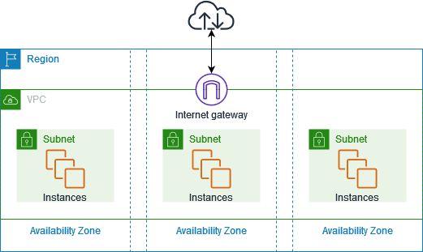

# What is Amazon VPC?

Amazon Virtual Private Cloud (VPC) is a fundamental building block, allowing you to provision a logically isolated virtual network within the AWS cloud. By creating your own VPC, you gain full control over the networking environment, including the ability to define IP address ranges, subnets, routing tables, and connectivity options.

With Amazon Virtual Private Cloud (Amazon VPC), you can launch AWS resources in a logically isolated virtual network that you've defined.

Your AWS account includes a default VPC in each AWS Region. Your default VPCs are configured such that you can immediately start launching and connecting to EC2 instances. The default VPC has all-public subnets.

You can choose to create additional VPCs with the subnets, IP addresses, gateways and routing that you need. By default you can create up to **5 VPCs per region**.

You cannot have multiple Internet Gateways in a VPC.

The following diagram shows an example VPC. The VPC has one subnet in each of the AZs in the Region, EC2 instances in each subnet, and an internet gateway to allow communication between the resources in your VPC and the internet.



# Components in a VPC

**Virtual private clouds (VPC)**

A VPC is a virtual network that closely resembles a traditional network that you'd operate in your own data center. After you create a VPC, you can add subnets.

**Subnets**

A subnet is a range of IP addresses in your VPC. A subnet must reside in a single AZ. After you add subnets, you can deploy AWS resources in your VPC.

Types of subnet:

- If a subnet’s traffic is routed to an internet gateway, the subnet is known as a **public subnet**.
- If a subnet doesn’t have a route to the internet gateway, the subnet is known as a **private subnet**.
- If a subnet doesn’t have a route to the internet gateway, but has its traffic routed to a virtual private gateway for a VPN connection, the subnet is known as a **VPN-only subnet**.

Subnets map 1:1 to AZs and cannot span AZs.

**IP addressing**

You can assign IP addresses, both `IPv4` and `IPv6`, to your VPCs and subnets. You can also bring your public IPv4 addresses and IPv6 GUA addresses to AWS and allocate them to resources in your VPC, such as EC2 instances, NAT gateways, and Network Load Balancers.

**Routing/Route Tables**

Use *route tables* to determine where network traffic from your subnet or gateway is directed. A *route table* contains a set of rules, called **routes**, that are used to determine where network traffic from your VPC is directed. You can explicitly associate a subnet with a particular route table. Otherwise, the subnet is implicitly associated with the main route table. 

Each route in a route table specifies the range of IP addresses where you want the traffic to go (*the destination*) and the gateway, network interface, or connection through which to send the traffic (*the target*).

**Gateways and VPC endpoints**

A gateway connects your VPC to another network. For example, use an internet gateway to connect your VPC to the internet. 

Use a VPC endpoint to connect to AWS services privately, without the use of an internet gateway or NAT device, by using `AWS PrivateLink`.

**NAT Instances & NAT Gateway**
NAT instances are managed by you and they are used to enable private subnet instances to access the Internet.

NAT instance must live on a public subnet with a route to an Internet Gateway. There needs to be a route from a private subnet to the NAT instance for it to work.

NAT gateways are managed for you by AWS.

| Attribute            | NAT gateway                                                                                                                                                                                                                                          | NAT instance                                                                                                                                                                                                                   |
| -------------------- | ---------------------------------------------------------------------------------------------------------------------------------------------------------------------------------------------------------------------------------------------------- | ------------------------------------------------------------------------------------------------------------------------------------------------------------------------------------------------------------------------------ |
| Availability         | Highly available. NAT gateways in each Availability Zone are implemented with redundancy. Create a NAT gateway in each Availability Zone to ensure zone-independent architecture.                                                                    | Use a script to manage failover between instances.                                                                                                                                                                             |
| Bandwidth            | Scale up to 100 Gbps.                                                                                                                                                                                                                                | Depends on the bandwidth of the instance type.                                                                                                                                                                                 |
| Maintenance          | Managed by AWS. You do not need to perform any maintenance.                                                                                                                                                                                          | Managed by you, for example, by installing software updates or operating system patches on the instance.                                                                                                                       |
| Performance          | Software is optimized for handling NAT traffic.                                                                                                                                                                                                      | A generic AMI that's configured to perform NAT.                                                                                                                                                                                |
| Cost                 | Charged depending on the number of NAT gateways you use, duration of usage, and amount of data that you send through the NAT gateways.	Charged depending on the number of NAT instances that you use, duration of usage, and instance type and size. |
| Type and size        | Uniform offering; you don’t need to decide on the type or size.                                                                                                                                                                                      | Choose a suitable instance type and size, according to your predicted workload.                                                                                                                                                |
| Public IP addresses  | Choose the Elastic IP address to associate with a public NAT gateway at creation.                                                                                                                                                                    | Use an Elastic IP address or a public IP address with a NAT instance. You can change the public IP address at any time by associating a new Elastic IP address with the instance.                                              |
| Private IP addresses | Automatically selected from the subnet's IP address range when you create the gateway.                                                                                                                                                               | Assign a specific private IP address from the subnet's IP address range when you launch the instance.                                                                                                                          |
| Security groups      | You cannot associate security groups with NAT gateways.                                                                                                                                                                                              | You can associate them with the resources behind the NAT gateway to control inbound and outbound traffic.	Associate with your NAT instance and the resources behind your NAT instance to control inbound and outbound traffic. |
| Network ACLs         | Use a network ACL to control the traffic to and from the subnet in which your NAT gateway resides.                                                                                                                                                   | Use a network ACL to control the traffic to and from the subnet in which your NAT instance resides.                                                                                                                            |
| Flow logs            | Use flow logs to capture the traffic.                                                                                                                                                                                                                | Use flow logs to capture the traffic.                                                                                                                                                                                          |
| Port forwarding      | Not supported.                                                                                                                                                                                                                                       | Manually customize the configuration to support port forwarding.                                                                                                                                                               |
| Bastion servers      | Not supported.                                                                                                                                                                                                                                       | Use as a bastion server.                                                                                                                                                                                                       |
| Traffic metrics      | View CloudWatch metrics for the NAT gateway.                                                                                                                                                                                                         | View CloudWatch metrics for the instance.                                                                                                                                                                                      |
| Timeout behavior     | When a connection times out, a NAT gateway returns an RST packet to any resources behind the NAT gateway that attempt to continue the connection (it does not send a FIN packet).                                                                    | When a connection times out, a NAT instance sends a FIN packet to resources behind the NAT instance to close the connection.                                                                                                   |
| IP fragmentation     | Supports forwarding of IP fragmented packets for the UDP protocol. <br>Does not support fragmentation for the TCP and ICMP protocols. Fragmented packets for these protocols will get dropped.                                                       | Supports reassembly of IP fragmented packets for the UDP, TCP, and ICMP protocols.                                                                                                                                             |

**Peering connections**

Use a VPC peering connection to route traffic between the resources in two VPCs.

**Traffic Mirroring**

Copy network traffic from network interfaces and send it to security and monitoring appliances for deep packet inspection.

**Transit gateways**

Use a transit gateway, which acts as a central hub, to route traffic between your VPCs, VPN connections, and AWS Direct Connect connections (for on-Prem networks).

**VPC Flow Logs**

A flow log captures information about the IP traffic going to and from network interfaces in your VPC.

**VPN connections**

Connect your VPCs to your on-premises networks using `AWS Virtual Private Network (AWS VPN)`.

# Routing

The VPC router performs routing between AZs within a region.

Each subnet has its own route table the router uses to forward traffic within the VPC. If no route table is specified a subnet will be assigned to the main route table at creation time.

Up to 200 route tables per VPC.

Up to 50 route entries per route table.

There is a default rule that allows all VPC subnets to communicate with one another – this cannot be deleted or modified.

Routing between subnets is always possible because of this rule – any problems communicating is more likely to be security groups or NACLs.

# Security Groups and NACLs

**Security groups:** 

- Security groups act like a firewall at the instance level.
- Can only assign **permit** rules in a security group, cannot assign **deny** rules.
- There is an **implicit deny** rule at the end of the security group.
- Security groups are `stateful`.
- All outbound traffic is allowed by default in custom and default security groups.
- Up to 5 security groups can be added per EC2 instance interface.

**Network ACLs:** 
ach subnet in your VPC must be associated with a network ACL. If you don’t do this manually it will be associated with the default network ACL.

- Subnet level firewall
- With NACLs you can have **permit** and **deny** rules.
- Network ACLs are `stateless`, so responses are subject to the rules for the direction of traffic.
- NACLs only apply to traffic that is ingress or egress to the subnet not to traffic within the subnet.

NACL is the first line of defense, the security group is the second line.

## Security Group vs NACL
| SG                                                                 | NACL                                          |
| ------------------------------------------------------------------ | --------------------------------------------- |
| Instance level firewall                                            | Subnet level firewall                         |
| Allow only rules                                                   | Both Allow and Deny rules available           |
| Stateful: any traffic allowed out will automatically be allowed in | Stateless: NACLs need separate outbound rules |

# Transit VPC

|      | Description                                                                                                          |
| ---- | -------------------------------------------------------------------------------------------------------------------- |
| What | Common strategy for connecting geographically dispersed VPCs and locations to create a global network transit center |
| When | Locations and VPC-deployed assets across multiple regions that need to communicate with one another                  |
| Pros | Ultimate flexibility and manageability but also AWS-managed VPN hub-and-spoke between VPCs                           |
| Cons | You must design for any redundancy across the whole chain                                                            |
| How  | Providers like Cisco, Juniper Networks, and Riverbed have offerings which work with their equipment and AWS VPC      |

# VPC Peering
|      | Description                                                                   |
| ---- | ----------------------------------------------------------------------------- |
| What | AWS-provided network connectivity between VPCs                                |
| When | Multiple VPCs need to connect with one another and access their resources     |
| Pros | Uses AWS backbone without traversing the internet                             |
| Cons | Transitive peering is not supported                                           |
| How  | VPC Peering request made; accepter request (either within or across accounts) |

# AWS PrivateLink
|      | Description                                                                                                           |
| ---- | --------------------------------------------------------------------------------------------------------------------- |
| What | AWS-provided connectivity between VPCs and/or AWS services using interface endpoints                                  |
| When | Keep private subnets truly private by using the AWS backbone rather than using the public internet                    |
| Pros | Redundant; uses AWS backbone                                                                                          |
| Cons |                                                                                                                       |
| How  | Create endpoint for required AWS or Marketplace service in all required subnets; access via the provided DNS hostname |

> EXAM TIP: Know the difference between AWS PrivateLink and ClassicLink. ClassicLink allows you to link EC2-Classic instances to a VPC in your account, within the same region. EC2-Classic is an old platform from before VPCs were introduced and is not available to accounts created after December 2013. However, ClassicLink may come up in exam questions as a possible (incorrect) answer, so you need to know what it is.

# VPC Endpoints
An Interface endpoint uses AWS PrivateLink and is an elastic network interface (ENI) with a private IP address that serves as an entry point for traffic destined to a supported service.

|          | Interface Endpoint                          | Gateway Endpoint                                        |
| -------- | ------------------------------------------- |
| What     | Elastic Network Interface with a private IP | A gateway that is a target for a specific route         |
| How      | Uses DNS entries to redirect traffic        | Use prefix lists in the route table to redirect traffic |
| Which    | Services	A large amount of AWS services     | Amazon S3, DynamoDB                                     |
| Security | Security Groups                             | VPC Endpoint Policies                                   |

# VPC Flow Logs
Flow Logs capture information about the IP traffic going to and from network interfaces in a VPC.

Flow log data is stored using Amazon CloudWatch Logs.

After you’ve created a flow log, you cannot change its configuration (you need to delete and re-create).

Flow logs can be created at the following levels:

```
VPC.
Subnet.
Network interface.
```

# Best Practices for VPC setup
- By creating subnets in the available AZs, you create Multi-AZ presence for your VPC.
- Best practice is to create at least two VPN tunnels into your Virtual Private Gateway.
- Direct Connect is not HA by default, so you need to establish a secondary connection via another Direct Connect (ideally with another provider) or use a VPN.
- Route 53’s health checks provide a basic level of redirecting DNS resolutions.
- Elastic IPs allow you flexibility to change out backing assets without impacting name resolution.
- For Multi-AZ redundancy of NAT Gateways, create gateways in each AZ with routes for private subnets to use the local gateway.