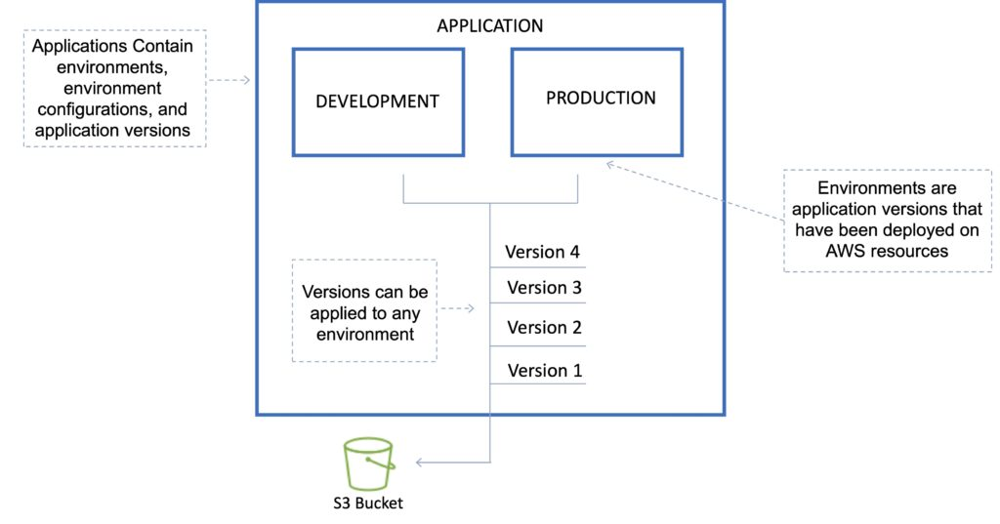
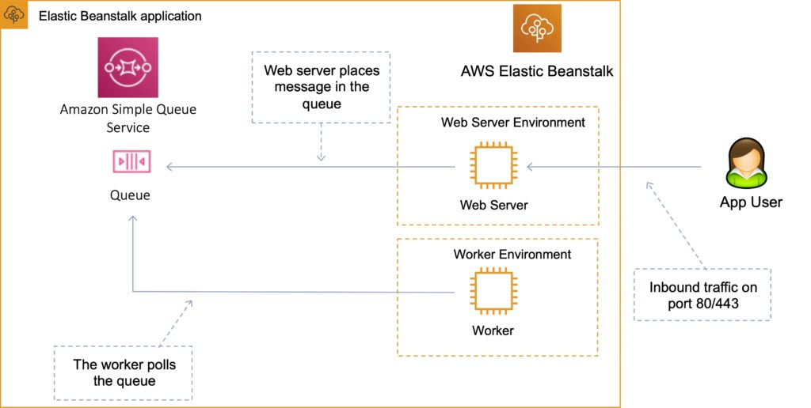

# AWS - Elastic BeanStalk

AWS Elastic Beanstalk can be used to quickly deploy and manage applications in the AWS Cloud.

Developers upload applications and Elastic Beanstalk handles the deployment details of capacity provisioning, load balancing, auto-scaling, and application health monitoring.

- Considered a Platform as a Service (PaaS) solution.
- Developers can focus on writing code and don’t need to worry about deploying infrastructure.
- Integrated with CloudWatch and X-Ray for performance data and metrics.
- Integrates with Amazon VPC and AWS IAM.
- Provides fault tolerance within a single region.
- By default applications are publicly accessible.
- Can access logs without logging into application servers.
- When deploying code to Amazon EC2 using Beanstalk, Elastic Beanstalk must resolve application dependencies which can take a long time. A `Golden AMI` is a method of reducing this time by packaging all dependencies, configuration, and software into the AMI before deploying.

## Elastic Beanstalk Layers
There are several layers that make up Elastic Beanstalk and each layer is described below:

**Application:**

Within Elastic Beanstalk, an application is a collection of different elements, such as environments, environment configurations, and application versions.
You can have multiple application versions held within an application.

**Application version:**

An application version is a very specific reference to a section of deployable code.
The application version will point typically to an Amazon s3 bucket containing the code.

- Elastic Beanstalk can store at most `1000` application versions.

- To phase out old versions use a lifecycle policy:

    <strong>
    Time-based – specify max age.

    Count based – specify max number to retain.
    </strong>

- Versions that are in use will not be deleted.

**Environment:**



An environment refers to an application version that has been deployed on AWS resources.
The resources are configured and provisioned by AWS Elastic Beanstalk.
The environment is comprised of all the resources created by Elastic Beanstalk and not just an EC2 instance with your uploaded code.

**Environment tier:**

Determines how Elastic Beanstalk provisions resources based on what the application is designed to do.
Web servers are standard applications that listen for and then process HTTP requests, typically over port 80.
Workers are specialized applications that have a background processing task that listens for messages on an Amazon SQS queue.

**Environment configurations:**

An environment configuration is a collection of parameters and settings that dictate how an environment will have its resources provisioned by Elastic Beanstalk and how these resources will behave.

**Configuration template:**

This is a template that provides the baseline for creating a new, unique environment configuration.

## Deployment Options

Single instance: great for development.

High availability with load balancer: great for production.

### Deployment policies

The deployment policies are: `All at once, Rolling, Rolling with additional batch, and Immutable`.

**All at once:**

Deploys the new version to all instances simultaneously.
All your instances are out of service while the deployment takes place.
Fastest deployment.
Good for quick iterations in the development environment.
You will experience an outage while the deployment is taking place – not ideal for mission-critical systems.
If the update fails, you need to roll back the changes by re-deploying the original version to all your instances.
No additional cost.

**Rolling:**

Update a few instances at a time (batch), and then move onto the next batch once the first batch is healthy (downtime for 1 batch at a time).
The application is running both versions simultaneously.
Each batch of instances is taken out of service while the deployment takes place.
Your environment capacity will be reduced by the number of instances in a batch while the deployment takes place.
Not ideal for performance-sensitive systems.
If the update fails, you need to perform an additional rolling update to roll back the changes.
No additional cost.
Long deployment time.

**Rolling with additional batch:**

Like Rolling but launches new instances in a batch ensuring that there is full availability.
The application is running at capacity.
You can set the bucket size.
The application is running both versions simultaneously.
Small additional cost.
Additional batch is removed at the end of the deployment.
Longer deployment.
Good for production environments.

**Immutable:**

Launches new instances in a new ASG and deploys the version update to these instances before swapping traffic to these instances once healthy.
Zero downtime.
New code is deployed to new instances using an ASG.
High cost as double the number of instances running during updates.
Longest deployment.
Quick rollback in case of failures.
Great for production environments.
Additionally, Elastic Beanstalk supports blue/green deployment.

**Blue / Green deployment:**

This is not a feature within Elastic Beanstalk
You create a new “staging” environment and deploy updates there.
The new environment (green) can be validated independently, and you can roll back if there are issues.
Route 53 can be set up using weighted policies to redirect a percentage of traffic to the staging environment.
Using Elastic Beanstalk, you can “swap URLs” when done with the environment test.
Zero downtime.

The following tables summarizes the different deployment policies:

| Deployment Policy             | Deploy Time | Zero Downtime | Rollback                | Extra Cost       | Reduction in capacity |
| ----------------------------- | ----------- | ------------- | ----------------------- | ---------------- | --------------------- |
| All at once                   | ★           | NO            | Manual redeploy         | NONE             | YES (total)           |
| Rolling                       | ★ ★         | YES           | Manual redeploy         | NONE             | YES (batch size)      |
| Rolling with additional batch | ★ ★ ★       | YES           | Manual redeploy         | YES (batch size) | NO                    |
| Immutable                     | ★ ★ ★ ★     | YES           | Terminate new instances | YES (total)      | NO                    |
| Blue/green                    | ★ ★ ★ ★     | YES           | Swap URL                | YES (varies)     | NO                    |

## Worker environments
If an application performs tasks that take a long time to complete (long-running tasks), offload to a worker environment.

- It allows you to decouple your application tiers.

- Can define periodic tasks in the `cron.yaml` file.



## Elastic Beanstalk Extensions
You can add AWS Elastic Beanstalk configuration files (`.ebextensions`) to your web application’s source code to configure your environment and customize the AWS resources that it contains.

Customization includes defining packages to install, create Linux users and groups, running shell commands, specifying services to enable, configuring a load balancer, etc.

Configuration files are `YAML-` or `JSON`-formatted documents with a `.config` file extension that you place in a folder named `.ebextensions` and deploy in your application source bundle.

The `.ebextensions` folder must be included in the top-level directory of your application source code bundle.

All the parameters set in the UI can be configured in the code.

### Requirements:

- Must be in the `.ebextensions`/directory of the source code.
- `YAML` or `JSON` format.
- `.config` extensions can be included (e.g. `logging.config`).
- You can modify some default settings using **“option_settings”**.
- You can add resources such as **`RDS`, `ElastiCache`, and `DynamoDB`**.

Resources managed by `.ebextensions` get deleted if the environment is terminated.

# AWS SAM (Serverless Access Model)
A serverless application is a combination of Lambda functions, event sources, and other resources that work together to perform tasks. Note that a serverless application is more than just a Lambda function—it can include additional resources such as APIs, databases, and event source mappings.

The **AWS Serverless Application Model (AWS SAM)** is an open-source framework designed to streamline the building and deployment of serverless applications on AWS. By simplifying the process of creating and managing resources, it significantly reduces the complexity usually associated with traditional architectures.


## SAM Templates
These are configuration files, written in `YAML` or `JSON`, that specify the resources used in your AWS serverless application. They are an extension of `AWS CloudFormation templates`, providing a simplified syntax for defining serverless resources such as Lambda functions, API Gateway APIs, and DynamoDB tables.

There are several resource types:
```
AWS::Serverless::Function (AWS Lambda)
AWS::Serverless::Api (API Gateway)
AWS::Serverless::SimpleTable (DynamoDB)
AWS::Serverless::Application (AWS Serverless Application Repository)
AWS::Serverless::HttpApi (API Gateway HTTP API)
AWS::Serverless::LayerVersion (Lambda layers)
```

## SAM Command Line Interface (CLI)
The `SAM CLI` is a vital tool for local development and testing of serverless applications. It provides commands for all phases of the development lifecycle, from debugging your application locally to deploying your code in the AWS cloud. Provides a Lambda-like execution environment that lets developers locally build, test, and debug applications defined by SAM templates.

- Offers a shorthand syntax to express functions, APIs, databases, and event source mappings.
- SAM seamlessly transforms and expands this syntax into AWS CloudFormation syntax, facilitating faster and more efficient construction of serverless applications. 
- AWS SAM supports all AWS CloudFormation template items such as `Outputs`, `Mappings`, `Parameters`, providing developers with the comprehensive tooling needed to build robust and scalable serverless applications.

### Commands
```yaml
# Only two commands are required to package and deploy to AWS.

sam package
sam deploy

# OR

aws cloudformation package
aws cloudformation deploy
```

## Key Benefits of AWS SAM

- Works seamlessly with popular integrated development environments (IDEs) like PyCharm, IntelliJ, and VS Code. Also integrates with a comprehensive suite of AWS serverless tools.

- Can leverage AWS CodeBuild, AWS CodeDeploy, and AWS CodePipeline to construct an efficient and reliable deployment pipeline for your serverless applications.

- With SAM CLI, you can locally build, test, and debug applications defined by SAM templates. This accelerates the development cycle by providing immediate feedback. The SAM CLI provides a Lambda-like execution environment that lets developers locally build, test, and debug applications defined by SAM templates.

- AWS SAM is an extension of AWS CloudFormation, which means you can use all the powerful, flexible features of CloudFormation in addition to serverless-specific capabilities.

- AWS SAM templates are designed with best practices in mind, incorporating built-in application lifecycle management features such as safe deployments and rollback capabilities

- AWS SAM enables you to deploy your infrastructure as configuration. This practice facilitates the implementation of additional best practices such as code reviews, which contribute to higher code quality and fewer deployment issues.

## Disadvantages of AWS SAM
- AWS SAM can be restrictive when it comes to API Gateway configuration. While it simplifies many aspects, it doesn’t offer the same level of flexibility as manual or Serverless Framework configurations.

- Compared to the Serverless Framework, AWS SAM has fewer plugins available.
