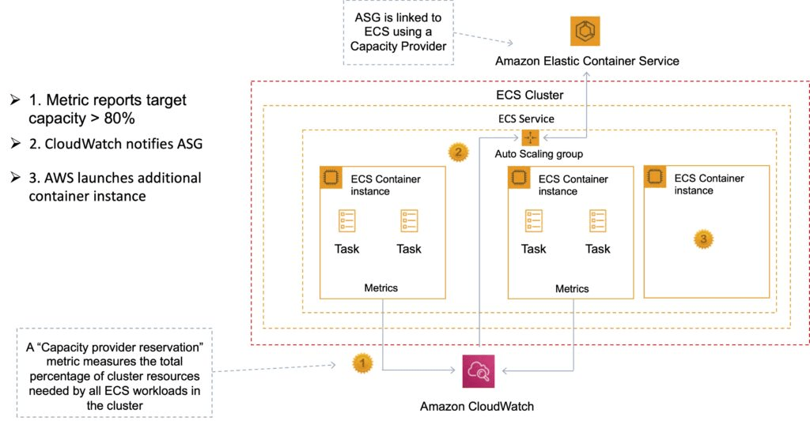
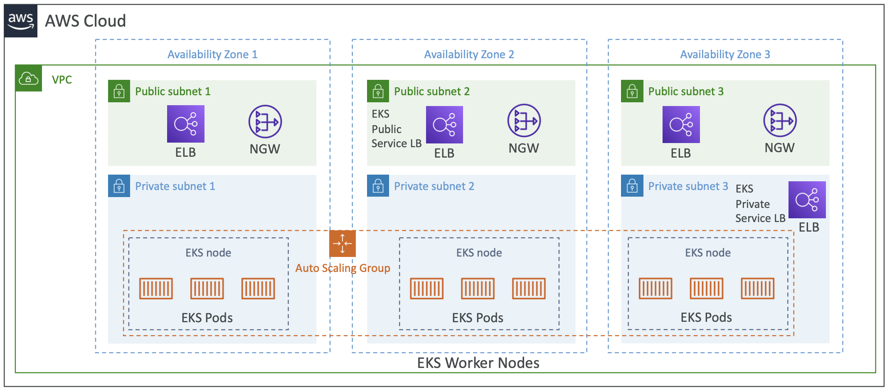

# Amazon ECS
Amazon Elastic Container Service (Amazon ECS) is a fully managed container orchestration service that helps you easily deploy, manage, and scale containerized applications.

- A container management service to run, stop and manage Docker containers on a cluster.
- ECS can be used to create a consistent deployment and build experience, manage, and scale batch and Extract-Transform-Load (ETL) workloads, and build sophisticated application architectures on a microservices model.
- Amazon ECS is a regional service.
- Amazon ECS can be used to schedule the placement of containers across clusters based on resource needs and availability requirements.
- After a cluster is up and running, you can define task definitions and services that specify which Docker container images to run across your clusters.

There is no additional charge for Amazon ECS. You pay for:

- Resources created with the `EC2 Launch Type` (e.g. EC2 instances and EBS volumes).
- The number and configuration of tasks you run for the `Fargate Launch Type`.

It is possible to use Elastic Beanstalk to handle the provisioning of an Amazon ECS cluster, load balancing, auto-scaling, monitoring, and placing your containers across your cluster. Alternatively use ECS directly for more fine-grained control for customer application architectures.

> **Exam note:** ECS tasks only supports `Rolling` and `Blue/Green` Deployment types.

## ECS Terminology
The following table provides an overview of some of the terminology used with Amazon ECS:

| Amazon ECS Term    | Definition                                                                                                             |
| ------------------ | ---------------------------------------------------------------------------------------------------------------------- |
| Cluster            | Logical Grouping of EC2 Instances                                                                                      |
| Container Instance | EC2 instance running the ECS agent                                                                                     |
| Image              | Containers are created from a read-only template that's called an image. Images are typically built from a Dockerfile. |
| DockerFile         | A Dockerfile is a plaintext file that contains the instructions for building a container.                              |
| Task Definition    | Blueprint that describes how a docker container should launch                                                          |
| Task               | A running container using settings in a Task Definition                                                                |
| Service            | Defines long running tasks – can control task count with Auto Scaling and attach an ELB                                |

## ECS Components


### Containers and Images
- Your application components must be architected to run in **containers** ー containing everything that your software application needs to run: code, runtime, system tools, system libraries, etc.
- Containers are created from a read-only template called an **image**.
- **Images** are typically built from a `Dockerfile`, a plain text file that specifies all of the components that are included in the container. These images are then stored in a **registry** from which they can be downloaded and run on your cluster.
- When you launch a **container instance**, you have the option of passing **user data** to the instance. **The data can be used to perform common automated configuration tasks and even run scripts when the instance boots.**
- **Docker Volumes** can be a local instance store volume, EBS volume, or EFS volume. Connect your Docker containers to these volumes using Docker drivers and plugins.

### Task Definition
**Task definitions** specify various parameters for your application. It is a text file, in JSON format, that describes one or more containers, up to a **maximum of 10**, that form your application.

Task definitions are split into separate parts:
- **Task family** – the name of the task, and each family can have multiple revisions.
- **IAM task role** – specifies the permissions that containers in the task should have.
- **Network mode** – determines how the networking is configured for your containers.
- **Container definitions** – specify which image to use, how much CPU and memory the container is allocated, and many more options.
- **Volumes** – allow you to share data between containers and even persist the data on the container instance when the containers are no longer running.\Task placement constraints – lets you customize how your tasks are placed within the infrastructure.
- **Launch types** – determines which infrastructure your tasks use - **EC2** or **Fargate**

#### Task Definitions for EC2 Launch Type
- Create task definitions that group the containers that are used for a common purpose, and separate the different components into multiple task definitions.
- After you have your task definitions, you can create services from them to maintain the availability of your desired tasks.
- For EC2 tasks, the following are the types of data volumes that can be used:
  - Docker volumes
  - Bind mounts
- Private repositories are only supported by the EC2 Launch Type.

#### Task Definitions for Fargate Launch Type
- Fargate task definitions require that the network mode is set to **awsvpc**. The **awsvpc** network mode provides each task with its own elastic network interface.
- Fargate task definitions require that you specify CPU and memory at the task level.
- Fargate task definitions only support the **awslogs** log driver for the log configuration. This configures your Fargate tasks to send log information to `Amazon CloudWatch Logs`.
- Task storage is **ephemeral**. After a Fargate task stops, the storage is deleted.
- Amazon ECS tasks running on both Amazon EC2 and AWS Fargate can mount `Amazon Elastic File System (EFS)` file systems.
- Put multiple containers in the same task definition if:
  - Containers share a common lifecycle.
  - Containers are required to be run on the same underlying host.
  - You want your containers to share resources.
  - Your containers share data volumes.
- Otherwise, define your containers in separate task definitions so that you can scale, provision, and de-provision them separately.

### Tasks and Scheduling

#### Tasks
A **task** is the instantiation of a **task definition** within a cluster. After you have created a task definition for your application, you can specify the number of tasks that will run on your cluster.

> Each task that uses the **Fargate** launch type has its own isolation boundary and does not share the underlying kernel, CPU resources, memory resources, or elastic network interface with another task.

#### Task LifeCycle
When a task is started, either manually or as part of a service, it can pass through several states before it finishes on its own or is stopped manually.

The flow chart below shows the task lifecycle flow.


`PROVISIONING`

Amazon ECS has to perform additional steps before the task is launched. For example, for tasks that use the awsvpc network mode, the elastic network interface needs to be provisioned.

`PENDING`

This is a transition state where Amazon ECS is waiting on the container agent to take further action. A task stays in the pending state until there are available resources for the task.

`ACTIVATING`

This is a transition state where Amazon ECS has to perform additional steps after the task is launched but before the task can transition to the RUNNING state. For example, for tasks that have service discovery configured, the service discovery resources must be created. For tasks that are part of a service that's configured to use multiple Elastic Load Balancing target groups, the target group registration occurs during this state.

`RUNNING`

The task is successfully running.

`DEACTIVATING`

This is a transition state where Amazon ECS has to perform additional steps before the task is stopped. For example, for tasks that are part of a service that's configured to use multiple Elastic Load Balancing target groups, the target group deregistration occurs during this state.

`STOPPING`

This is a transition state where Amazon ECS is waiting on the container agent to take further action.

For Linux containers, the container agent will send the SIGTERM signal to notify the application needs to finish and shut down, and then send a SIGKILL after waiting the StopTimeout duration set in the task definition.

`DEPROVISIONING`

Amazon ECS has to perform additional steps after the task has stopped but before the task transitions to the STOPPED state. For example, for tasks that use the awsvpc network mode, the elastic network interface needs to be detached and deleted.

`STOPPED`

The task has been successfully stopped.

If your task stopped because of an error, see Viewing Amazon ECS stopped task errors.

`DELETED`

This is a transition state when a task stops. This state is not displayed in the console, but is displayed in describe-tasks.

#### Task Scheduler
The **task scheduler** is responsible for placing tasks within your cluster. There are several different scheduling options available.

- **REPLICA** — places and maintains the desired number of tasks across your cluster. By default, the service scheduler **spreads** tasks across Availability Zones. You can use **task placement strategies** and **constraints** to customize task placement decisions.
- **DAEMON** — deploys exactly one task on each active container instance that meets all of the task placement constraints that you specify in your cluster. When using this strategy, there is no need to specify a desired **number of tasks**, a **task placement strategy**, or use **Service Auto Scaling policies**.

You can upload a new version of your application task definition, and the ECS scheduler automatically starts new containers using the updated image and stop containers running the previous version.

> Amazon ECS tasks running on both Amazon EC2 and AWS Fargate can mount **Amazon Elastic File System (EFS)** file systems.

### ECS Task placement

> **Very important for exam**

You can use task placement to configure Amazon ECS to place your tasks on container instances that meet certain criteria, for example an Availability Zone or instance type.

The following are task placement components:

- **Task placement strategy** - The algorithm for selecting container instances for task placement or tasks for termination. For example, Amazon ECS can select container instances at random, or it can select container instances such that tasks are distributed evenly across a group of instances.
- **Task group** - A group of related tasks, for example database tasks.
- **Task placement constraint** - These are rules that must be met in order to place a task on a container instance. If the constraint is not met, the task is not placed and remains in the `PENDING` state. For example, you can use a constraint to place tasks only on a particular instance type.

Amazon ECS has different algorithms for the launch types.

#### EC2 Launch Type Task Placement

For tasks that use the EC2 launch type, Amazon ECS must determine where to place the task based on the requirements specified in the task definition, such as CPU and memory. Similarly, when you scale down the task count, Amazon ECS must determine which tasks to terminate. You can apply task placement strategies and constraints to customize how Amazon ECS places and terminates tasks.

You specify task placement strategies in the service definition, or task definition using the placementStrategy parameter.

```json
"placementStrategy": [
    {
        "field": "The field to apply the placement strategy against",
        "type": "The placement strategy to use"
    }
]
```

The following table describes the available types and fields. 
  
| type    | description                                                                                                                                                                                                                                                                                                                                                                                                                                                                                                          | Valid field values                                                                                                                                                            |
| ------- | -------------------------------------------------------------------------------------------------------------------------------------------------------------------------------------------------------------------------------------------------------------------------------------------------------------------------------------------------------------------------------------------------------------------------------------------------------------------------------------------------------------------- | ----------------------------------------------------------------------------------------------------------------------------------------------------------------------------- |
| binpack | Tasks are placed on container instances so as to leave the least amount of unused CPU or memory. This strategy minimizes the number of container instances in use. <br>  <br> When this strategy is used and a scale-in action is taken, Amazon ECS terminates tasks. It does this based on the amount of resources that are left on the container instance after the task is terminated. The container instance that has the most available resources left after task termination has that task terminated.         | cpu & memory                                                                                                                                                                  |
| random  | Tasks are placed randomly.                                                                                                                                                                                                                                                                                                                                                                                                                                                                                           | Not used                                                                                                                                                                      |
| spread  | Tasks are placed evenly based on the specified value. <br>  <br> Service tasks are spread based on the tasks from that service. Standalone tasks are spread based on the tasks from the same task group. For more information about task groups, see Group related Amazon ECS tasks. <br> <br>  When the spread strategy is used and a scale-in action is taken, Amazon ECS selects tasks to terminate that maintain a balance across Availability Zones. Within an Availability Zone, tasks are selected at random. | instanceId (or host, which has the same effect) <br>  <br> any platform or custom attribute that's applied to a container instance, such as `attribute:ecs.availability-zone` |

> Note: You can create a task placement strategy that uses multiple strategies by creating arrays of strategies in the order that you want them performed. For example, if you want to spread tasks across Availability Zones and then bin pack tasks based on memory within each Availability Zone, specify the Availability Zone strategy followed by the memory strategy.

#### Fargate Launch Type Task Placement

Task placement strategies and constraints aren't supported for tasks using the Fargate launch type. Fargate will try its best to spread tasks across accessible Availability Zones. If the capacity provider includes both Fargate and Fargate Spot, the spread behavior is independent for each capacity provider.

### Clusters
When you run tasks using ECS, you place them in a **cluster**, which is a logical grouping of resources.

- Clusters are Region-specific.
- A default cluster is created but you can then create multiple clusters to separate resources.
- Clusters can contain tasks using both the **Fargate** and **EC2 launch types**.
  - When using the Fargate launch type with tasks within your cluster, ECS manages your cluster resources.
  - When using the EC2 launch type, then your clusters are a group of container instances you manage. These clusters can contain multiple different container instance types, but each container instance may only be part of one cluster at a time.
- Before you can delete a cluster, you must delete the services and deregister the container instances inside that cluster.
- Enabling managed Amazon ECS cluster auto-scaling allows ECS to manage the *scale-in* and *scale-out* actions of the Auto Scaling group. On your behalf, Amazon ECS creates an AWS Auto Scaling scaling plan with a target tracking scaling policy based on the target capacity value that you specify.
- You can create IAM policies for your clusters to allow or restrict users’ access to specific clusters.

#### ECS Cluster - Launch Types

An Amazon ECS launch type determines the type of infrastructure on which your tasks and services are hosted. 

##### Fargate Launch Type
The Fargate launch type allows you to run your containerized applications without the need to provision and manage the backend infrastructure. Just register your task definition and Fargate launches the container for you.
Fargate Launch Type is a serverless infrastructure managed by AWS.
Fargate only supports container images hosted on Elastic Container Registry (ECR) or Docker Hub.

##### EC2 Launch Type
The EC2 launch type allows you to run your containerized applications on a cluster of Amazon EC2 instances that you manage.
Private repositories are only supported by the EC2 Launch Type.

The following diagram shows the two launch types and summarizes some key differences:


### Services
ECS allows you to run and maintain a specified number of instances of a *task definition* simultaneously in a cluster.

- In addition to maintaining the desired count of tasks in your service, you can optionally run your service behind a load balancer.
- There are two deployment strategies in ECS:
  - **Rolling Update**
    - This involves the service scheduler replacing the currently running version of the container with the latest version.
    - The number of tasks ECS adds or removes from the service during a rolling update is controlled by the deployment configuration, which consists of the minimum and maximum number of tasks allowed during service deployment.
  - **Blue/Green Deployment with AWS CodeDeploy**
    - This deployment type allows you to verify a new deployment of a service before sending production traffic to it.
    - The service must be configured to use either an Application Load Balancer or Network Load Balancer.

### Container Agent
The **container agent** runs on each infrastructure resource within an ECS cluster.

It sends information about the resource’s current running tasks and resource utilization to ECS, and starts and stops tasks whenever it receives a request from ECS.
The container agent is only supported on Amazon EC2 instances.

### Service Load Balancing

- Amazon ECS services support the **Application Load Balancer**, **Network Load Balancer**, and **Classic Load Balancer** ELBs. 
  - Application Load Balancers are used to route HTTP/HTTPS (or layer 7) traffic. 
  - Network Load Balancers are used to route TCP or UDP (or layer 4) traffic. 
  - Classic Load Balancers are used to route TCP traffic.
- You can attach multiple target groups to your Amazon ECS services that are running on either Amazon EC2 or AWS Fargate. This allows you to maintain a single ECS service that can serve traffic from both internal and external load balancers and support multiple path-based routing rules and applications that need to expose more than one port.
- The *Classic Load Balancer* **doesn’t allow** you to run multiple copies of a task on the same instance. You must statically map port numbers on a container instance. However, an *Application Load Balancer* uses dynamic port mapping, so you **can run multiple tasks** from a single service on the same container instance.
- If a service’s task fails the load balancer health check criteria, the task is stopped and restarted. This process continues until your service reaches the number of desired running tasks.

> Services with tasks that use the **awsvpc network mode**, such as those with the Fargate launch type, do not support Classic Load Balancers. You must use NLB instead of TCP. 

## Amazon Elastic Container Registry (ECR)
Amazon Elastic Container Registry (ECR) is a fully managed Docker container registry that makes it easy for developers to store, manage, and deploy Docker container images.

Amazon ECR is integrated with Amazon Elastic Container Service (ECS).

Amazon ECR hosts your images in a highly available and scalable architecture, allowing you to reliably deploy containers for your applications.

Integration with AWS Identity and Access Management (IAM) provides resource-level control of each repository.


### Pushing and Pulling Images to ECR
You must first authenticate.

To authenticate Docker to an Amazon ECR registry with get-login-password, run the aws ecr get-login-password command:

`aws ecr get-login-password –region us-east-1 | docker login –username AWS –password-stdin aws_account_id.dkr.ecr.us-east-1.amazonaws.com`

Tag your image:

`docker tag e9ae3c220b23 aws_account_id.dkr.ecr.region.amazonaws.com/my-web-app`

Push the image using the docker push command:

`docker push aws_account_id.dkr.ecr.region.amazonaws.com/my-web-app`

Pull the image using the docker pull command. The image name format should be registry/repository[:tag] to pull by tag, or registry/repository[@digest] to pull by digest.

`docker pull aws_account_id.dkr.ecr.region.amazonaws.com/my-web-app:e9ae3c220b23`

#@ Security with ECS
Your Amazon ECS `tasks` can have an `IAM role` associated with them. The permissions granted in the IAM role are assumed by the containers running in the task. The following explain the benefits of using IAM roles with your tasks.

• `Credential Isolation`: A container can only retrieve credentials for the IAM role that is defined in the task definition to which it belongs; a container never has access to credentials that are intended for another container that belongs to another task.

• `Authorization`: Unauthorized containers cannot access IAM role credentials defined for other tasks.

• `Auditability`: Access and event logging is available through CloudTrail to ensure retrospective auditing. Task credentials have a context of taskArn that is attached to the session, so CloudTrail logs show which task is using which role.

### Gotchas
- It is **NOT RECOMMENDED** to assign AWS service permissions to an ECS instance profile. The privileges assigned to ECS instance profiles on the Amazon ECS instances are available to all tasks running on the instance. This is **not secure and AWS recommend that you limit the permissions you assign to the instance profile**.

- Access keys are not a secure way of providing authentication. It is better to use IAM roles that obtain temporary security permissions using the `AWS STS` service.

## Auto Scaling in ECS
Amazon EC2 Auto Scaling helps you maintain application availability and allows you to automatically add or remove EC2 instances according to conditions you define. You can use the fleet management features of EC2 Auto Scaling to maintain the health and availability of your fleet.

You can also use the dynamic and predictive scaling features of EC2 Auto Scaling to add or remove EC2 instances. Dynamic scaling responds to changing demand and predictive scaling automatically schedules the right number of EC2 instances based on predicted demand. Dynamic scaling and predictive scaling can be used together to scale faster.

### Service Auto Scaling
Amazon ECS service can optionally be configured to use Service Auto Scaling to adjust the desired task count up or down automatically.

Service Auto Scaling leverages the Application Auto Scaling service to provide this functionality.

Amazon ECS Service Auto Scaling supports the following types of scaling policies:

- **Target Tracking Scaling Policies**
  Increase or decrease the number of tasks that your service runs based on a target value for a specific CloudWatch metric. This is similar to the way that your thermostat maintains the temperature of your home. You select temperature and the thermostat does the rest.
- **Step Scaling Policies**
  Increase or decrease the number of tasks that your service runs in response to CloudWatch alarms. Step scaling is based on a set of scaling adjustments, known as step adjustments, which vary based on the size of the alarm breach.
- **Scheduled Scaling**
  Increase or decrease the number of tasks that your service runs based on the date and time.


### Cluster Auto Scaling
Uses an Amazon ECS resource type called a `Capacity Provider`.

A Capacity Provider can be associated with an `EC2 Auto Scaling Group (ASG)`.

When you associate an ECS Capacity Provider with an ASG and add the Capacity Provider to an ECS cluster, the cluster can now scale your ASG automatically by using two new features of ECS:

1. **Managed scaling**, with an automatically created scaling policy on your ASG, and a new scaling metric (Capacity Provider Reservation) that the scaling policy uses; and

2. **Managed instance termination protection**, which enables container-aware termination of instances in the ASG when scale-in happens.



# Amazon EKS
The Amazon Elastic Kubernetes Service (Amazon EKS) is a managed service for running Kubernetes on AWS and on-premises.

- Amazon EKS can run on **Amazon EC2** or **AWS Fargate**.
- Integrates with Application Load Balancers, AWS IAM for RBA and Amazon VPC.
- Kubernetes is cloud-agnostic (can be used in any cloud – Azure, GCP...)
- For multiple regions, deploy one EKS cluster per region
- Amazon EKS provides a scalable and highly available Kubernetes control plane running across multiple AWS Availability Zones (AZs) and automatically detects and replaces unhealthy control plane nodes.

> **Exam tip:** The principle use case is when organizations need a consistent control plane for managing containers across hybrid clouds and multicloud environments.



## Amazon EKS – Node Types
- **Managed Node Groups**
  - Creates and manages Nodes (EC2 instances) for you
  - Nodes are part of an ASG managed by EKS • Supports On-Demand or Spot Instances
- **Self-Managed Nodes**
  - Nodes created by you and registered to the EKS cluster and managed by an ASG
  - You can use prebuilt AMI - Amazon EKS Optimized AMI • Supports On-Demand or Spot Instances
- **AWS Fargate**
  - No maintenance required; no nodes managed

## Amazon EKS – Data Volumes
- Need to specify `StorageClass` manifest on your EKS cluster
- Leverages a `Container Storage Interface (CSI)` compliant driver
- Support for: Amazon EBS, Amazon EFS (works with Fargate), Amazon FSx for Lustre, and Amazon FSx for NetApp ONTAP

# Amazon ECS vs Amazon EKS

| Amazon ECS                                                                                       | Amazon EKS                                                                                           |
| ------------------------------------------------------------------------------------------------ | ---------------------------------------------------------------------------------------------------- |
| Managed, highly available, highly scalable container platform                                    | Managed, highly available, highly scalable container platform                                        |
| AWS-specific platform that supports Docker Containers                                            | Compatible with upstream Kubernetes so it’s easy to lift and shift from other Kubernetes deployments |
| Considered simpler and easier to use                                                             | Considered more feature-rich and complex with a steep learning curve                                 |
| Leverages AWS services like Route 53, ALB, and CloudWatch                                        | A hosted Kubernetes platform that handles many things internally                                     |
| “Tasks” are instances of containers that are run on underlying compute but more of less isolated | “Pods” are containers collocated with one another and can have shared access to each other           |
| Limited extensibility                                                                            | Extensible via a wide variety of third-party and community add-ons.                                  |

# AWS Copilot
AWS Copilot is a command line interface (CLI) tool that simplifies the process of building, releasing and operating containerized applications on Amazon Elastic Container Service (ECS).

Here are some key points about AWS Copilot from the DVA-C02 exam perspective:

1.  **Application Deployment** : AWS Copilot automates the deployment of containerized applications to Amazon ECS, including creating the necessary AWS resources such as VPC, ECS clusters, load balancers, and task definitions. [\[2\]](https://docs.aws.amazon.com/AmazonECS/latest/developerguide/AWS_Copilot.html)
    
2.  **Infrastructure as Code** : Copilot uses AWS CloudFormation under the hood to provision the required infrastructure, following the principles of Infrastructure as Code (IaC).
    
3.  **CI/CD Pipeline** : Copilot can set up a continuous integration and continuous deployment (CI/CD) pipeline for your application, integrating with AWS CodePipeline, CodeBuild, and CodeDeploy services.
    
4.  **Local Development** : Developers can build and test their applications locally using Docker, and then deploy them to ECS using Copilot.
    
5.  **Logging and Monitoring** : Copilot configures AWS CloudWatch for logging and monitoring the deployed applications.
    
6.  **Service Discovery** : Copilot can enable service discovery for your applications using AWS Cloud Map, allowing services to communicate with each other.
    
7.  **Addons** : Copilot supports addons, which are pre-configured components that can be added to your application, such as AWS X-Ray for distributed tracing or AWS Firelens for log routing.
    
8.  **Multi-Environment Deployments** : Copilot supports deploying applications to multiple environments (e.g., dev, staging, prod) with different configurations.
    
9.  **Compatibility** : Copilot is compatible with various programming languages and frameworks, as long as the application can be containerized using Docker.
    
10.  **Best Practices** : Copilot follows AWS best practices for deploying and operating containerized applications on ECS, which is important for the DVA-C02 exam.
