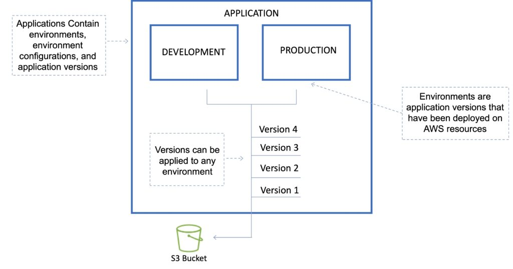

# AWS - Elastic BeanStalk

AWS Elastic Beanstalk can be used to quickly deploy and manage applications in the AWS Cloud.

Developers upload applications and Elastic Beanstalk handles the deployment details of capacity provisioning, load balancing, auto-scaling, and application health monitoring.

- Considered a Platform as a Service (PaaS) solution.
- Developers can focus on writing code and don’t need to worry about deploying infrastructure.
- Integrated with CloudWatch and X-Ray for performance data and metrics.
- Integrates with Amazon VPC and AWS IAM.
- Provides fault tolerance within a single region.
- By default applications are publicly accessible.
- Can access logs without logging into application servers.
- When deploying code to Amazon EC2 using Beanstalk, Elastic Beanstalk must resolve application dependencies which can take a long time. A `Golden AMI` is a method of reducing this time by packaging all dependencies, configuration, and software into the AMI before deploying.

## Elastic Beanstalk Layers
There are several layers that make up Elastic Beanstalk and each layer is described below:

**Application:**

Within Elastic Beanstalk, an application is a collection of different elements, such as environments, environment configurations, and application versions.
You can have multiple application versions held within an application.

**Application version:**

An application version is a very specific reference to a section of deployable code.
The application version will point typically to an Amazon s3 bucket containing the code.

- Elastic Beanstalk can store at most `1000` application versions.

- To phase out old versions use a lifecycle policy:

    <strong>
    Time-based – specify max age.

    Count based – specify max number to retain.
    </strong>

- Versions that are in use will not be deleted.

**Environment:**



An environment refers to an application version that has been deployed on AWS resources.
The resources are configured and provisioned by AWS Elastic Beanstalk.
The environment is comprised of all the resources created by Elastic Beanstalk and not just an EC2 instance with your uploaded code.

**Environment tier:**

Determines how Elastic Beanstalk provisions resources based on what the application is designed to do.
Web servers are standard applications that listen for and then process HTTP requests, typically over port 80.
Workers are specialized applications that have a background processing task that listens for messages on an Amazon SQS queue.

**Environment configurations:**

An environment configuration is a collection of parameters and settings that dictate how an environment will have its resources provisioned by Elastic Beanstalk and how these resources will behave.

**Configuration template:**

This is a template that provides the baseline for creating a new, unique environment configuration.

## Deployment Options

Single instance: great for development.

High availability with load balancer: great for production.

### Deployment policies

The deployment policies are: `All at once, Rolling, Rolling with additional batch, and Immutable`.

**All at once:**

Deploys the new version to all instances simultaneously.
All your instances are out of service while the deployment takes place.
Fastest deployment.
Good for quick iterations in the development environment.
You will experience an outage while the deployment is taking place – not ideal for mission-critical systems.
If the update fails, you need to roll back the changes by re-deploying the original version to all your instances.
No additional cost.

**Rolling:**

Update a few instances at a time (batch), and then move onto the next batch once the first batch is healthy (downtime for 1 batch at a time).
The application is running both versions simultaneously.
Each batch of instances is taken out of service while the deployment takes place.
Your environment capacity will be reduced by the number of instances in a batch while the deployment takes place.
Not ideal for performance-sensitive systems.
If the update fails, you need to perform an additional rolling update to roll back the changes.
No additional cost.
Long deployment time.

**Rolling with additional batch:**

Like Rolling but launches new instances in a batch ensuring that there is full availability.
The application is running at capacity.
You can set the bucket size.
The application is running both versions simultaneously.
Small additional cost.
Additional batch is removed at the end of the deployment.
Longer deployment.
Good for production environments.

**Immutable:**

Launches new instances in a new ASG and deploys the version update to these instances before swapping traffic to these instances once healthy.
Zero downtime.
New code is deployed to new instances using an ASG.
High cost as double the number of instances running during updates.
Longest deployment.
Quick rollback in case of failures.
Great for production environments.
Additionally, Elastic Beanstalk supports blue/green deployment.

**Blue / Green deployment:**

This is not a feature within Elastic Beanstalk
You create a new “staging” environment and deploy updates there.
The new environment (green) can be validated independently, and you can roll back if there are issues.
Route 53 can be set up using weighted policies to redirect a percentage of traffic to the staging environment.
Using Elastic Beanstalk, you can “swap URLs” when done with the environment test.
Zero downtime.

The following tables summarizes the different deployment policies:

| Deployment Policy             | Deploy Time | Zero Downtime | Rollback                | Extra Cost       | Reduction in capacity |
| ----------------------------- | ----------- | ------------- | ----------------------- | ---------------- | --------------------- |
| All at once                   | ★           | NO            | Manual redeploy         | NONE             | YES (total)           |
| Rolling                       | ★ ★         | YES           | Manual redeploy         | NONE             | YES (batch size)      |
| Rolling with additional batch | ★ ★ ★       | YES           | Manual redeploy         | YES (batch size) | NO                    |
| Immutable                     | ★ ★ ★ ★     | YES           | Terminate new instances | YES (total)      | NO                    |
| Blue/green                    | ★ ★ ★ ★     | YES           | Swap URL                | YES (varies)     | NO                    |

## Worker environments
If an application performs tasks that take a long time to complete (long-running tasks), offload to a worker environment.

- It allows you to decouple your application tiers.

- Can define periodic tasks in the `cron.yaml` file.


## Elastic Beanstalk Extensions
You can add AWS Elastic Beanstalk configuration files (`.ebextensions`) to your web application’s source code to configure your environment and customize the AWS resources that it contains.

Customization includes defining packages to install, create Linux users and groups, running shell commands, specifying services to enable, configuring a load balancer, etc.

Configuration files are `YAML-` or `JSON`-formatted documents with a `.config` file extension that you place in a folder named `.ebextensions` and deploy in your application source bundle.

The `.ebextensions` folder must be included in the top-level directory of your application source code bundle.

All the parameters set in the UI can be configured in the code.

### Requirements:

- Must be in the `.ebextensions`/directory of the source code.
- `YAML` or `JSON` format.
- `.config` extensions can be included (e.g. `logging.config`).
- You can modify some default settings using **“option_settings”**.
- You can add resources such as **`RDS`, `ElastiCache`, and `DynamoDB`**.

Resources managed by `.ebextensions` get deleted if the environment is terminated.

# Amazon EC2 Auto Scaling
Amazon EC2 Auto Scaling helps you ensure that you have the correct number of Amazon EC2 instances available to handle the load for your application.

- Auto Scaling is a region-specific service.
- Auto Scaling can span multiple AZs within the same AWS region.
- Auto Scaling can be configured from the Console, CLI, SDKs and APIs.
- Auto Scaling works with ELB, CloudWatch and CloudTrail.
- Auto Scaling will try to distribute EC2 instances evenly across AZs.
- Amazon EC2 Auto Scaling offers high availability (HA) when instances are launched into at least two Availability Zones.

## Launch Configuration
Launch configuration is the template used to create new EC2 instances and includes parameters such as instance family, instance type, AMI, key pair, and security groups.

You cannot edit a launch configuration once defined.

A launch configuration:

- Can be created from the AWS console or CLI.
- You can create a new launch configuration, or you can use an existing running EC2 instance to create the launch configuration.
- The AMI must exist on EC2.
- EC2 instance tags and any additional block store volumes created after the instance launch will not be considered.
- If you want to change your launch configurations you have to create a new one, make the required changes, and use that with your auto scaling groups.

You can use a launch configuration with multiple Auto Scaling Groups (ASG).

## Auto-Scaling Group (ASG)
An `Auto Scaling Group (ASG)` is a logical grouping of EC2 instances managed by an Auto Scaling Policy.

An ASG can be edited once defined.

You can attach one or more classic ELBs to your existing ASG.

You can attach one or more Target Groups to your ASG to include instances behind an ALB.

The ELBs must be in the same region.

Once you do this any EC2 instance existing or added by the ASG will be automatically registered with the ASG defined ELBs.

If adding an instance to an ASG would result in exceeding the maximum capacity of the ASG the request will fail.

You can add a running instance to an ASG if the following conditions are met:
- The instance is in a running state.
- The AMI used to launch the instance still exists.
- The instance is not part of another ASG.
- The instance is in the same AZs for the ASG.

When you delete an Auto Scaling group all EC2 instances will be terminated.

If Auto Scaling fails to launch instances in a specific AZ it will try other AZs until successful.

All Elastic IPs and EBS volumes are detached from terminated EC2 instances and will need to be manually reattached.

The ASG can be configured to send an Amazon SNS notification when:
- An instance is launched.
- An instance is terminated.
- An instance fails to launch.
- An instance fails to terminate.

### Merging ASGs.

- Can merge multiple single AZ Auto Scaling Groups into a single multi-AZ ASG.
- Merging can only be performed by using the CLI.
- The process is to rezone one of the groups to cover/span the other AZs for the other ASGs and then delete the other ASGs.
- This can be performed on ASGs with or without ELBs attached to them.

### Cooldown Period:

- The cooldown period is a setting you can configure for your Auto Scaling group that helps to ensure that it doesn’t launch or terminate additional instances before the previous scaling activity takes effect.
- A default cooldown period of 300 seconds is applied when you create your Auto Scaling group.
- You can configure the cooldown period when you create the Auto Scaling group.
- You can override the default cooldown via scaling-specific cooldown.
- The warm-up period is the period in which a newly launched EC2 instance in an ASG that uses step scaling is not considered toward the ASG metrics.

## Scaling Options

The scaling options define the triggers and when instances should be provisioned/de-provisioned.

There are five scaling options:

- `Maintain` – keep a specific or minimum number of instances running.
- `Manual` – use maximum, minimum, or a specific number of instances.
- `Scheduled` – increase or decrease the number of instances based on a schedule.
- `Dynamic` – scale based on real-time system metrics (e.g. `CloudWatch metrics`).
- `Predictive` – machine learning to schedule the right number of EC2 instances in anticipation of approaching traffic changes.

The following table describes the scaling options available and when to use them:

| Scaling    | Description                                                      | When to use                                                                                                                     |
| ---------- | ---------------------------------------------------------------- | ------------------------------------------------------------------------------------------------------------------------------- |
| Maintain   | Ensures the required number of instances are running             | Use when you always need a known number of instances running at all times                                                       |
| Manual     | Manually change desired capacity                                 | Use when your needs change rarely enough that you’re ok the make manual changes                                                 |
| Scheduled  | Adjust min/max on specific dates/times or recurring time periods | Use when you know when your busy and quiet times are. Useful for ensuring enough instances are available before very busy times |
| Dynamic    | Scale in response to system load or other triggers using metrics | Useful for changing capacity based on system utilization, e.g. CPU hits 80%.                                                    |
| Predictive | predict capacity required ahead of time using ML                 | Useful for when capacity, and number of instances is unknown.                                                                   |

### Scheduled Scaling
Scaling based on a schedule allows you to scale your application ahead of predictable load changes.

For example, you may know that traffic to your application is highest between 9am and 12pm Monday-Friday.

### Dynamic Scaling
Amazon EC2 Auto Scaling enables you to follow the demand curve for your applications closely, reducing the need to manually provision Amazon EC2 capacity in advance.

For example, you can track the CPU utilization of your EC2 instances or the “Request Count Per Target” to track the number of requests coming through an Application Load Balancer.

Amazon EC2 Auto Scaling will then automatically adjust the number of EC2 instances as needed to maintain your target.

### Predictive Scaling
Predictive Scaling uses machine learning to schedule the optimum number of EC2 instances in anticipation of upcoming traffic changes.

Predictive Scaling predicts future traffic, including regularly occurring spikes, and provisions the right number of EC2 instances in advance.

Predictive Scaling uses machine learning algorithms to detect changes in daily and weekly patterns and then automatically adjust forecasts.

You can configure the scaling options through Scaling Policies which determine when, if, and how the ASG scales out and in.

The following table describes the scaling policy types available for dynamic scaling policies and when to use them (more detail further down the page):

| Scaling                | Policy                                                                                                                                     | What it is	When to use                                                                    |
| ---------------------- | ------------------------------------------------------------------------------------------------------------------------------------------ | ----------------------------------------------------------------------------------------- |
| Target Tracking Policy | Adds or removes capacity as required to keep the metric at or close to the specific target value.                                          | You want to keep the CPU usage of your ASG at 70%                                         |
| Simple Scaling Policy  | Waits for the health check and cool down periods to expire before re-evaluating                                                            | Useful when load is erratic. AWS recommends step scaling instead of simple in most cases. |
| Step Scaling Policy    | Increases or decreases the configured capacity of the Auto Scaling group based on a set of scaling adjustments, known as step adjustments. | You want to vary adjustments based on the size of the alarm breach                        |

The diagram below depicts an Auto Scaling group with a Scaling policy set to a minimum size of 1 instance, a desired capacity of 2 instances, and a maximum size of 4 instances:


### Scaling based on Amazon SQS
Can also scale based on an Amazon Simple Queue Service (SQS) queue.

This comes up as an exam question for SAA-C02.

Uses a custom metric that’s sent to Amazon CloudWatch that measures the number of messages in the queue per EC2 instance in the Auto Scaling group.

A target tracking policy configures your Auto Scaling group to scale based on the custom metric and a set target value. CloudWatch alarms invoke the scaling policy.

A custom “backlog per instance” metric is used to track the number of messages in the queue and also the number available for retrieval.

Can base the adjustments off the SQS Metric `“ApproximateNumberOfMessages”`.

## Launch Templates vs Launch Configurations
Launch templates are like launch configurations in that they specify the instance configuration information.

Information includes the ID of the Amazon Machine Image (AMI), the instance type, a key pair, security groups, and the other parameters that you use to launch EC2 instances.

Launch templates include additional features such as supporting multiple versions of a template.

With versioning, you can create a subset of the full set of parameters and then reuse it to create other templates or template versions.

## EC2 Auto Scaling Lifecycle Hooks
Lifecycle pause EC2 instances as an Auto Scaling group launches or terminates them so you can perform custom actions.

Paused instances remain in a wait state either until you complete the lifecycle action using the `complete-lifecycle-action` command or the `CompleteLifecycleAction` operation, or until the timeout period ends (`one hour` by default).

Lifecycle hooks provide greater control over how instances launch and terminate.

You can send notifications when an instance enters a wait state using `Amazon EventBridge, Amazon SNS, or Amazon SQS` to receive the notifications.

## Monitoring and Reporting
When Auto Scaling group metrics are enabled the Auto Scaling group sends sampled data to CloudWatch every minute (no charge).

The AWS/AutoScaling namespace includes the following metrics which are sent to CloudWatch every 1 minute:

```
- GroupMinSize
- GroupMaxSize
- GroupDesiredCapacity
- GroupInServiceInstances
- GroupStandbyInstances
- GroupTerminatingInstances
- GroupTotalInstances
```

EC2 Auto Scaling uses health checks to check if instances are healthy and available.

- By default Auto Scaling uses EC2 status checks.
- Auto Scaling supports `ELB health checks` and custom health checks in addition to the EC2 status checks.
- If any of the configured health checks returns an unhealthy status the instance will be terminated.
- With `ELB health checks` enabled an instance is marked as unhealthy if the ELB reports it as `OutOfService`.
- A healthy instance enters the `InService` state.
- If an EC2 instance is marked as unhealthy it will be scheduled for replacement.
- If connection draining is enabled, EC2 Auto Scaling will wait for any in-flight requests to complete or timeout before terminating instances.
- The health check grace period is a period of time in which a new instance is allowed to warm up before health check are performed (`300 seconds` by default).

> Note: When using Elastic Load Balancers it is an AWS best practice to enable the `ELB health checks`. If you don’t, EC2 status checks may show an instance as being healthy that the `ELB` has determined is unhealthy. In this case the instance will be removed from service by the ELB but will not be terminated by Auto Scaling.

## Authorization and Access Control
EC2 Auto Scaling support `identity-based` IAM policies.

Amazon EC2 Auto Scaling does not support `resource-based` policies.

Amazon EC2 Auto Scaling uses `service-linked` roles for the permissions that it requires to call other AWS services on your behalf.

A `service-linked` role is a unique type of IAM role that is linked directly to an AWS service.

There is a default `service-linked` role for your account, named `AWSServiceRoleForAutoScaling`.

This role is automatically assigned to your Auto Scaling groups unless you specify a different `service-linked` role.

Amazon EC2 Auto Scaling also does not support `Access Control Lists (ACLs)`.

You can apply `tag-based`, `resource-level` permissions in the `identity-based` policies that you create for Amazon EC2 Auto Scaling.

This offers better control over which resources a user can create, modify, use, or delete.