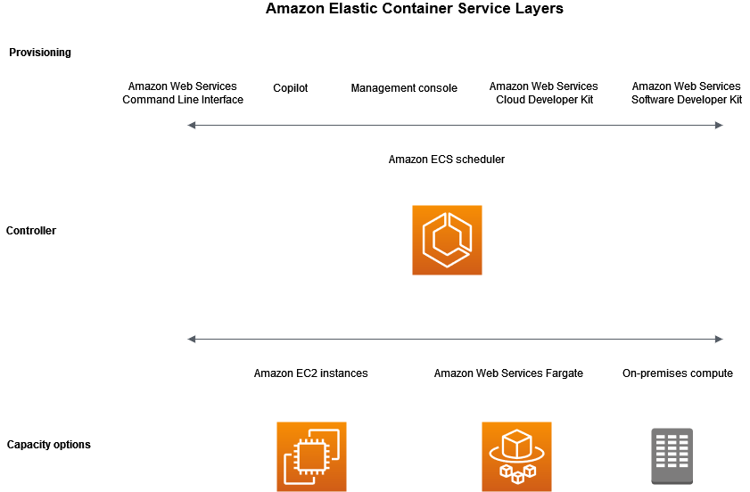
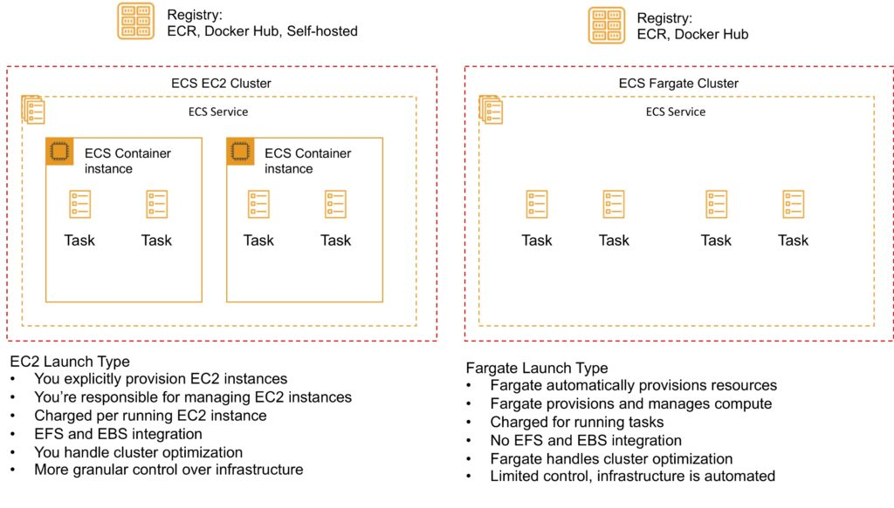
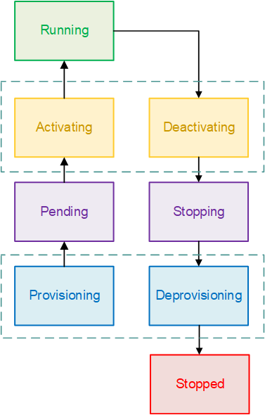
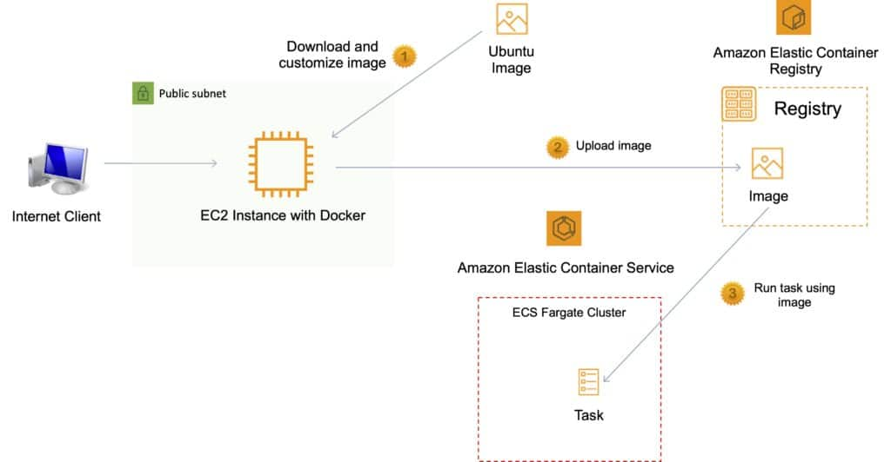
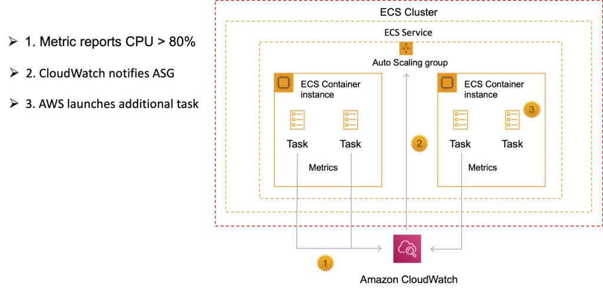
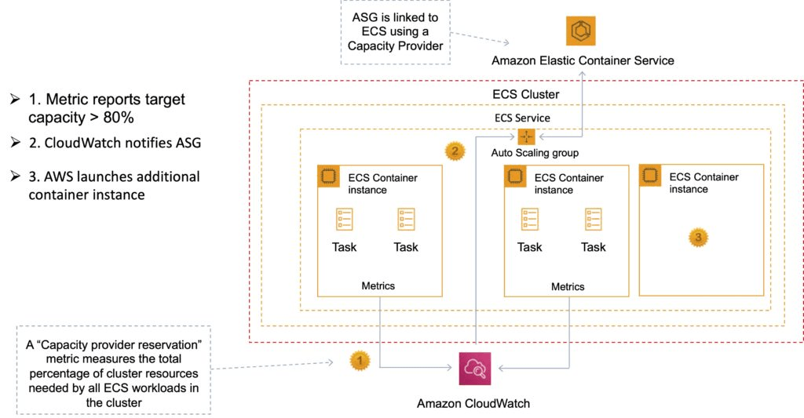

# Amazon ECS
Amazon Elastic Container Service (Amazon ECS) is a fully managed container orchestration service that helps you easily deploy, manage, and scale containerized applications. As a fully managed service, Amazon ECS comes with AWS configuration and operational best practices built-in. It's integrated with both AWS and third-party tools, such as Amazon Elastic Container Registry and Docker. This integration makes it easier for teams to focus on building the applications, not the environment. You can run and scale your container workloads across AWS Regions in the cloud, and on-premises, without the complexity of managing a control plane.

Amazon ECS can be used to schedule the placement of containers across clusters based on resource needs and availability requirements.

There is no additional charge for Amazon ECS. You pay for:

- Resources created with the `EC2 Launch Type` (e.g. EC2 instances and EBS volumes).
- The number and configuration of tasks you run for the `Fargate Launch Type`.

It is possible to use Elastic Beanstalk to handle the provisioning of an Amazon ECS cluster, load balancing, auto-scaling, monitoring, and placing your containers across your cluster. Alternatively use ECS directly for more fine-grained control for customer application architectures.

ECS (and Lambda) does not support `In-Place` Deployment type.

## ECS Terminology
The following table provides an overview of some of the terminology used with Amazon ECS:

| Amazon ECS Term    | Definition                                                                                                             |
| ------------------ | ---------------------------------------------------------------------------------------------------------------------- |
| Cluster            | Logical Grouping of EC2 Instances                                                                                      |
| Container Instance | EC2 instance running the ECS agent                                                                                     |
| Image              | Containers are created from a read-only template that's called an image. Images are typically built from a Dockerfile. |
| DockerFile         | A Dockerfile is a plaintext file that contains the instructions for building a container.                              |
| Task Definition    | Blueprint that describes how a docker container should launch                                                          |
| Task               | A running container using settings in a Task Definition                                                                |
| Service            | Defines long running tasks – can control task count with Auto Scaling and attach an ELB                                |

## ECS Components

There are three layers in Amazon ECS:

### **Capacity** - The infrastructure where your containers run

- **Amazon EC2 instances in the AWS cloud**: You choose the instance type, the number of instances, and manage the capacity.

- **Serverless (AWS Fargate (Fargate)) in the AWS cloud**: Fargate is a serverless, pay-as-you-go compute engine. With Fargate you don't need to manage servers, handle capacity planning, or isolate container workloads for security.

- **On-premises virtual machines (VM) or servers**: Amazon ECS Anywhere provides support for registering an external instance such as an on-premises server or virtual machine (VM), to your Amazon ECS cluster.

### **Controller**
Deploy and manage your applications that run on the containers

### **Provisioning**
The tools that you can use to interface with the scheduler to deploy and manage your applications and containers



## ECS Clusters
ECS Clusters are a logical grouping of container instances that you can place tasks on.

A default cluster is created but you can then create multiple clusters to separate resources.

ECS allows the definition of a specified number (desired count) of tasks to run in the cluster.

Clusters can contain tasks using the Fargate and EC2 launch type.

For clusters with the EC2 launch type clusters can contain different container instance types.

Each container instance may only be part of one cluster at a time.

“Services” provide auto-scaling functions for ECS.

Clusters are region specific.

You can create IAM policies for your clusters to allow or restrict users’ access to specific clusters.

### ECS Cluster - Launch Types

An Amazon ECS launch type determines the type of infrastructure on which your tasks and services are hosted.

There are two launch types, and the table below describes some of the differences between the two launch types:

| Amazon EC2                                                   | Amazon Fargate                                                           |
| ------------------------------------------------------------ | ------------------------------------------------------------------------ |
| You can explicitly provision EC2 instances                   | The control plan asks for resources and Fargate automatically provisions |
| You’re responsible for upgrading, patching, care of EC2 pool | Fargate provisions compute as needed                                     |
| You must handle cluster optimization                         | Fargate handles customer optimizations                                   |
| More granular control over infrastructure                    | Limited control, as infrastructure is automated                          |

### Fargate Launch Type
The Fargate launch type allows you to run your containerized applications without the need to provision and manage the backend infrastructure. Just register your task definition and Fargate launches the container for you.
Fargate Launch Type is a serverless infrastructure managed by AWS.
Fargate only supports container images hosted on Elastic Container Registry (ECR) or Docker Hub.

### EC2 Launch Type
The EC2 launch type allows you to run your containerized applications on a cluster of Amazon EC2 instances that you manage.
Private repositories are only supported by the EC2 Launch Type.

The following diagram shows the two launch types and summarizes some key differences:



## Images
Containers are created from a read-only template called an `image` which has the instructions for creating a Docker container.

Images are built from a `Dockerfile`.

Only Docker containers are currently supported.

An image contains the instructions for creating a Docker container.

Images are stored in a registry such as DockerHub or AWS Elastic Container Registry (ECR).

ECR is a managed AWS Docker registry service that is secure, scalable, and reliable.

ECR supports private Docker repositories with resource-based permissions using AWS IAM to access repositories and images.

Developers can use the Docker CLI to push, pull and manage images.

## ECS Tasks
A running container is called a `task`. A **task definition** is required to run Docker containers in Amazon ECS. A task definition is a text file in `JSON` format that describes one or more containers, up to a `maximum of 10`.

Task definitions use Docker images to launch containers.

Some of the parameters you can specify in a task definition include:

- Which Docker images to use with the containers in your task.
- How much CPU and memory to use with each container.
- Whether containers are linked together in a task.
- The Docker networking mode to use for the containers in your task.
- What (if any) ports from the container are mapped to the host container instances.
- Whether the task should continue if the container finished or fails.
- The commands the container should run when it is started.
- Environment variables that should be passed to the container when it starts.
- Data volumes that should be used with the containers in the task.
- IAM role the task should use for permissions.

You can use Amazon ECS `Run task` to run one or more tasks once.

### Task LifeCycle
When a task is started, either manually or as part of a service, it can pass through several states before it finishes on its own or is stopped manually.

The flow chart below shows the task lifecycle flow.



`PROVISIONING`

Amazon ECS has to perform additional steps before the task is launched. For example, for tasks that use the awsvpc network mode, the elastic network interface needs to be provisioned.

`PENDING`

This is a transition state where Amazon ECS is waiting on the container agent to take further action. A task stays in the pending state until there are available resources for the task.

`ACTIVATING`

This is a transition state where Amazon ECS has to perform additional steps after the task is launched but before the task can transition to the RUNNING state. For example, for tasks that have service discovery configured, the service discovery resources must be created. For tasks that are part of a service that's configured to use multiple Elastic Load Balancing target groups, the target group registration occurs during this state.

`RUNNING`

The task is successfully running.

`DEACTIVATING`

This is a transition state where Amazon ECS has to perform additional steps before the task is stopped. For example, for tasks that are part of a service that's configured to use multiple Elastic Load Balancing target groups, the target group deregistration occurs during this state.

`STOPPING`

This is a transition state where Amazon ECS is waiting on the container agent to take further action.

For Linux containers, the container agent will send the SIGTERM signal to notify the application needs to finish and shut down, and then send a SIGKILL after waiting the StopTimeout duration set in the task definition.

`DEPROVISIONING`

Amazon ECS has to perform additional steps after the task has stopped but before the task transitions to the STOPPED state. For example, for tasks that use the awsvpc network mode, the elastic network interface needs to be detached and deleted.

`STOPPED`

The task has been successfully stopped.

If your task stopped because of an error, see Viewing Amazon ECS stopped task errors.

`DELETED`

This is a transition state when a task stops. This state is not displayed in the console, but is displayed in describe-tasks.

### ECS Task placement

>> **Very important for exam**

You can use task placement to configure Amazon ECS to place your tasks on container instances that meet certain criteria, for example an Availability Zone or instance type.

The following are task placement components:

- **Task placement strategy** - The algorithm for selecting container instances for task placement or tasks for termination. For example, Amazon ECS can select container instances at random, or it can select container instances such that tasks are distributed evenly across a group of instances.
- **Task group** - A group of related tasks, for example database tasks.
- **Task placement constraint** - These are rules that must be met in order to place a task on a container instance. If the constraint is not met, the task is not placed and remains in the PENDING state. For example, you can use a constraint to place tasks only on a particular instance type.

Amazon ECS has different algorithms for the launch types.

#### EC2 Launch Type Task Placement

For tasks that use the EC2 launch type, Amazon ECS must determine where to place the task based on the requirements specified in the task definition, such as CPU and memory. Similarly, when you scale down the task count, Amazon ECS must determine which tasks to terminate. You can apply task placement strategies and constraints to customize how Amazon ECS places and terminates tasks.

You specify task placement strategies in the service definition, or task definition using the placementStrategy parameter.

```json
"placementStrategy": [
    {
        "field": "The field to apply the placement strategy against",
        "type": "The placement strategy to use"
    }
]
```

The following table describes the available types and fields. 
  
| type    | description                                                                                                                                                                                                                                                                                                                                                                                                                                                                                                          | Valid field values                                                                                                                                                            |
| ------- | -------------------------------------------------------------------------------------------------------------------------------------------------------------------------------------------------------------------------------------------------------------------------------------------------------------------------------------------------------------------------------------------------------------------------------------------------------------------------------------------------------------------- | ----------------------------------------------------------------------------------------------------------------------------------------------------------------------------- |
| binpack | Tasks are placed on container instances so as to leave the least amount of unused CPU or memory. This strategy minimizes the number of container instances in use. <br>  <br> When this strategy is used and a scale-in action is taken, Amazon ECS terminates tasks. It does this based on the amount of resources that are left on the container instance after the task is terminated. The container instance that has the most available resources left after task termination has that task terminated.         | cpu & memory                                                                                                                                                                  |
| random  | Tasks are placed randomly.                                                                                                                                                                                                                                                                                                                                                                                                                                                                                           | Not used                                                                                                                                                                      |
| spread  | Tasks are placed evenly based on the specified value. <br>  <br> Service tasks are spread based on the tasks from that service. Standalone tasks are spread based on the tasks from the same task group. For more information about task groups, see Group related Amazon ECS tasks. <br> <br>  When the spread strategy is used and a scale-in action is taken, Amazon ECS selects tasks to terminate that maintain a balance across Availability Zones. Within an Availability Zone, tasks are selected at random. | instanceId (or host, which has the same effect) <br>  <br> any platform or custom attribute that's applied to a container instance, such as `attribute:ecs.availability-zone` |

>> Note: You can create a task placement strategy that uses multiple strategies by creating arrays of strategies in the order that you want them performed. For example, if you want to spread tasks across Availability Zones and then bin pack tasks based on memory within each Availability Zone, specify the Availability Zone strategy followed by the memory strategy.

#### Fargate Launch Type Task Placement

Task placement strategies and constraints aren't supported for tasks using the Fargate launch type. Fargate will try its best to spread tasks across accessible Availability Zones. If the capacity provider includes both Fargate and Fargate Spot, the spread behavior is independent for each capacity provider.

# ECS Container Agent
The ECS container agent allows container instances to connect to the cluster.

The container agent runs on each infrastructure resource on an ECS cluster.

The ECS container agent is included in the Amazon ECS optimized AMI and can also be installed on any EC2 instance that supports the ECS specification (only supported on EC2 instances).

Linux and Windows based.

For non-AWS Linux instances to be used on AWS you must manually install the ECS container agent.

# Amazon Elastic Container Registry (ECR)
Amazon Elastic Container Registry (ECR) is a fully managed Docker container registry that makes it easy for developers to store, manage, and deploy Docker container images.

Amazon ECR is integrated with Amazon Elastic Container Service (ECS).

Amazon ECR hosts your images in a highly available and scalable architecture, allowing you to reliably deploy containers for your applications.

Integration with AWS Identity and Access Management (IAM) provides resource-level control of each repository.



### Pushing and Pulling Images to ECR
You must first authenticate.

To authenticate Docker to an Amazon ECR registry with get-login-password, run the aws ecr get-login-password command:

`aws ecr get-login-password –region us-east-1 | docker login –username AWS –password-stdin aws_account_id.dkr.ecr.us-east-1.amazonaws.com`

Tag your image:

`docker tag e9ae3c220b23 aws_account_id.dkr.ecr.region.amazonaws.com/my-web-app`

Push the image using the docker push command:

`docker push aws_account_id.dkr.ecr.region.amazonaws.com/my-web-app`

Pull the image using the docker pull command. The image name format should be registry/repository[:tag] to pull by tag, or registry/repository[@digest] to pull by digest.

`docker pull aws_account_id.dkr.ecr.region.amazonaws.com/my-web-app:e9ae3c220b23`

# Security with ECS
Your Amazon ECS `tasks` can have an `IAM role` associated with them. The permissions granted in the IAM role are assumed by the containers running in the task. The following explain the benefits of using IAM roles with your tasks.

• `Credential Isolation`: A container can only retrieve credentials for the IAM role that is defined in the task definition to which it belongs; a container never has access to credentials that are intended for another container that belongs to another task.

• `Authorization`: Unauthorized containers cannot access IAM role credentials defined for other tasks.

• `Auditability`: Access and event logging is available through CloudTrail to ensure retrospective auditing. Task credentials have a context of taskArn that is attached to the session, so CloudTrail logs show which task is using which role.

### Gotchas
- It is **NOT RECOMMENDED** to assign AWS service permissions to an ECS instance profile. The privileges assigned to ECS instance profiles on the Amazon ECS instances are available to all tasks running on the instance. This is **not secure and AWS recommend that you limit the permissions you assign to the instance profile**.

- Access keys are not a secure way of providing authentication. It is better to use IAM roles that obtain temporary security permissions using the `AWS STS` service.

# Auto Scaling in ECS
Amazon EC2 Auto Scaling helps you maintain application availability and allows you to automatically add or remove EC2 instances according to conditions you define. You can use the fleet management features of EC2 Auto Scaling to maintain the health and availability of your fleet.

You can also use the dynamic and predictive scaling features of EC2 Auto Scaling to add or remove EC2 instances. Dynamic scaling responds to changing demand and predictive scaling automatically schedules the right number of EC2 instances based on predicted demand. Dynamic scaling and predictive scaling can be used together to scale faster.

## Launch Configuration
A launch configuration is an instance configuration template that an Auto Scaling group uses to launch EC2 instances. When you create a launch configuration, you specify information for the instances. Include the ID of the Amazon Machine Image (AMI), the instance type, a key pair, one or more security groups, and a block device mapping. If you've launched an EC2 instance before, you specified the same information in order to launch the instance.

## Service Auto Scaling
Amazon ECS service can optionally be configured to use Service Auto Scaling to adjust the desired task count up or down automatically.

Service Auto Scaling leverages the Application Auto Scaling service to provide this functionality.

Amazon ECS Service Auto Scaling supports the following types of scaling policies:

- **Target Tracking Scaling Policies**
  Increase or decrease the number of tasks that your service runs based on a target value for a specific CloudWatch metric. This is similar to the way that your thermostat maintains the temperature of your home. You select temperature and the thermostat does the rest.
- **Step Scaling Policies**
  Increase or decrease the number of tasks that your service runs in response to CloudWatch alarms. Step scaling is based on a set of scaling adjustments, known as step adjustments, which vary based on the size of the alarm breach.
- **Scheduled Scaling**
  Increase or decrease the number of tasks that your service runs based on the date and time.



## Cluster Auto Scaling
Uses an Amazon ECS resource type called a `Capacity Provider`.

A Capacity Provider can be associated with an `EC2 Auto Scaling Group (ASG)`.

When you associate an ECS Capacity Provider with an ASG and add the Capacity Provider to an ECS cluster, the cluster can now scale your ASG automatically by using two new features of ECS:

1. **Managed scaling**, with an automatically created scaling policy on your ASG, and a new scaling metric (Capacity Provider Reservation) that the scaling policy uses; and

2. **Managed instance termination protection**, which enables container-aware termination of instances in the ASG when scale-in happens.



# Amazon EKS
The Amazon Elastic Kubernetes Service (Amazon EKS) is a managed service for running Kubernetes on AWS and on-premises.

Amazon EKS can run on Amazon EC2 or AWS Fargate.

Integrates with Application Load Balancers, AWS IAM for RBA and Amazon VPC.

Amazon EKS provides a scalable and highly available Kubernetes control plane running across multiple AWS Availability Zones (AZs).

Amazon EKS automatically manages availability and scalability of Kubernetes API servers and etcd persistence layer.

Amazon EKS runs the Kubernetes control plane across three AZs to ensure high availability, and automatically detects and replaces unhealthy control plane nodes.

> **Exam tip:** The principle use case is when organizations need a consistent control plane for managing containers across hybrid clouds and multicloud environments.

# Amazon ECS vs Amazon EKS

Amazon also provide the `Elastic Container Service for Kubernetes (Amazon EKS)` which can be used to deploy, manage, and scale containerized applications using Kubernetes on AWS.

The table below describes some of the differences between these services to help you understand when you might choose one over the other:

| Amazon ECS                                                                                       | Amazon EKS                                                                                           |
| ------------------------------------------------------------------------------------------------ | ---------------------------------------------------------------------------------------------------- |
| Managed, highly available, highly scalable container platform                                    | Managed, highly available, highly scalable container platform                                        |
| AWS-specific platform that supports Docker Containers                                            | Compatible with upstream Kubernetes so it’s easy to lift and shift from other Kubernetes deployments |
| Considered simpler and easier to use                                                             | Considered more feature-rich and complex with a steep learning curve                                 |
| Leverages AWS services like Route 53, ALB, and CloudWatch                                        | A hosted Kubernetes platform that handles many things internally                                     |
| “Tasks” are instances of containers that are run on underlying compute but more of less isolated | “Pods” are containers collocated with one another and can have shared access to each other           |
| Limited extensibility                                                                            | Extensible via a wide variety of third-party and community add-ons.                                  |
