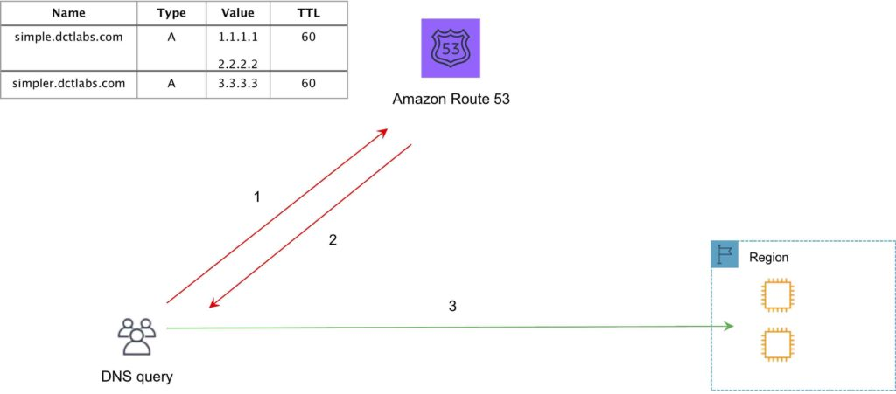
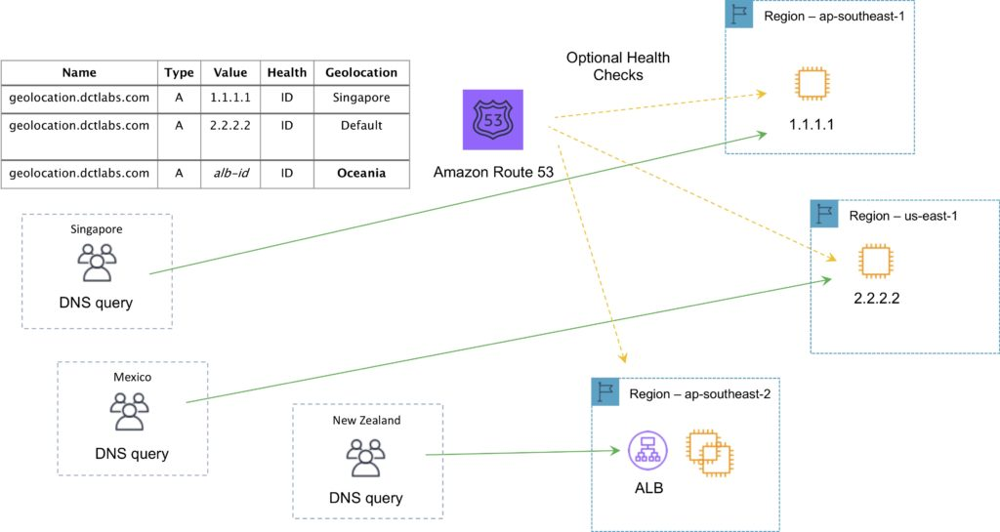
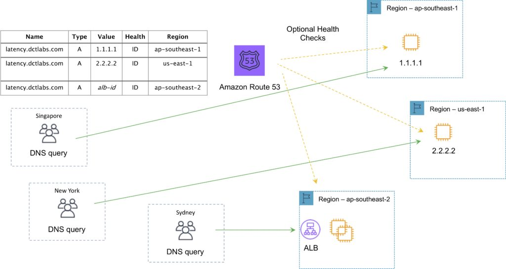
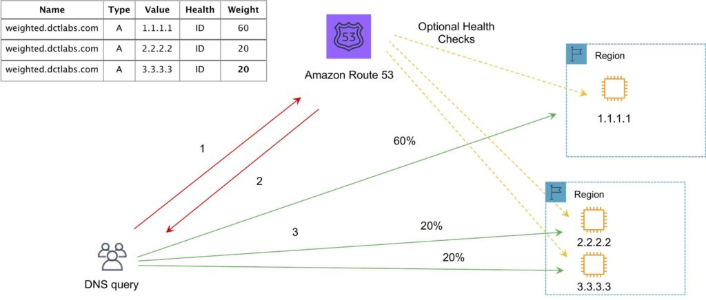

# Amazon Route 53
Amazon Route 53 is a highly available and scalable `Domain Name System (DNS)` web service designed to provide highly reliable and cost-effective routing of end users to internet applications.

Amazon Route 53 offers the following functions:

- Domain name registry.
- DNS resolution.
- Health checking of resources.

Route 53 can perform any combination of these functions.

You can control management access to your Amazon Route 53 hosted zone by using IAM.

There is a default limit of 50 domain names, but this can be increased by contacting support.

Private DNS is a Route 53 feature that lets you have authoritative DNS within your VPCs without exposing your DNS records including the name of the resource and its IP address(es) to the Internet.

## Hosted Zones
A hosted zone is a collection of records for a specified domain.

There are two types of zones:

**Public host zone** – determines how traffic is routed on the Internet.

**Private hosted zone for VPC** – determines how traffic is routed within `VPC` (resources are not accessible outside the VPC). 

You can associate the Route 53 private hosted zone in one account with a `VPC` in another account.

## Alias records
The Alias record is a Route 53 specific record type.

You can use Alias records to map custom domain names (such as api.example.com) both to API Gateway custom regional APIs and edge-optimized APIs and to Amazon VPC interface endpoints.

An alias record can only point to a `CloudFront distribution, Elastic Beanstalk environment, ELB, S3 bucket as a static website`, or to `another record in the same hosted zone` that you’re creating the alias record in.

## Routing Policies
Routing policies determine how Route 53 responds to queries.

The following table highlights the key function of each type of routing policy:

| Policy            | What it Does                                                                        |
| ----------------- | ----------------------------------------------------------------------------------- |
| Simple            | Simple DNS response providing the IP address associated with a name                 |
| Failover          | If primary is down (based on health checks), routes to secondary destination        |
| Geolocation       | Uses geographic location you’re in (e.g. Europe) to route you to the closest region |
| Geoproximity      | Routes you to the closest region within a geographic area                           |
| Latency           | Directs you based on the lowest latency route to resources                          |
| Multivalue answer | Returns several IP addresses and functions as a basic load balancer                 |
| Weighted          | Uses the relative weights assigned to resources to determine which to route to      |

### Simple Routing Policy
An A record is associated with one or more IP addresses.

Uses round robin.

Does not support health checks.

The following diagram depicts an Amazon Route 53 Simple routing policy configuration:



### Failover Routing Policy

- Failover to a secondary IP address.
- Associated with a health check.
- Used for active-passive.
- Routes only when the resource is healthy.
- Can be used with ELB.
- When used with Alias records set Evaluate Target Health to “Yes” and do not use health checks.

### Geo-location Routing Policy
Use for routing traffic based on the location of resources and, optionally, shift traffic from resources in one location to resources in another.

- Caters to different users in different countries and different languages.
- Contains users within a particular geography and offers them a customized version of the workload based on their specific needs.
- Geolocation can be used for localizing content and presenting some or all your website in the language of your users.
- Can also protect distribution rights.
- Can be used for spreading load evenly between regions.
- If you have multiple records for overlapping regions, Route 53 will route to the smallest geographic region.
- You can create a default record for IP addresses that do not map to a geographic location.

The following diagram depicts an Amazon Route 53 Geolocation routing policy configuration:



### Latency Routing Policy
AWS maintains a database of latency from different parts of the world.

- Focused on improving performance by routing to the region with the lowest latency.
- You create latency records for your resources in multiple EC2 locations.

The following diagram depicts an Amazon Route 53 Latency based routing policy configuration:



### Multi-value Answer Routing Policy
Use for responding to DNS queries with up to eight healthy records selected at random.

### Weighted Routing Policy
- Like simple but you can specify a weight per IP address.
- You create records that have the same name and type and assign each record a relative weight.
- Numerical value that favors one IP over another.
- To stop sending traffic to a resource you can change the weight of the record to 0.

The following diagram depicts an Amazon Route 53 Weighted routing policy configuration:



# AWS Certificate Management
Create, store, and renew SSL/TLS X.509 certificates

Single domains, multiple domain names and wildcards

Integrates with several AWS services including:

```json
Elastic Load Balancing.
Amazon CloudFront.
AWS Elastic Beanstalk.
AWS Nitro Enclaves.
AWS CloudFormation.
```
Public certificates are signed by the AWS public Certificate Authority.

You can also create a Private CA with ACM.

Can then issue private certificates.

You can also import certificates from third-party issuers.