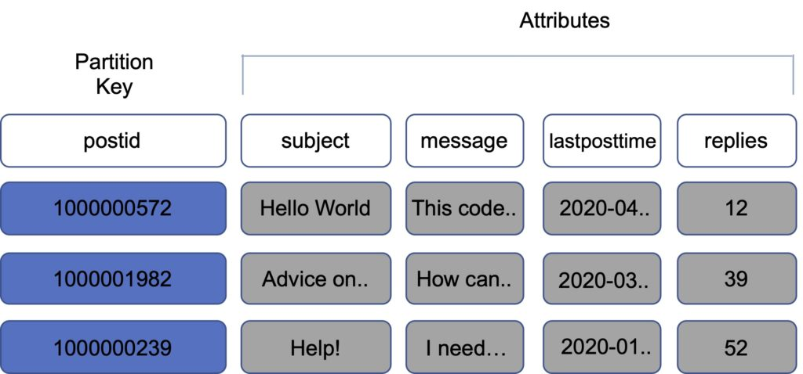
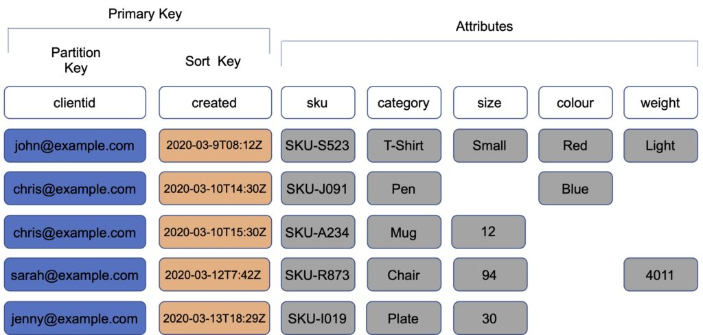
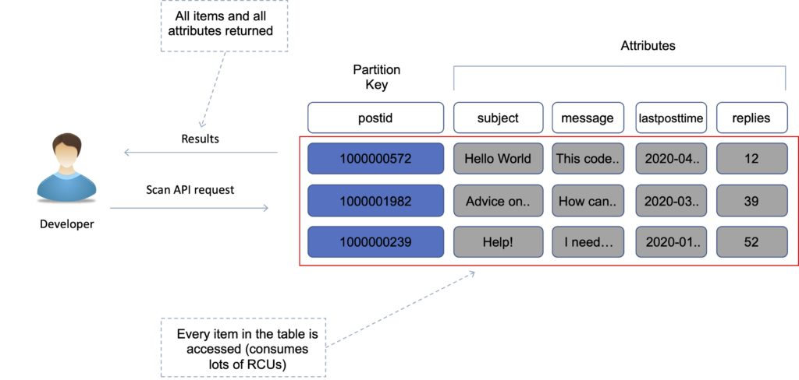
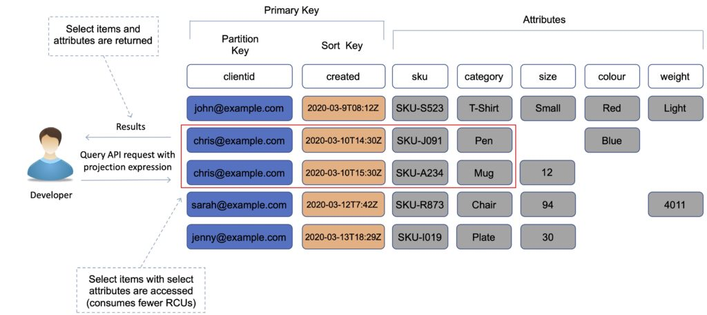

# Usecases of all AWS database solutions

| Data Store         | When to Use                                                                                                                                  |
| ------------------ | -------------------------------------------------------------------------------------------------------------------------------------------- |
| Database on EC2    | Ultimate control over database <br> Preferred DB not available under RDS                                                                     |
| Amazon RDS         | Need traditional relational database for OLTP <br> Your data is well formed and structured <br> Existing apps requiring RDBMS                |
| Amazon DynamoDB    | Name/value pair data or unpredictable data structure <br> In-memory performance with persistence <br>  High I/O needs <br> Scale dynamically |
| Amazon RedShift    | Massive amounts of data <br> Primarily OLAP workloads                                                                                        |
| Amazon Neptune     | Relationships between objects a major portion of data value                                                                                  |
| Amazon Elasticache | Fast temporary storage for small amounts of data <br> Highly volatile data                                                                   |
| Amazon S3          | BLOBs <br> Static Websites                                                                                                                   |

# Amazon RDS
Amazon Relational Database Service (Amazon RDS) is a managed service that you can use to launch and manage relational databases on AWS.

Amazon RDS is an Online Transaction Processing (OLTP) type of database.

It is best suited to structured, relational data store requirements.

**Managed Service:** Amazon RDS is a fully managed service that automates database management tasks such as provisioning, patching, backup, and recovery, allowing users to focus more on their applications.

Database Engines Supported: Amazon RDS supports various popular relational database engines:

```
MySQL
PostgreSQL
MariaDB
Oracle Database
Microsoft SQL Server
Amazon Aurora (MySQL and PostgreSQL compatible)
```

**Scalability:** Amazon RDS makes it easy to scale your database deployment both vertically (by changing instance types) and horizontally (by adding read replicas for read scalability).

**High Availability:** RDS provides high availability through automated backups, automated failover, and Multi-AZ deployments for supported database engines (such as MySQL, PostgreSQL, and SQL Server).

**Security:** Amazon RDS offers built-in security features to help control access to your databases:

- Encryption at rest using AWS Key Management Service (KMS)
- Network isolation using Amazon VPC (Virtual Private Cloud)
- SSL/TLS encrypted connections
- IAM database authentication

RDS supports both `identity-based` and `resource-based` policies, giving you flexibility in how you manage access control to your RDS resources based on your specific requirements.

**Monitoring and Metrics:** Amazon RDS provides monitoring and metrics through Amazon CloudWatch, which allows you to monitor database performance metrics such as CPU utilization, storage capacity, and more.

**Backup and Restore:** Automated backups are enabled by default with a retention period of up to 35 days. You can also take manual snapshots for backup and restore purposes.

**Performance:**

Amazon RDS uses EBS volumes (never uses instance store) for DB and log storage.

There are three storage types available: 
- General Purpose (gp2) - Moderate I/O workloads upto 3000 IOPS
- Provisioned IOPS (SSD) - I/O intensite workloads upto 80k IOPS
- Magnetic - Old and not recommended max 1000 IOPS

## DB Instance
A DB instance is a virtual database environment in the cloud with the compute and storage resources you specify.

DB instances are available in different instance types that vary in compute, memory, and storage capacity. Examples include `db.t3.micro`, `db.r5.large`, etc. Instance types can be chosen based on the workload and performance requirements of your application.

DB instances can be deployed in `Multi-AZ (Availability Zone)` configurations. This provides high availability and automatic failover capability in case of infrastructure failures.

DB instances support vertical scaling by changing to a larger instance type with more compute power and memory. Horizontal scaling is achieved through the use of `read replicas` for read scalability.

## Multi-AZ Deployments:
**Purpose:** Multi-AZ (Availability Zone) deployments in Amazon RDS are designed to enhance the availability and durability of database instances by automatically replicating data to a standby instance in a different Availability Zone within the same AWS region.

**High Availability:** In the event of a planned maintenance event, DB instance failure, or an Availability Zone outage, Amazon RDS can automatically failover to the standby instance, minimizing downtime.

**Synchronous Replication:** Multi-AZ deployments use synchronous replication to keep data consistent between the primary and standby instances. This ensures that data is durable and available with minimal latency impact.

**Supported Database Engines:** Multi-AZ deployments are available for certain database engines such as MySQL, PostgreSQL, and SQL Server.

**Automatic Failover:** Amazon RDS handles automatic failover from the primary to the standby instance in case of failure or maintenance, reducing the need for manual intervention and improving application resilience.

**Cost:** Multi-AZ deployments typically incur higher costs compared to single-AZ deployments due to the additional infrastructure and data replication overhead.

## Read Replicas:
**Purpose:** Read Replicas in Amazon RDS allow you to create one or more copies of your database instance within the same AWS region or even across different regions.

**Scaling Read Workloads:** Read Replicas are used primarily to offload read-only queries from the primary database instance, improving overall performance and scalability for read-heavy workloads.

**Asynchronous Replication: **Data replication to Read Replicas is asynchronous, meaning there might be slight replication lag compared to the primary instance. However, this allows for greater scalability without impacting the primary workload.

**Use Cases:** Read Replicas are beneficial for applications that require frequent read operations such as reporting, analytics, and scaling read-heavy workloads like web applications.

**Supported Database Engines:** Read Replicas are supported for `MySQL`, `PostgreSQL`, `MariaDB`, and `Aurora` (`MySQL` and `PostgreSQL` compatible).

**Promotion to Standalone Instance:** In case of a primary instance failure, a Read Replica can be promoted to become a standalone instance, but it loses its replication relationship and becomes independent.

## DB Snapshots:
**Purpose:** DB Snapshots in Amazon RDS are `point-in-time` backups of your database instance stored in `Amazon S3`. They capture the entire state of your database at the moment the snapshot is taken.

**Manual Creation:** DB Snapshots can be manually created using the AWS Management Console, CLI, or API. They are user-initiated and provide a way to create backups before making significant changes to your database.

**Retention:** DB Snapshots are retained until explicitly deleted by the user. You can keep snapshots for as long as needed to comply with regulatory requirements or for disaster recovery purposes.

**Storage Cost:** Storing DB Snapshots incurs storage costs based on the size of the database at the time the snapshot was taken.

**Restore Operations:** You can restore a database instance from a DB Snapshot, which recreates the database using the snapshot's data. This is useful for recovering from accidental data loss or corruption.

## DB Backups:
**Automated Backups:** Amazon RDS enables automated backups by default, which are automatically taken daily during a user-defined backup window.

**Retention Period:** Automated backups are retained for a specified retention period, which can be set between 1 to 35 days. These backups are incremental, capturing changes since the last full backup.

**Point-in-Time Recovery: **With automated backups, you can perform point-in-time recovery to restore your database to any second during the retention period. This helps in recovering to specific moments before data loss or corruption occurred.

**Storage Cost:** Storage for automated backups is managed by Amazon RDS and does not count towards your provisioned storage limit. However, it incurs storage costs based on the volume of data stored.

**Manual Snapshots:** In addition to automated backups, you can manually create DB Snapshots for additional backups or to retain backups for longer periods beyond the automated retention period.

# Amazon Dynamo DB
Amazon DynamoDB is a fully managed NoSQL database service that provides fast and predictable performance with seamless scalability. It is a non-relational, key-value type of database. A key-value database stores data as a collection of key-value pairs in which a key serves as a unique identifier.

Data is synchronously replicated across **3 facilities (`AZs`) in a region**.

DynamoDB is made up of:

```markdown
Tables.
Items.
Attributes.
```

`Tables` are a collection of `items` and `items` are made up of `attributes` (columns). `Attributes` consists of a name and a value or set of values.

The aggregate size of an item cannot exceed `400KB` including keys and all attributes.

DynamoDB supports both resource-based and identity-based policies.

## Features of Dynamo DB
Some of the features and benefits of Amazon DynamoDB are summarized in the following table:

| DynamoDB Feature                                   | Benefit                                                                                                                                                                                        |
| -------------------------------------------------- | ---------------------------------------------------------------------------------------------------------------------------------------------------------------------------------------------- |
| Serverless                                         | Fully managed, fault tolerant service                                                                                                                                                          |
| Highly available                                   | 99.99% Availability SLA – 99.999% for Global tables                                                                                                                                            |
| NoSQL type of database with Name / Value structure | Flexible Schema, good for when data is not well structured or unpredictable                                                                                                                    |
| Horizontal scaling                                 | Seamless scalability to any scale with push button scaling or Auto scaling                                                                                                                     |
| DynamoDB Streams                                   | Captures a time-ordered sequence of item-level modifications in a DynamoDB table and durably stores the information for 24 hours. Often used with Lambda and the Kinesis Client Library (KCL). |
| DynamoDB Accelerator (DAX)                         | Fully managed in-memory cache for DynamoDB that increases performance (microsecond latency)                                                                                                    |
| Transaction options                                | Strongly consistent or eventually consistent reads, support for ACID transactions                                                                                                              |
| Backup                                             | Point-in-time recovery down to the second in last 35 days; On-demand backup and restore                                                                                                        |
| Global Tables                                      | Fully managed multi-region, multi-master solution                                                                                                                                              |
## Consistency models in DynamoDB
When reading data from DynamoDB, users can specify whether they want the read to be eventually consistent or strongly consistent:

- **Eventually consistent reads (the default)** – The eventual consistency option maximizes your read throughput. However, an eventually consistent read might not reflect the results of a recently completed write. All copies of data usually reach consistency within a second. Repeating a read after a short time should return the updated data.

- **Strongly consistent reads** — In addition to eventual consistency, DynamoDB also gives you the flexibility and control to request a strongly consistent read if your application, or an element of your application, requires it. A strongly consistent read returns a result that reflects all writes that received a successful response before the read.

- **ACID transactions** – DynamoDB transactions provide developers atomicity, consistency, isolation, and durability (`ACID`) across one or more tables within a single AWS account and region. You can use transactions when building applications that require coordinated inserts, deletes, or updates to multiple items as part of a single logical business operation. DynamoDB performs **two underlying reads or writes of every item in the transaction**: one to prepare the transaction and one to commit the transaction.


## Partitions
Amazon DynamoDB stores data in partitions. A partition is an allocation of storage for a table that is automatically replicated across multiple AZs within an AWS Region. Partition management is handled entirely by DynamoDB—you never have to manage partitions yourself.

DynamoDB allocates sufficient partitions to your table so that it can handle your provisioned throughput requirements.

DynamoDB allocates additional partitions to a table in the following situations:

- If you increase the table’s provisioned throughput settings beyond what the existing partitions can support.
- If an existing partition fills to capacity and more storage space is required.

### Performance considerations
DynamoDB evenly distributes provisioned throughput — `read capacity units (RCUs)` and `write capacity units (WCUs)` among partitions.

If your access pattern exceeds `3000 RCU or 1000 WCU` for a single partition key value, your requests might be throttled.

**Best practices for partition keys:**

- Use high-cardinality attributes – e.g. e-mailid, employee_no, customerid, sessionid, orderid, and so on.
- Use composite attributes – e.g. customerid+productid+countrycode as the partition key and order_date as the sort key.
- Cache popular items – use DynamoDB accelerator (DAX) for caching reads.
- Add random numbers or digits from a predetermined range for write-heavy use cases – e.g. add a random suffix to an invoice number such as INV00023-04593


## Primary Keys in DynamoDB

In DynamoDB, understanding and correctly utilizing primary keys is fundamental to designing efficient and scalable database schemas. Here’s a detailed look at primary keys in DynamoDB:

Every DynamoDB table must have a primary key, which uniquely identifies each item in the table.

The primary key can be either simple (`partition key`) or composite (`partition key and sort key`).

### Simple Primary Key


- Simple Primary Key consists of a single attribute known as the `partition key`. DynamoDB uses the partition key's value as input to an internal hash function to determine the physical partition in which the item is stored.
- Items with the same partition key value are stored together and can be retrieved efficiently using simple key-value lookups.

Example: A table storing customer data might use `CustomerId` as the partition key if each customer ID is unique.

### Composite Primary Key


- Composite (`Partition Key `and `Sort Key`) consists of two attributes:
  - **Partition Key:** Same as above, used to determine the partition.
  - **Sort Key (Range Key):** Specifies the sort order for items with the same partition key. Items within a partition are stored and sorted by the sort key value.

- Composite keys enable efficient querying and sorting of items based on the sort key within each partition.

Example: In a table tracking orders, `CustomerId` could be the partition key, and `OrderId` could be the sort key to enable efficient retrieval of orders for a specific customer or orders within a customer’s history.

### Considerations and limitations

- **Uniqueness:** Values of the partition key must be unique within the table. For composite keys, the combination of partition key and sort key must be unique.

- **Query Flexibility:** Design your primary key to support the types of queries your application needs to perform efficiently. Queries based on equality conditions on the partition key are more efficient than those requiring scans or using filters.

- **Access Patterns:** Understand your application’s access patterns (how you retrieve and manipulate data) to design an appropriate primary key structure.

- **Data Modeling:** Carefully model your data to optimize for query patterns and avoid hot partitions (where a single partition receives disproportionately high read or write activity).

### Choosing Between Simple and Composite Keys:
- Use a simple primary key when each item in the table has a unique identifier.
- Use a composite primary key when items have a hierarchical relationship or when you need to query and sort items within a partition.

## Indexes in DynamoDB

### Global Secondary Indexes (GSI)
DynamoDB also supports `global secondary indexes`. A `GSI` in DynamoDB is a separate data structure that allows you to query the table using an alternative `partition key` (hash key) and optionally a `sort key` (range key), different from the table's primary key.

GSIs enable you to perform queries that wouldn't be efficient using only the primary key, such as querying by different attributes or sorting items differently.

#### Key Features of GSI

- **Different Partition and Sort Keys:** Each GSI has its own partition key and optional sort key, distinct from the table's primary key.
- **Projection:** You can specify which attributes to project into the index (all attributes or just specific ones), optimizing query efficiency by reducing read operations.
- **Consistency:** GSIs provide `eventual consistency` for non-primary key attributes by default, with an option for `strong consistency`.

#### Use Cases of GSI

- **Query Flexibility:** Allow querying by attributes other than the table’s primary key.
- **Diverse Access Patterns:** Support different access patterns and query requirements from those provided by the primary key.
- **Efficiency:** Improve query performance by reducing the need for scans and filters on the base table.

#### Considerations and limitations

- **Cost:** GSIs may incur additional costs in terms of storage and read/write capacity units.
- **Limitations:** Each table can have up to `20 GSIs` (by default), and the attributes chosen as GSI keys must exist in the table.

### Local Secondary Indexes (LSI)
An LSI is similar to a GSI but with some key differences:

- It shares the same partition key as the table's primary key but allows a different sort key.
- LSIs are physically stored together with the table data in the same partitions, which means they inherit the partition and sort key attributes from the table's primary key.

#### Key Features of LSI

- **Same Partition Key:** Uses the same partition key as the table's primary key, ensuring `strong consistency` for data within the same partition.
- **Different Sort Key:** Allows querying by a different attribute as the sort key, offering flexibility in sorting items within a partition.

#### Use Cases

- **Range Queries:** Perform range queries within a partition using a different sort key.
- **Cost Efficiency:** LSIs do not incur additional storage costs beyond the base table, unlike GSIs.

#### Considerations and limitations

- **Limitations:** Each table can have up to `5 LSIs`.
- **Design Considerations:** Plan LSIs based on your application’s access patterns and ensure they align with the table’s primary key structure.

### GSI vs LSI
- **Access Patterns:** GSIs offer more flexibility in query patterns compared to LSIs, as they can use different partition and sort keys.
- **Consistency:** LSIs provide strong consistency for queries within the same partition, whereas GSIs offer eventual consistency by default.
- **Cost:** LSIs are more cost-effective in terms of storage since they reuse the same partition keys as the base table.
- **Limitations**: Each table can have up to `5 LSIs` and `30 GSIs`.

## Scan and Query API calls

### Scan
- The Scan operation returns one or more items and item attributes by accessing every item in a table or a secondary index.
- A single Scan operation reads up to the maximum number of items set (if using the Limit parameter) or a maximum of `1 MB`.
- Scan API calls can use a lot of RCUs as they access every item in the table.
- You can use the ProjectionExpression parameter so that Scan only returns some of the attributes, rather than all of them. If you need to further refine the Scan results, you can optionally provide a filter expression.
- Scan uses `eventually consistent` reads when accessing the data in a table.



### Query
- A query operation finds items in your table based on the primary key attribute and a distinct value to search for.
- You can use an optional `sort key` name and value to refine the results. Results are always sorted by the sort key.
- By default, queries are `eventually consistent`. To use strongly consistent you need to explicitly set this in the query.



### Scan vs Query
- Query is more efficient than Scan.
- Scan dumps the entire table, then filters out the values that provide the desired result (removing unwanted data). This adds an extra step of removing the data you don’t want.
- As the table grows, the scan operation takes longer.
- A Scan operation on a large table can use up the provisioned throughput for a large table in just a single operation.

### Performance Considerations
- You can reduce the impact of a query or scan by setting a smaller page size which uses fewer read operations.
- A larger number of smaller operations will allow other requests to succeed without throttling.
- Avoid using scan operations if you can: design tables in a way that you can use the `Query`, `Get`, or `BatchGetItem` APIs.
- By default, a scan operation processes data sequentially and returns data in `1MB` increments before moving on to retrieve the next `1MB` of data. It can only scan 1 partition at a time. You can configure DynamoDB to use `Parallel scans` instead by logically dividing a `table` or `index` into `segments` and scanning each segment in parallel.

> best to avoid parallel scans if your table or index is already incurring heavy read / write activity from other applications.

