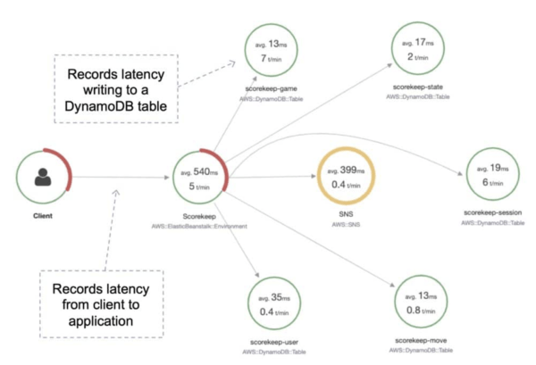

# AWS DevTools
With the AWS Developer Tools you can host your code, build, test, and deploy your application quickly and effectively. AWS provides a suite of tools including software development kits (SDKs), code editors, and continuous integration and delivery (CI/CD) services for DevOps software development.

`AWS CodeArtifact | AWS CodeCommit | AWS CodeBuild | AWS CodeDeploy | AWS CodePipeline | AWS CodeStar | AWS X-Ray`

## **AWS CodeBuild**

You can define the specific commands that you want AWS CodeBuild to perform, such as installing build tool packages, running unit tests, and packaging your code.

The build specification (`buildspec.yaml`) is a YAML file that lets you choose the commands to run at each phase of the build and other settings. 

**Phases:**

`Install`: install dependencies you may need for the build.

`Pre-build`: final commands to execute before build.

`Build`: actual build commands.

`Post build`: finishing touches (e.g. zip file output).

The code sample shows the contents of a `buildspec.yml` file that is being used to build a Docker image and push it to Amazon Elastic Container Registry (ECR):

```yaml
version: 0.2

phases:
  install:
    runtime-versions:
    docker: 18
  pre_build:
    commands:
      - echo Logging in to Amazon ECR...
      - $(aws ecr get-login --no-include-email --region $AWS_DEFAULT_REGION)
  build:
    commands:
      - echo Build started on `date`
      - echo Building the Docker image...
      - docker build -t $IMAGE_REPO_NAME:$IMAGE_TAG .
      - docker tag $IMAGE_REPO_NAME:$IMAGE_TAG $AWS_ACCOUNT_ID.dkr.ecr.$AWS_DEFAULT_REGION.amazonaws.com/$IMAGE_REPO_NAME:$IMAGE_TAG
  post_build:
    commands:
      - echo Build completed on `date`
      - echo Pushing the Docker image...
      - docker push $AWS_ACCOUNT_ID.dkr.ecr.$AWS_DEFAULT_REGION.amazonaws.com/$IMAGE_REPO_NAME:$IMAGE_TAG
```

**Useful exam tips**
> You must have a `buildspec.yml` file at the root of your source code.


## **AWS CodeDeploy**

CodeDeploy is a deployment service that automates application deployments to Amazon EC2 instances, on-premises instances, serverless Lambda functions, or Amazon ECS services. An AWS CodeDeploy application contains information about what to deploy and how to deploy it.

CodeDeploy provides two deployment type options – `in-place and blue/green`.

Need to choose the compute platform:

- `EC2/On-premises` - Supports in-place or blue/green deployment type.
- `AWS Lambda` - Supports canary, linear, or all-at-once configuration deployment type.
- `Amazon ECS` - Supports canary, linear, or all-at-once configuration deployment type.

The application specification file (`AppSpec` file) is a YAML-formatted, or JSON-formatted file used by CodeDeploy to manage a deployment. Example:

```yaml
version: 0.0

os: linux

files:
  - source: /
  destination: /var/www/html/WordPress

hooks 
  BeforeInstall:
    - location: scripts/install_dependencies.sh
    timeout: 300
    runas: root
  AfterInstall:
    - location: scripts/change_permissions.sh
    timeout: 300
    runas: root
  ApplicationStart:
    - location: scripts/start_server.sh
    - location: scripts/create_test_db.sh
    timeout: 300
    runas: root
  ApplicationStop:
    - location: scripts/stop_server.sh
    timeout: 300
    runas: root
```

Here is an example of an AppSpec file written in YAML for deploying an **Amazon ECS service**:

```yaml
version: 0.0

Resources:
  - TargetService:
    Type: AWS::ECS::Service
    Properties:
      TaskDefinition: "arn:aws:ecs:us-east-1:111222333444:task-definition/my-task-definition-family-name:1"
      LoadBalancerInfo:
        ContainerName: "SampleApplicationName"
        ContainerPort: 80
      # Optional properties
      PlatformVersion: "LATEST"
      NetworkConfiguration:
        AwsvpcConfiguration:
          Subnets: ["subnet-1234abcd","subnet-5678abcd"]
          SecurityGroups: ["sg-12345678"]
          AssignPublicIp: "ENABLED"

Hooks:
  - BeforeInstall: "LambdaFunctionToValidateBeforeInstall"
  - AfterInstall: "LambdaFunctionToValidateAfterTraffic"
  - AfterAllowTestTraffic: "LambdaFunctionToValidateAfterTestTrafficStarts"
  - BeforeAllowTraffic: "LambdaFunctionToValidateBeforeAllowingProductionTraffic"
  - AfterAllowTraffic: "LambdaFunctionToValidateAfterAllowingProductionTraffic"
```

The format of the AppSpec.yaml file for use with **AWS Lambda** is as follows:

```yaml
version: 0.0

Resources:
  - myLambdaFunction:
    Type: AWS::Lambda::Function
    Properties:
      Name: "myLambdaFunction"
      Alias: "myLambdaFunctionAlias"
      CurrentVersion: "1"
      TargetVersion: "2"

Hooks:
  - BeforeAllowTraffic: "LambdaFunctionToValidateBeforeTrafficShift"
  - AfterAllowTraffic: "LambdaFunctionToValidateAfterTrafficShift"
```

**Useful exam tips**
> CodeDeploy provides two deployment type options – `in-place` and `blue/green`.

> `in-place` deployment strategy works only in `EC2/On-Premises` deployments.

> All AWS Lambda and Amazon ECS deployments are `blue/green`. An EC2/On-Premises deployment can be `in-place or blue/green`.

> The hooks in `AppSpec.yaml` file are different for each type of compute platform.

## **AWS CodePipeline**
AWS CodePipeline is a fully managed continuous delivery service that helps you automate your release pipelines for fast and reliable application and infrastructure updates. CodePipeline automates the build, test, and deploy phases of your release process every time there is a code change, based on the release model you define.

**Key CodePipeline Concepts**

`Pipelines:`
A workflow that describes how software changes go through the release process.

`Artifacts:`
- Files or changes that will be worked on by the actions and stages in the pipeline.
- Each pipeline stage can create “artifacts”.
- Artifacts are passed, stored in Amazon S3, and then passed on to the next stage.

`Stages:`
- Pipelines are broken up into stages, e.g., build stage, deployment stage.
- Each stage can have sequential actions and or parallel actions.
- Stage examples would be build, test, deploy, load test etc.
- Manual approval can be defined at any stage.

`Actions:`
Stages contain at least one action, these actions take some action on artifacts and will have artifacts as either an input, and output, or both.

`Transitions:`
The progressing from one stage to another inside of a pipeline.

## AWS CodeStar
AWS CodeStar enables you to quickly develop, build, and deploy applications on AWS. AWS CodeStar provides a unified user interface, enabling you to easily manage your software development activities in one place.

With AWS CodeStar, you can set up your entire continuous delivery toolchain in minutes, allowing you to start releasing code faster.

**Exam tip:** If an exam scenario requires a unified development toolchain, and mentions collaboration between team members, synchronization, and centralized management of the CI/CD pipeline this will be CodeStar rather than CodePipeline or CodeCommit.

## AWS X-Ray


AWS X-Ray helps developers analyze and debug production, distributed applications, such as those built using a microservices architecture.

With X-Ray, you can understand how your application and its underlying services are performing to identify and troubleshoot the root cause of performance issues and errors.

X-Ray provides an end-to-end view of requests as they travel through your application and shows a map of your application’s underlying components.

**Key X-Ray terminology**
`Trace:`

An X-Ray trace is a set of data points that share the same trace ID.

`Segments:`

An X-Ray segment encapsulates all the data points for a single component (for example, authorization service) of the distributed application.

Segments include system-defined and user-defined data in the form of annotations and are composed of one or more sub-segments that represent remote calls made from the service.

`Subsegments:`

Subsegments provide more granular timing information and details about downstream calls that your application made to fulfill the original request.

A subsegment can contain additional details about a call to an AWS service, an external HTTP API, or an SQL database.
You can even define arbitrary subsegments to instrument specific functions or lines of code in your application.
For services that don’t send their own segments, like Amazon DynamoDB, X-Ray uses subsegments to generate inferred segments and downstream nodes on the service map.

This lets you see all your downstream dependencies, even if they don’t support tracing, or are external.

`Annotations:`

An X-Ray annotation is system-defined, or user-defined data associated with a segment.

System-defined annotations include data added to the segment by AWS services, whereas user-defined annotations are metadata added to a segment by a developer.

A segment can contain multiple annotations. These are key / value pairs used to index traces and use with filters.

Use annotations to record information on segments or subsegments that you want indexed for search.

`Sampling:`

To provide a performant and cost-effective experience, X-Ray does not collect data for every request that is sent to an application.

Instead, it collects data for a statistically significant number of requests.
X-Ray should not be used as an audit or compliance tool because it does not guarantee data completeness.

`Metadata:`

Key / value pairs, not indexed and not used for searching.

**Exam tip:** Remember that annotations can be used for adding system or user-defined data to segments and subsegments that you want to index for search. Metadata is not indexed and cannot be used for searching.