# Amazon Cognito
Amazon Cognito is a service provided by AWS that simplifies user authentication, authorization, and user management for web and mobile applications.

- Your users can sign in directly with a user name and password, or through a third party such as Facebook, Amazon, or Google.
- Users can sign-up and sign-in using email, phone number, or user name.
- End users of an application can also sign in with SMS-based MFA.
- There is an import tool for migrating users into an Amazon Cognito User Pool.

With Amazon Cognito, you can focus on building great app experiences instead of managing complex authentication and authorization code. It scales to millions of users and is available in multiple AWS regions worldwide.

## User Pools and Identity Pools

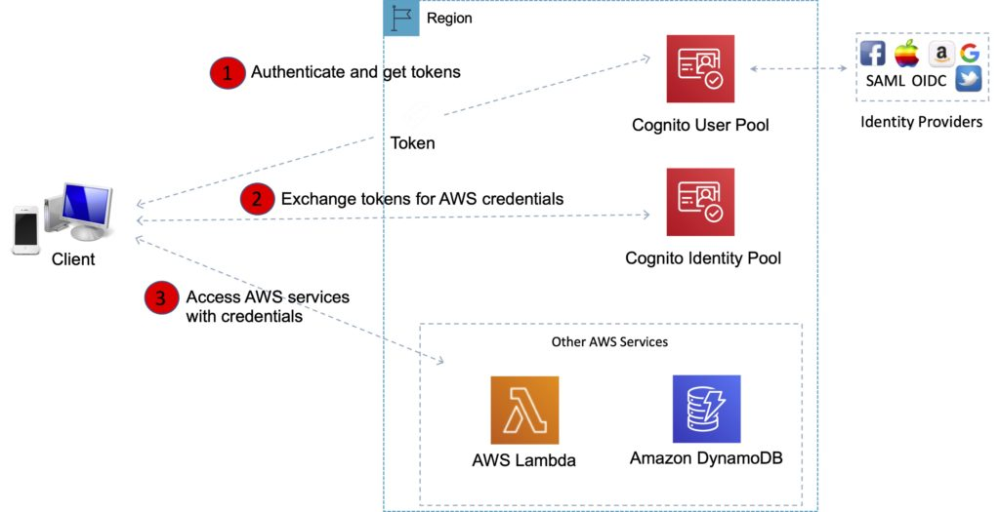

The two main components of AWS Cognito are **user pools** and **identity pools**.

>> **Exam tip:** To make it easier to remember the different between `User Pools` and `Identity Pools`, think of Users Pools as being like `IAM Users` or `Active Directory` and an Identity Pools as being like an `IAM Role`.

### User Pools (Authentication)

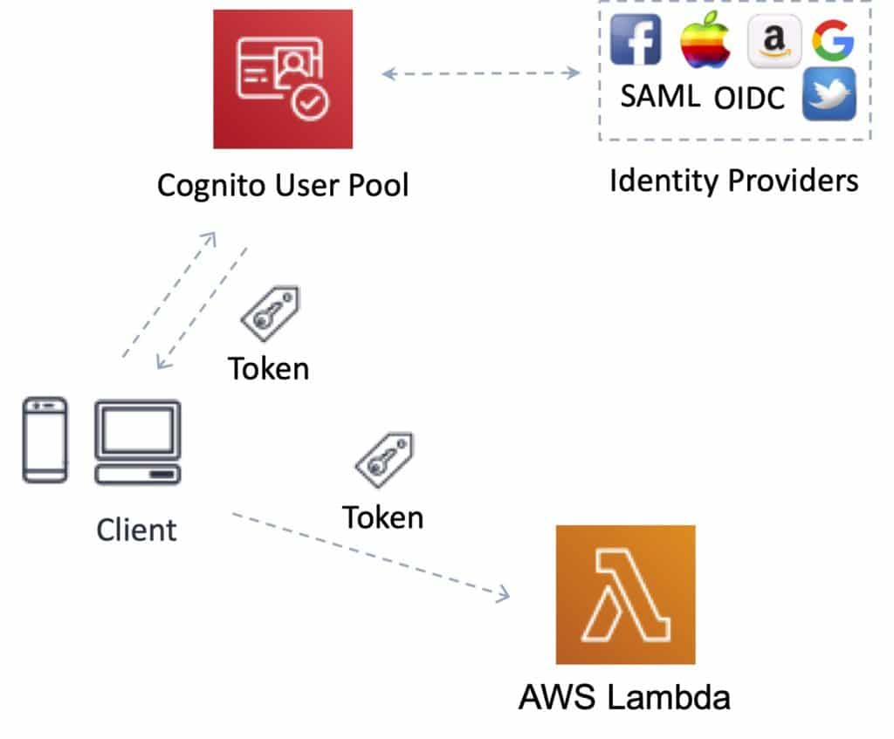

User Pools primarily handle user sign-up, sign-in, and user management. They are responsible for authenticating users.

Cognito User Pools are user directories used to manage sign-up and sign-in functionality for mobile and web applications for your app users. 

Users can also sign in through social identity providers like Facebook or Amazon, and through SAML identity providers.

Whether users sign-in directly or through a third party, all members of the user pool have a directory profile that you can access through an SDK.

Cognito acts as an **Identity Broker** between the **ID provider** and **AWS**.

User pools provide:

- Sign-up and sign-in services.
- A built-in, customizable web UI to sign in users.
- Social sign-in with *Facebook*, *Google*, and *Login with Amazon*, as well as sign-in with SAML identity providers from your user pool.
- User directory management and user profiles.
- Security features such as multi-factor authentication (MFA), checks for compromised credentials, account takeover protection, and phone and email verification.
- Customized workflows and user migration through AWS Lambda triggers.
- After successfully authenticating a user, Amazon Cognito issues **JSON web tokens (JWT)** that you can use to secure and authorize access to your own APIs, or exchange for AWS credentials.

### Identity Pools (Authorization)

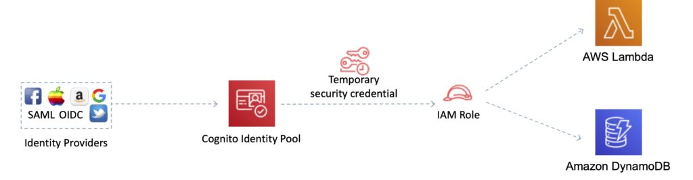

Identity Pools are used for granting temporary AWS credentials to users, allowing them to access AWS resources. They are primarily focused on authorizing access to AWS services.

Identity Pools enable you to create unique identities for your users and authenticate them with identity providers. With an identity, you can obtain temporary, limited-privilege AWS credentials to access other AWS services.

Cognito tracks the association between user identity and the various different devices they sign-in from.

In order to provide a seamless user experience for your application, Cognito uses Push Synchronization to push updates and synchronize user data across multiple devices.

`Amazon SNS` is used to send a silent push notification to all the devices whenever data stored in the cloud changes.

Amazon Cognito identity pools support the following identity providers:

- Public providers: Login with Amazon (Identity Pools), Facebook (Identity Pools), Google (Identity Pools).
- Amazon Cognito User Pools.
- Open ID Connect Providers (Identity Pools).
- SAML Identity Providers (Identity Pools).
- Developer Authenticated Identities (Identity Pools).

## Developer Authenticated Identities
With developer authenticated identities, you can register and authenticate users via your own existing authentication process, while still using Amazon Cognito to synchronize user data and access AWS resources.

Using developer authenticated identities involves interaction between the end user device, your backend for authentication, and Amazon Cognito.

## Amazon Cognito Sync
Amazon Cognito Sync is an AWS service and client library that enables cross-device syncing of application-related user data.

You can use it to synchronize user profile data across mobile devices and the web without requiring your own backend.

The client libraries cache data locally so your app can read and write data regardless of device connectivity status.

When the device is online, you can synchronize data, and if you set up push sync, notify other devices immediately that an update is available.

>> **Exam tip:** AWS AppSync is a similar service that has additional capabilities. With AppSync you can synchronize mobile app data across devices and users (Cognito Sync cannot synchronize across users, only devices), it has support for additional devices and data types, and is based on GraphQL.

# AWS IAM
AWS Identity and Access Management (IAM) provides centralized control of an AWS account, allowing the creation of users with specific permissions to access AWS resources. By default, new IAM users have no access to services and can only log in to the AWS console. Permissions must be explicitly granted for service access.

IAM can be used to manage:

```
Users.
Groups.
Access policies.
Roles.
User credentials.
User password policies.
Multi-factor authentication (MFA).
API keys for programmatic access (CLI).
```

IAM users consist of a username, password, and access permissions. Security credentials like access keys and multi-factor authentication (MFA) can be assigned. IAM supports Identity Federation for secure access without creating IAM user accounts and offers MFA to enhance security.

MFA can be used via the AWS Management Console, API, or CLI. It is recommended to use MFA for all users, particularly privileged ones. IAM is universal and operates globally, with eventual consistency and data replication across multiple data centers.

The root account has full admin access and should be used only for billing purposes. Power user access allows all permissions except managing IAM groups and users. IAM can assign temporary security credentials and integrates with various AWS services. For security and compliance, AWS advises using SDKs or the IAM Query API for programmatic access.

## IAM Elements

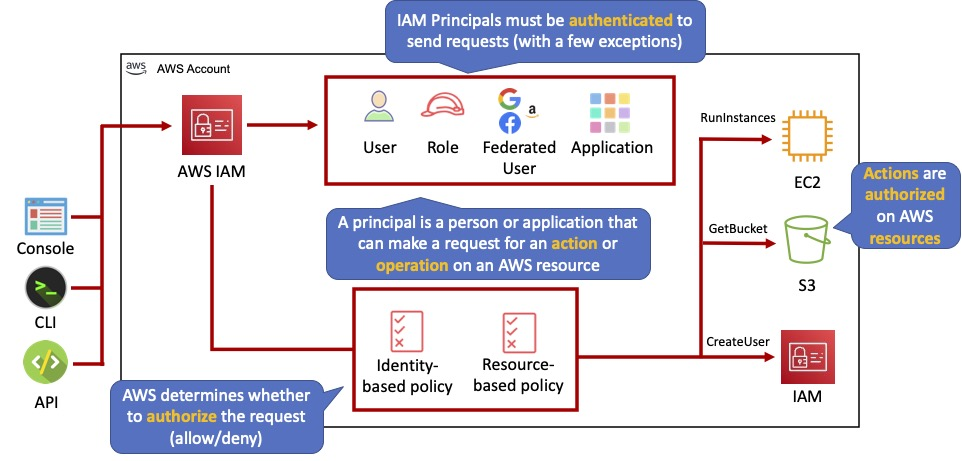

### Principals:

- An entity that can take an action on an AWS resource.
- Your administrative IAM user is your first principal.
- You can allow users and services to assume a role.
- IAM supports federated users.
- IAM supports programmatic access to allow an application to access your AWS account.
- IAM users, roles, federated users, and applications are all AWS principals.

### Requests:

- Principals send requests via the Console, CLI, SDKs, or APIs.
- Requests are:
  - Actions (or operations) that the principal wants to perform.
  - Resources upon which the actions are performed.
  - Principal information including the environment from which the request was made.
- Request context – AWS gathers the request information:
  - Principal (requester).
  - Aggregate permissions associated with the principal.
  - Environment data, such as IP address, user agent, SSL status etc.
  - Resource data, or data that is related to the resource being requested.

### Authentication:

- A principal sending a request must be authenticated to send a request to AWS.
- To authenticate from the console, you must sign in with your user name and password.
- To authenticate from the API or CLI, you must provide your access key and secret key.

### Authorization:

- IAM uses values from the request context to check for matching policies and determines whether to allow or deny the request.
- IAM policies are stored in IAM as JSON documents and specify the permissions that are allowed or denied.
- IAM policies can be:
  - User (identity) based policies.
  - Resource-based policies.
- IAM checks each policy that matches the context of your request.
- If a single policy has a deny action IAM denies the request and stops evaluating (explicit deny).
- Evaluation logic:
  - By default all requests are denied (implicit deny).
  - An explicit allow overrides the implicit deny.
  - An explicit deny overrides any explicit allows.
- Only the root user has access to all resources in the account by default.

### Actions:

- Actions are defined by a service.
- Actions are the things you can do to a resource such as viewing, creating, editing, deleting.
- Any actions on resources that are not explicitly allowed are denied.
- To allow a principal to perform an action you must include the necessary actions in a policy that applies to the principal or the affected resource.

### Resources:

- A resource is an entity that exists within a service.
- E.g. EC2 instances, S3 buckets, IAM users, and DynamoDB tables.
- Each AWS service defines a set of actions that can be performed on the resource.
- After AWS approves the actions in your request, those actions can be performed on the related resources within your account.

## IAM Users

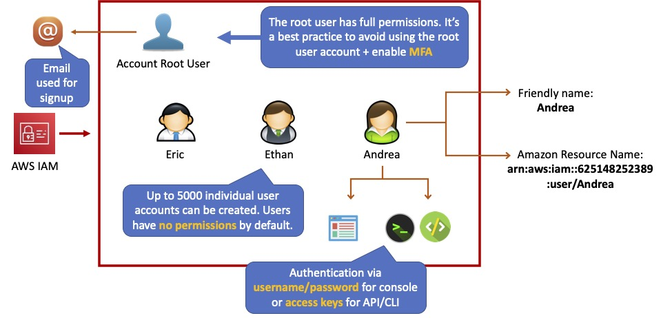

An IAM user is an entity that represents a person or service.

Can be assigned:
- An access key ID and secret access key for programmatic access to the AWS API, CLI, SDK, and other development tools.
- A password for access to the management console.

By default users cannot access anything in your account.

The account root user credentials are the email address used to create the account and a password.

The root account has full administrative permissions, and these cannot be restricted.

Best practice for root accounts:

- Don’t use the root user credentials.
- Don’t share the root user credentials.
- Create an IAM user and assign administrative permissions as required.
- Enable MFA.

IAM users can be created to represent applications, and these are known as “service accounts”.

You can have up to 5000 users per AWS account.

Each user account has a friendly name and an ARN which uniquely identifies the user across AWS.

A unique ID is also created which is returned only when you create the user using the API, Tools for Windows PowerShell, or the AWS CLI.

You should create individual IAM accounts for users (best practice not to share accounts).

The Access Key ID and Secret Access Key are not the same as a password and cannot be used to login to the AWS console.

The Access Key ID and Secret Access Key can only be generated once and must be regenerated if lost.

A password policy can be defined for enforcing password length, complexity etc. (applies to all users).

You can allow or disallow the ability to change passwords using an IAM policy.

Access keys and passwords should be changed regularly.

## Groups

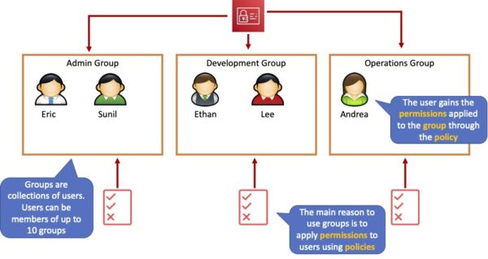

Groups are collections of users and have policies attached to them.

A group is not an identity and cannot be identified as a principal in an IAM policy.

Use the principal of least privilege (POLP) when assigning permissions.

You cannot nest groups (groups within groups).

## Roles

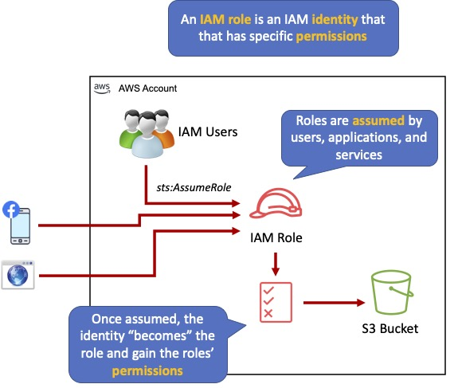

Roles are created and then **“assumed”** by trusted entities and define a set of permissions for making AWS service requests.

With IAM Roles you can delegate permissions to resources for users and services without using permanent credentials (e.g. user name and password).

IAM users or AWS services can assume a role to obtain temporary security credentials that can be used to make AWS API calls.

IAM users can temporarily assume a role to take on permissions for a specific task.

A role can be assigned to a federated user who signs in using an external identity provider.

Temporary credentials are primarily used with IAM roles and automatically expire.

Roles can be assumed temporarily through the console or programmatically with the AWS CLI, Tools for Windows PowerShell, or API.

IAM roles with EC2 instances:

- IAM roles can be used for granting applications running on EC2 instances permissions to AWS API requests using instance profiles.
- Only one role can be assigned to an EC2 instance at a time.
- A role can be assigned at the EC2 instance creation time or at any time afterwards.
- When using the AWS CLI or API instance profiles must be created manually (it’s automatic and transparent through the console).
- Applications retrieve temporary security credentials from the instance metadata.

Role Delegation:

- Create an IAM role with two policies:
  - Permissions policy – grants the user of the role the required permissions on a resource.
  - Trust policy – specifies the trusted accounts that are allowed to assume the role.
- Wildcards (*) cannot be specified as a principal.
- A permissions policy must also be attached to the user in the trusted account.

## Policies

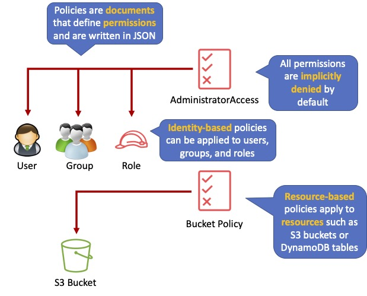

Policies are documents that define permissions and can be applied to users, groups, and roles.

Policy documents are written in JSON (key value pair that consists of an attribute and a value).

All permissions are implicitly denied by default.

The most restrictive policy is applied.

The IAM policy simulator is a tool to help you understand, test, and validate the effects of access control policies.

The Condition element can be used to apply further conditional logic.

### Inline Policies vs Managed Policies
There are 3 types of policies:

- Managed policies.
- Customer managed policies.
- Inline policies.

#### Managed Policy:

- Created and administered by AWS.
- Used for common use cases based on job function.
- Save you having to create policies yourself.
- Can be attached to multiple users, groups, or roles within and across AWS accounts.
- Cannot change the permissions assigned.

#### Customer Managed Policy:

- Standalone policy that you create and administer in your own AWS account.
- Can be attached to multiple users, groups, and roles – but only within your own account.
- Can be created by copying an existing managed policy and then customizing it.
- Recommended for use cases where the existing AWS Managed Policies don’t meet the needs of your environment.

#### Inline Policy:

- Inline policies are embedded within the user, group, or role to which it is applied.
- Strict 1:1 relationship between the entity and the policy.
- When you delete the user, group, or role in which the inline policy is embedded, the policy will also be deleted.
- In most cases, AWS recommends using Managed Policies instead of inline policies.
- Inline policies are useful when you want to be sure that the permissions in a policy are not inadvertently assigned to any other user, group, or role.

## IAM Policy Evaluation Logic
By default, all requests are implicitly denied. (Alternatively, by default, the AWS account root user has full access).

An explicit allow in an identity-based or resource-based policy overrides this default.

If a permissions boundary, Organizations SCP, or session policy is present, it might override the allow with an implicit deny.

An explicit deny in any policy overrides any allows.

A few concepts should be known to understand the logic:

- **Identity-based policies –** Identity-based policies are attached to an IAM identity (user, group of users, or role) and grant permissions to IAM entities (users and roles).
- **Resource-based policies – **Resource-based policies grant permissions to the principal (account, user, role, or federated user) specified as the principal.
- **IAM permissions boundaries –** Permissions boundaries are an advanced feature that sets the maximum permissions that an identity-based policy can grant to an IAM entity (user or role).
- **AWS Organizations service control policies (SCPs) –** Organizations SCPs specify the maximum permissions for an organization or organizational unit (OU). Session policies – Session policies are advanced policies that you pass as parameters when you programmatically create a temporary session for a role or federated user.

The following flowchart details the IAM policy evaluation logic:

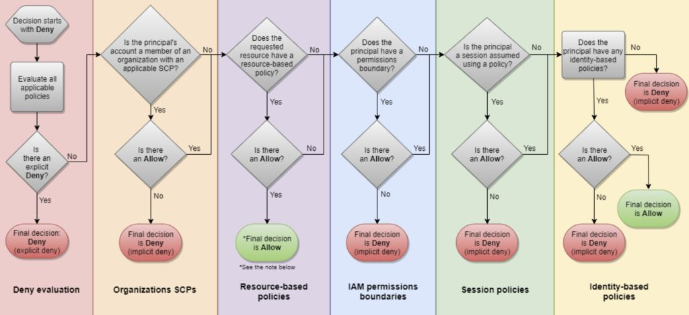

## IAM Instance Profiles
An IAM Instance Profile is a container that passes an IAM Role to an Amazon EC2 instance. It allows you to associate an IAM Role with an EC2 instance, granting the instance the permissions defined by the policies attached to that role.

You can use the following AWS CLI commands to work with instance profiles in an AWS account:

- Create an instance profile: `aws iam create-instance-profile`
- Add a role to an instance profile: `aws iam add-role-to-instance-profile`
- List instance profiles: `aws iam list-instance-profiles, aws iam list-instance-profiles-for-role`
- Get information about an instance profile: `aws iam get-instance-profile`
- Remove a role from an instance profile: `aws iam remove-role-from-instance-profile`
- Delete an instance profile: `aws iam delete-instance-profile`

## AWS Security Token Service (STS)

The AWS Security Token Service (STS) is a web service that enables you to request temporary, limited-privilege credentials for IAM users or for users that you authenticate (federated users).

By default, AWS STS is available as a global service, and all AWS STS requests go to a single endpoint at https://sts.amazonaws.com

You can optionally send your AWS STS requests to endpoints in any region (can reduce latency).

Credentials will always work globally.

STS supports `AWS CloudTrail`, which records AWS calls for your AWS account and delivers log files to an S3 bucket.

Temporary security credentials work almost identically to long-term access key credentials that IAM users can use, with the following differences:

- Temporary security credentials are short-term.
- They can be configured to last anywhere from a few minutes to several hours.
- After the credentials expire, AWS no longer recognizes them or allows any kind of access to API requests made with them.
- Temporary security credentials are not stored with the user but are generated dynamically and provided to the user when requested.
- When (or even before) the temporary security credentials expire, the user can request new credentials, if the user requesting them still has permission to do so.

### Advantages of STS

- You do not have to distribute or embed long-term AWS security credentials with an application.
- You can provide access to your AWS resources to users without having to define an AWS identity for them (temporary security credentials are the basis for IAM Roles and ID Federation).
The temporary security credentials have a limited lifetime, so you do not have to rotate them or explicitly revoke them when they’re no longer needed.
After temporary security credentials expire, they cannot be reused (you can specify how long the credentials are valid for, up to a maximum limit).

The AWS STS API action returns temporary security credentials that consist of:

- An access key which consists of an access key ID and a secret ID.
- A session token.
- Expiration or duration of validity.
- Users (or an application that the user runs) can use these credentials to access your resources.

With STS you can request a session token using one of the following APIs:

- `AssumeRole` – can only be used by IAM users (can be used for MFA).
- `AssumeRoleWithSAML` – can be used by any user who passes a SAML authentication response that indicates authentication from a known (trusted) identity provider.
- `AssumeRoleWithWebIdentity` – can be used by an user who passes a web identity token that indicates authentication from a known (trusted) identity provider.
- `GetSessionToken` – can be used by an IAM user or AWS account root user (can be used for MFA).
- `GetFederationToken` – can be used by an IAM user or AWS account root user.


## AWS IAM - Cross Account Access

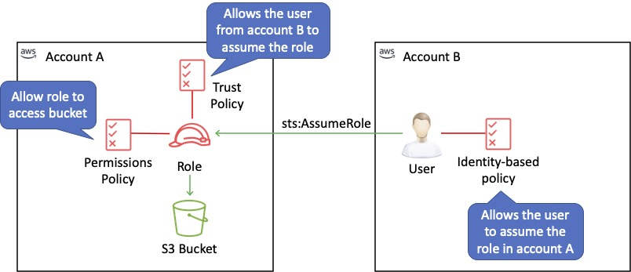

Lets users from one AWS account access resources in another.

Useful for situations where an AWS customer has separate AWS account – for example for development and production resources.

To make a request in a different account the resource in that account must have an attached resource-based policy with the permissions you need.

Or you must assume a role (identity-based policy) within that account with the permissions you need.

## AWS IAM - Access delegation workflow
The following diagram depicts how you can establish delegated access across two AWS accounts:

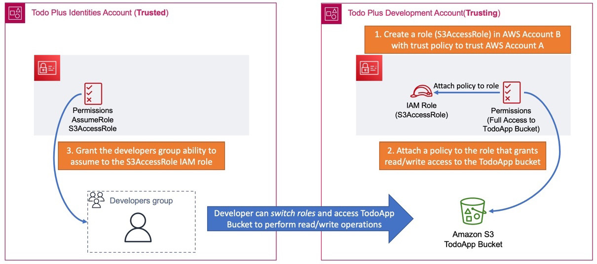

As shown in the Figure, we use the example of a developer in the `Identities` Account that needs to access an `S3 bucket` (called `TodoApp`) in the `Development` Account. This is known as `cross-account access`, and the following are the primary steps involved in configuring this:

1. In the Development Account, you must configure a role with a trust policy that identifies the trusted account (in this case, the Identities Account). In this example, we named the IAM Role `IAM-User-S3-AccessRole` as per the diagram. The configuration requires you to provide the ID for Account A.

2. You will also need to configure a policy that contains the necessary permissions to perform read/write operations against the TodoApp S3 bucket in Account B.

3. Finally, in Account A, you need to configure another policy that grants the developer the ability to assume the S3AccessRole created in Account B. You do this by specifying the Account ID of Account B and the role in the policy statement. The policy will grant the sts:AssumeRole permission as per the following JSON script:

```json
{
  "Version": "2024-06-17",
  "Statement": {
    "Effect": "Allow",
    "Action": "sts:AssumeRole",
    "Resource": "arn:aws:iam::Developer-Account-ID:role/S3AccessRole"
  }
}
```

4. Once the above configuration is in place, the developers can switch roles and access the TodoApp S3 bucket in AWS Account B.

>> **Note:** With the new IAM Identity Center Service (previously known as AWS Single Sign On), you may not need to use cross-account access extensively for IAM users. This is because the IAM Identity Center offers an alternative approach to granting your workforce users access to multiple out-of-the-box accounts in your AWS Organizations. These users can be from AWS Identity Providers as well as external providers. 

## IAM Best Practices

To secure AWS resources it is recommended that you follow these best practices:

- Lock away your AWS account root user access keys.
- Use roles to delegate permissions.
- Grant least privilege.
- Get started using permissions with AWS managed policies.
- Validate your policies.
- Use customer managed policies instead of inline policies.
- Use access levels to review IAM permissions.
- Configure a strong password policy for your users.
- Enable MFA.
- Use roles for applications that run on Amazon EC2 instances.
- Do not share access keys.
- Rotate credentials regularly.
- Remove unnecessary credentials.
- Use policy conditions for extra security.
- Monitor activity in your AWS account.