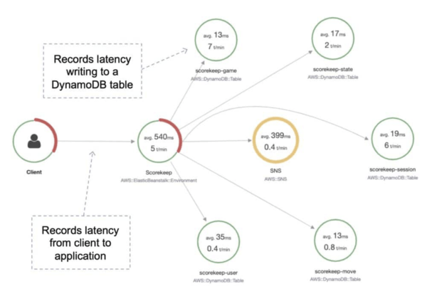
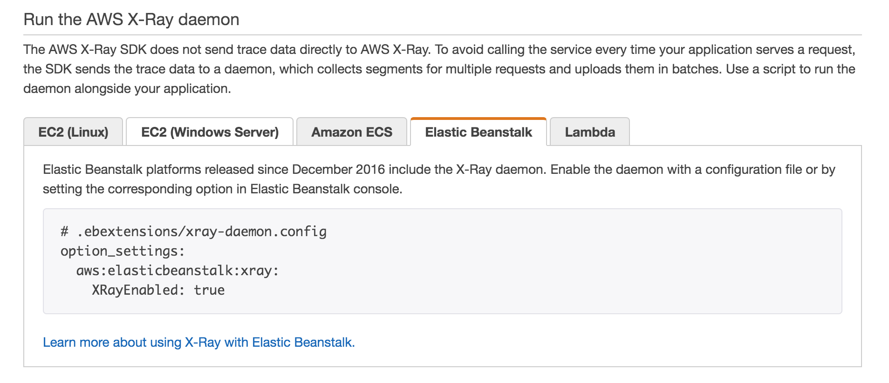

# Amazon CloudWatch
Amazon CloudWatch is a monitoring service for AWS cloud resources and the applications you run on AWS. CloudWatch is used to collect and track metrics, collect, and monitor log files, and set alarms.

- CloudWatch integrates with AWS IAM.
- CloudWatch can automatically react to changes in your AWS resources.

## Components
**CloudWatch alarms** monitor metrics and can be configured to automatically initiate actions.

**CloudWatch Logs** centralizes logs from systems, applications, and AWS services.

**CloudWatch Events** delivers a stream of system events that describe changes in AWS resources.

## Metrics
A metric represents a time-ordered set of data points that are published to CloudWatch.
Metrics exist within a region.
Metrics cannot be deleted but automatically expire after 15 months.
Metrics are uniquely defined by a name, a namespace, and zero or more dimensions.

CloudWatch retains metric data as follows:

- Data points with a period of less than 60 seconds are available for 3 hours. These data points are high-resolution custom metrics.
- Data points with a period of 60 seconds (1 minute) are available for 15 days.
- Data points with a period of 300 seconds (5 minute) are available for 63 days.
- Data points with a period of 3600 seconds (1 hour) are available for 455 days (15 months).

### High-Resolution Metrics
High-resolution metrics can give you more immediate insight into your application’s sub-minute activity.

When you publish a high-resolution metric, CloudWatch stores it with a resolution of 1 second, and you can read and retrieve it with a period of 1 second, 5 seconds, 10 seconds, 30 seconds, or any multiple of 60 seconds.

## Namespace
A namespace is a container for CloudWatch metrics.

Metrics in different namespaces are isolated from each other, so that metrics from different applications are not mistakenly aggregated into the same statistics.

## Dimensions
A dimension further clarifies what the metric is and what data it stores.

You can have up to 10 dimensions in one metric, and each dimension is defined by a name and value pair.

With put-metric-data, you specify each dimension as MyName=MyValue, and with get-metric-statistics or put-metric-alarm you use the format Name=MyName, Value=MyValue.

## Statistics
Statistics are metric data aggregations over specified periods of time.
CloudWatch provides statistics based on the metric data points provided by your custom data or provided by other AWS services to CloudWatch.

## CloudWatch Alarms
You can use an alarm to automatically initiate actions on your behalf.

An alarm watches a single metric over a specified time period, and performs one or more specified actions, based on the value of the metric relative to a threshold over time.

The action is a notification sent to an Amazon SNS topic or an Auto Scaling policy.

## CloudWatch Logs
Amazon CloudWatch Logs lets you monitor and troubleshoot your systems and applications using your existing system, application, and custom log files.

### CloudWatch Logs Agent
The CloudWatch Logs agent provides an automated way to send log data to CloudWatch Logs from Amazon EC2 instances.

The unified CloudWatch agent enables you to do the following:

- Collect more system-level metrics from Amazon EC2 instances across operating systems. The metrics can include in-guest metrics, in addition to the metrics for EC2 instances.
- Collect system-level metrics from on-premises servers. These can include servers in a hybrid environment as well as servers not managed by AWS.
- Retrieve custom metrics from your applications or services using the StatsD and collectd protocols.

## CloudWatch Events
Amazon CloudWatch Events delivers a near real-time stream of system events that describe changes in AWS resources.

Can use CloudWatch Events to schedule automated actions that self-trigger at certain times using cron or rate expressions

Can match events and route them to one or more target functions or streams.

Useful API Actions

It is useful to understand the following API actions for the Developer Associate exam. You should check these out and other API actions on the AWS website as well prior to your exam.

`GetMetricData`

Retrieve as many as 500 different metrics in a single request.

`PutMetricData`

Publishes metric data points to Amazon CloudWatch.
CloudWatch associates the data points with the specified metric.
If the specified metric does not exist, CloudWatch creates the metric.

`GetMetricStatistics`

Gets statistics for the specified metric.
CloudWatch aggregates data points based on the length of the period that you specify.
Maximum number of data points returned from a single call is `1,440`.

`PutMetricAlarm`

Creates or updates an alarm and associates it with the specified metric, metric math expression, or anomaly detection model.
Alarms based on anomaly detection models cannot have Auto Scaling actions.

# Amazon CloudTrail
AWS CloudTrail is a web service that records activity made on your account. CloudTrail enables governance, compliance, and operational and risk auditing of your AWS account.

CloudTrail is about logging events and saving a history of API calls for your AWS account. Events include actions taken in the AWS Management Console, AWS Command Line Interface, and AWS SDKs and APIs.

CloudTrail is per AWS account but you can consolidate logs in S3 from multiple accounts. CloudTrail is enabled on your AWS account when you create it.

Logs API calls made via:

- AWS Management Console.
- AWS SDKs.
- Command line tools.
- Higher-level AWS services (such as CloudFormation).

CloudTrail records account activity and service events from most AWS services and logs the following records:

- The identity of the API caller.
- The time of the API call.
- The source IP address of the API caller.
- The request parameters.
- The response elements returned by the AWS service.

You can create two types of trails for an AWS account:

- A trail that applies to all regions – records events in all regions and delivers to an S3 bucket.
- A trail that applies to a single region – records events in a single region and delivers to an S3 bucket. Additional single trails can use the same or a different S3 bucket.

Trails can be configured to log data events and management events:

- **Data events:** These events provide insight into the resource operations performed on or within a resource. These are also known as data plane operations.
- **Management events:** Management events provide insight into management operations that are performed on resources in your AWS account. These are also known as control plane operations. Management events can also include non-API events that occur in your account.

Example `data events` include:

- Amazon S3 object-level API activity (for example, GetObject, DeleteObject, and PutObject API operations).
- AWS Lambda function execution activity (the Invoke API).

Example `management events` include:

- Configuring security (for example, IAM AttachRolePolicy API operations).
- Registering devices (for example, Amazon EC2 CreateDefaultVpc API operations).
- Configuring rules for routing data (for example, Amazon EC2 CreateSubnet API operations).
- Setting up logging (for example, AWS CloudTrail CreateTrail API operations).
- CloudTrail log files are encrypted using S3 Server Side Encryption (SSE).

You can consolidate logs from multiple accounts using an S3 bucket:

1. Turn on CloudTrail in the paying account.
2. Create a bucket policy that allows cross-account access.
3. Turn on CloudTrail in the other accounts and use the bucket in the paying account.

You can integrate CloudTrail with CloudWatch Logs to deliver data events captured by CloudTrail to a CloudWatch Logs log stream.

# Amazon CloudWatch vs AWS CloudTrail:

| CloudWatch                                              | CloudTrail                                                               |
| ------------------------------------------------------- | ------------------------------------------------------------------------ |
| Performance monitoring                                  | Auditing                                                                 |
| Log events across AWS Services – think operations       | Log API activity across AWS services – think activities, or who to blame |
| Higher-level comprehensive monitoring and event service | More low-level, granular                                                 |
| Log from multiple accounts                              | Log from multiple accounts                                               |
| Logs stored indefinitely                                | Logs stored to S3 or CloudWatch indefinitely                             |
| Alarms history for 14 days                              | No native alarming; can use CloudWatch alarms                            |

# AWS X-Ray

AWS X-Ray helps developers analyze and debug production, distributed applications, such as those built using a microservices architecture.

With X-Ray, you can understand how your application and its underlying services are performing to identify and troubleshoot the root cause of performance issues and errors.

X-Ray provides an end-to-end view of requests as they travel through your application and shows a map of your application’s underlying components.

## X-Ray terminology

`Trace:`

An X-Ray trace is a set of data points that share the same trace ID.

`Segments:`

An X-Ray segment encapsulates all the data points for a single component (for example, authorization service) of the distributed application.

Segments include system-defined and user-defined data in the form of annotations and are composed of one or more sub-segments that represent remote calls made from the service.

`Subsegments:`

Subsegments provide more granular timing information and details about downstream calls that your application made to fulfill the original request.

A subsegment can contain additional details about a call to an AWS service, an external HTTP API, or an SQL database.
You can even define arbitrary subsegments to instrument specific functions or lines of code in your application.
For services that don’t send their own segments, like Amazon DynamoDB, X-Ray uses subsegments to generate inferred segments and downstream nodes on the service map.

This lets you see all your downstream dependencies, even if they don’t support tracing, or are external.

`Annotations:`

An X-Ray annotation is system-defined, or user-defined data associated with a segment.

System-defined annotations include data added to the segment by AWS services, whereas user-defined annotations are metadata added to a segment by a developer.

A segment can contain multiple annotations. These are key / value pairs used to index traces and use with filters.

Use annotations to record information on segments or subsegments that you want indexed for search.

`Sampling:`

To provide a performant and cost-effective experience, X-Ray does not collect data for every request that is sent to an application.

Instead, it collects data for a statistically significant number of requests.
X-Ray should not be used as an audit or compliance tool because it does not guarantee data completeness.

`Metadata:`

Key / value pairs, not indexed and not used for searching.

**Exam tip:** Remember that `annotations` can be used for adding system or user-defined data to segments and subsegments that you want to index for search. `Metadata` is not indexed and cannot be used for searching.

## Enabling tracing on various computes

| Type              | Method                                                                                                                                |
| ----------------- | ------------------------------------------------------------------------------------------------------------------------------------- |
| ECS Cluster       | Create a **Docker image** that runs the X-Ray daemon                                                                                  |
| Elastic BeanStalk | Enable the X-Ray daemon by including the `xray-daemon.config` configuration file in the `.ebextensions` directory of your source code |
| EC2 instances     | Using a **user data script** to run the daemon automatically                                                                          |
| Lambda            | update the lambda function and add `--tracing-config Mode=Active`                                                                     |

