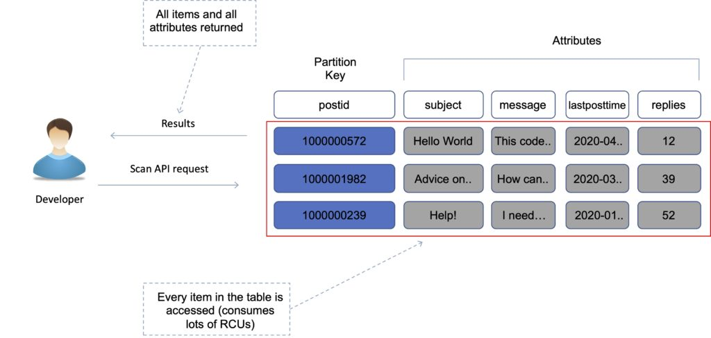
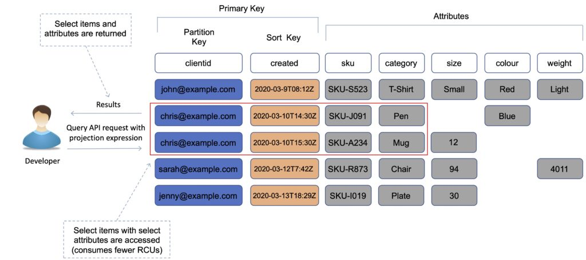

# Use cases of all AWS database solutions

| Data Store         | When to Use                                                                                                                                  |
| ------------------ | -------------------------------------------------------------------------------------------------------------------------------------------- |
| Database on EC2    | Ultimate control over database <br> Preferred DB not available under RDS                                                                     |
| Amazon RDS         | Need traditional relational database for OLTP <br> Your data is well formed and structured <br> Existing apps requiring RDBMS                |
| Amazon DynamoDB    | Name/value pair data or unpredictable data structure <br> In-memory performance with persistence <br>  High I/O needs <br> Scale dynamically |
| Amazon RedShift    | Massive amounts of data <br> Primarily OLAP workloads                                                                                        |
| Amazon Neptune     | Relationships between objects a major portion of data value                                                                                  |
| Amazon Elasticache | Fast temporary storage for small amounts of data <br> Highly volatile data                                                                   |
| Amazon S3          | BLOBs <br> Static Websites                                                                                                                   |

# Amazon S3
Amazon S3 is a widely used object storage solution with high levels of security, scalability, and durability.

Amazon S3 comprises of four primary concepts:

`Buckets` - act as the primary container for objects.

`Objects` - contain the actual data and metadata.

`Keys` - unique identifiers for each object within a bucket.

`Region` - denotes the geographic location where the bucket is stored.

An object is comprised of three elements: data, metadata, and a unique identifier. Metadata contains context-specific information about the object and is stored as a collection of key-value pairs. It includes essential details such as the content type, length, and last modified date. 

## Amazon S3: Types of consistency models 
#### Read-after-write Consistency
Read-after-write consistency in Amazon S3 ensures that updates made to the database are immediately available to all clients. When an item is uploaded to a bucket using a `PUT` operation, it can be read immediately after receiving a successful response, even if not all copies in all availability zones have yet received the replicas.

#### Eventual Consistency
Amazon S3 adds support for data consistency overwrite of `PUT` and `DELETE` operations. `Overwrite PUT` means replacing it with a new object bearing the same name while `Overwriting DELETE` removes the object from Amazon S3. 
The final action won’t occur during an overwrite PUT until all copies are replicated across all availability zones. Likewise, deleting an object may not immediately remove it from Amazon S3 until the deletion has fully propagated across all availability zones in the region

## Amazon S3: Storage classes
#### Amazon S3 Standard Storage Class
Amazon S3 Standard is a popular class ideal for frequently accessible data. It provides users with fast throughput performance and low latency, ensuring their frequently accessed data is quickly and readily available. This versatile storage class can be used for various purposes, such as cloud applications, big data analytics, content distribution, dynamic web pages, and mobile or gaming applications.

While the most expensive of all classes, Amazon S3 Standard storage class is ideal for hosting static websites. This is because there is no requirement to limit the number of size of retrievals you can make. As such as end users will gain access to content seamlessly comprising of HTML pages, images, and video.

#### Amazon S3-IA storage
This class is a cost-effective option designed for data accessed less frequently but where you still need instant access to the data.

Amazon S3-IA storage provides users a lower-cost storage option than Amazon S3 Standard while maintaining the same durability and low latency level.

One of the key benefits of this class is its flexible pricing model. The pricing is based on a combination of storage and retrieval fees, allowing users to save costs by storing infrequently accessed data at a lower price and paying only for retrieval when needed. This makes it an excellent option for businesses that need to store large volumes of data accessed less frequently.

#### Amazon S3 One Zone-IA
Another cost-effective class is designed for data that can be recreated easily, such as non-critical backup copies, which need to be accessed less frequently but still require instant access when needed.

Amazon S3 One Zone-IA stores data in a single availability zone only. This makes it a lower-cost option for infrequently accessed data, provided that the data can be easily regenerated or does not require high availability.

The pricing for Amazon S3 One Zone-IA is like Amazon S3-IA, with a lower cost for storage and retrieval fees, making it a cost-effective option for businesses that require a lower-cost storage option for their data.

#### Amazon S3 Intelligent-Tiering
Amazon S3 Intelligent-Tiering is a storage class designed to automatically move data between two access tiers based on changing access patterns. This storage class is ideal for businesses that require a cost-effective storage option for data that has changing access patterns and requires fast access when needed.

Amazon S3 Intelligent-Tiering offers a highly cost-effective storage option that is priced based on the amount of data stored and the number of monthly monitoring and automation requests. This makes it an excellent option for businesses that need to store large volumes of data for long periods while also requiring fast access to the data when needed.

#### Amazon S3 Glacier
Amazon S3 Glacier is a highly cost-effective storage service offered by Amazon Web Services (AWS) that is designed for long-term archival storage of data that is rarely accessed but needs to be retained for compliance, regulatory, or business purposes.

Amazon S3 Glacier is specifically designed for data accessed less than once yearly and provides high durability, low-cost storage, and flexible retrieval options. With its support for data encryption, versioning, and access controls, Amazon S3 Glacier ensures that data is always protected and secure.

One of the key benefits of this storage class is its low-cost pricing model. This storage class is priced based on the quantity of data stored, with separate fees for data retrieval and transfer. This makes it an excellent option for businesses that must store large volumes of data, such as financial or medical records, for long-term archival purposes.

## Amazon S3: Encryption options
AWS offers its customers the ability to encrypt the data that is hosted on its platform. There are two kinds of encryption technologies:

1. `Encryption in transit` which makes use of Secure Sockets Layer/Transport Layer Security (SSL/TLS), which is a cryptographic protocol that protects Internet communications.
2. `Encryption at rest` ensures that data is encrypted as it is committed to disk for long-term storage.

With `Encryption at rest`, AWS offers various options for encrypting your data as it is stored in your S3 buckets categorised into `Server-side encryption` | `Client-side encryption`.

#### Server-side encryption
Server-side encryption involves encrypting your data before saving it to disk and decrypting it as you access it from disk. AWS handles all the encryption and decryption process for you and here four key options are available:

1. **Server-Side Encryption with Amazon S3 managed keys (SSE-S3)** – This is the default option for object-level encryption. AWS has also enforced this encryption method for all new objects uploaded from January 5th, 2023, at no additional cost. This method of encryption uses AES-256-bit encryption, and AWS will create and manage the keys as well as the encryption process. When performing PUT operations, you must set the header to include `“x-amz-server-side-encryption”:”AES256”`.

2. **Server-Side Encryption with AWS KMS keys (SSE-KMS)** – If you require greater flexibility in how your encryption keys are created and managed, you can use the AWS Key Management Service (KMS) to centrally create, edit, monitor, rotate, and delete KMS keys. In addition, with this encryption option, you can restrict who can use the keys as well as maintain an audit log on usage. This helps you fulfil more restrictive compliance policies. Note that to use KMS to encrypt and decrpt your objects, you will also need the kms:GenerateDataKey and the kms:Decrypt permissions respectively. In addition, for PUT operations, you should set the header to include `“x-amz-server-side-encryption”:”awskms”`.

3. **Dual-Layer Server-Side Encryption with AWS KMS keys (DSSE-KMS)** – For organizations that require multilayer encryption features, DSSE-KMS offers two layers of objects that are uploaded to an Amazon S3 bucket. Note that the KMS keys must be in the same region as the object when requesting DSSE-KMS. Furthermore, with DSSE-KMS, the S3 checksum that’s part of the object’s metadata is stored in encrypted form. When performing PUT operations, you must ensure that the header includes `“s3:x-amz-server-side-encryption”:”aws:kms:dsse”`.

4. **Server-Side Encryption with customer-provided keys (SSE-C)** – This option enables you to create and manage your own encryption keys, which you then supply to Amazon S3 to perform all encryption and decryption operations for you. The keys are removed from memory after completing the encryption and decryption activity. Furthermore, Amazon S3 uses randomly salted Hash-based Message Authentication Code (HMAC) value of the encryption key (as opposed to retaining it) to verify additional requests. An important point to note is that to use SSE-C, you must use HTTPS since S3 will reject any requests made over HTTP.

#### Client-side encryption
Client-Side Encryption is where the customer performs the encryption of the objects locally before it is sent to AWS. This option requires the use of the Amazon S3 Encryption Client. This ensures that your unencrypted data is not exposed to AWS in any way and is often used to fulfil additional compliance requirements. If you lose the keys, you also lose access to the data, so the responsibility lies entirely with the customer.

## Amazon S3: Lifecycle management
Amazon S3 Lifecycle management allows users to define rules for a group of objects, specifying the actions that Amazon S3 should take. By combining object versioning with S3 Lifecycle, users can optimize their data preservation strategy and reduce storage costs.

Two actions can be performed with the S3 Lifecycle: `transitional` and `expiration`. 

`Transitional` actions help manage storage class transitions by transferring items to a different storage class after a specified time.

`Expiration` actions allow users to specify when objects should expire, and once an object expires, Amazon S3 automatically removes it from storage.

## Amazon S3: Data protection with resource-based policies

#### Resource-based policies
By default, S3 buckets are private; only the root user and the IAM account that created the bucket can access it. In contrast to IAM policies that determine actions for IAM users or roles, `resource-based policies` are inline policy statements attached to the resource itself. With Amazon S3, these policies are called `bucket policies`, which specify the allowed access levels against that resource and its access source.

Resource-based policies can also provide additional permission levels, including the ability to grant `anonymous access`. This feature allows users on the public internet to access your resources.

The following example illustrates how to grant anonymous public access using the `“s3: GetObject”` permission for the `“packt-aws-developer”` bucket. This allows anonymous users to access the contents of the bucket as depicted in the following screenshot:


#### Securing access with pre-signed URLs
Sometimes, knowing who the end user is may not be possible until they have requested access. Rather than following the cumbersome process of defining new principals or re-assigning your IAM policies, you can utilize another feature: pre-signed URLs.

Pre-signed URLs enable you to grant temporary credentials to allow the end user access to objects they would not usually have access to. The URLs are crafted with temporary tokens and represent the credentials of a specific AWS user who generated the URL.

These URLs allow end users to upload objects to your Amazon S3 bucket without requiring another AWS security credential. Pre-signed URLs can be configured multiple times with a specified expiration date and time.

## Amazon S3: Other features
#### Building static websites with Amazon S3
Once you have enabled static hosting, your S3 bucket will be accessible via a website endpoint URL. This URL can access your website directly, or you can configure a custom domain name using Route53. 

#### Amazon S3 Transfer Acceleration
Amazon S3 Transfer Acceleration is a bucket feature that when enabled allows end users to upload objects to the S3 bucket via a local Edge location enabling fast transfer speeds over the AWS backbone network.

- You must either be the bucket owner to configure transfer acceleration or assign the `s3:PutAccelerateConfiguration` to another user to delegate this capability.
- In addition, transfer Acceleration is only supported on `virtual-hosted` style requests. 

> **Exam note:** An important point to note is that your bucket names must not contain any dots `(.)` and be DNS compliant. 

#### Amazon S3 Event Notification
Amazon S3 can create a notification based on the following events that occur:

```
Object creation events
Object removal events
Object restore events
Object ACL events
Object tagging events
Reduced Redundancy Storage (for lost events)
Replication events
Lifecycle events
Intelligent-Tiering events
```

Once an event occurs in any of the above categories, a notification can be sent to destinations such as `Amazon SNS topics`, `SQS queues`, `AWS Lambda functions` or `Amazon EventBridge`.

#### Amazon S3 Select and Glacier Select
Amazon S3 Select and Glacier Select is a feature that enables you to run structured query language (SQL) to filter your data held in buckets and retrieve only a subset required. This means you can avoid downloading massive amounts of data, reducing cost and latency. You can use Amazon S3 Select on data held within CSV, JSON, or Apache Parquet file formats and objects held in compressed or encrypted files.

Some limitations to be aware of:

1. Your SQL expressions have a maximum limit of 256 KB.
2. The resulting record has a maximum length of 1 MB.
3. Nested data can only be emitted through the JSON output format.
4. Objects in the S3 Glacier Flexible Retrieval, S3 Glacier Deep Archive, or Reduced Redundancy Storage (RRS) storage classes cannot be queried. You cannot query objects in the S3 Intelligent-Tiering Archive Access tier or the S3 Intelligent-Tiering Deep Archive Access tier.

#### S3 Server Access Logs
Amazon S3 server accessing logging is a feature that, when enabled, records all requests made to an S3 bucket. This is particularly useful for auditing and analytics on usage. 

1. You must enable server access logging at the bucket level. 
2. Furthermore, you will need to create another bucket (known as the target bucket) that will act as the destination of the log data. (This is necessary as if you used the source bucket as the destination for log data then this will create an infinite loop of logs making it difficult to identify relevant log data) 
3. Both the source bucket and the target bucket must reside in the same region. 
4. You can also assign a prefix to all log data again making it easier to categorize log information from other data in the bucket.

# Amazon RDS
Amazon Relational Database Service (Amazon RDS) is a managed service that you can use to launch and manage relational databases on AWS.

Amazon RDS is an Online Transaction Processing (OLTP) type of database.

It is best suited to structured, relational data store requirements.

**Managed Service:** Amazon RDS is a fully managed service that automates database management tasks such as provisioning, patching, backup, and recovery, allowing users to focus more on their applications.

Database Engines Supported: Amazon RDS supports various popular relational database engines:

```
MySQL
PostgreSQL
MariaDB
Oracle Database
Microsoft SQL Server
Amazon Aurora (MySQL and PostgreSQL compatible)
```

**Scalability:** Amazon RDS makes it easy to scale your database deployment both vertically (by changing instance types) and horizontally (by adding read replicas for read scalability).

**High Availability:** RDS provides high availability through automated backups, automated failover, and Multi-AZ deployments for supported database engines (such as MySQL, PostgreSQL, and SQL Server).

**Security:** Amazon RDS offers built-in security features to help control access to your databases:

- Encryption at rest using AWS Key Management Service (KMS)
- Network isolation using Amazon VPC (Virtual Private Cloud)
- SSL/TLS encrypted connections
- IAM database authentication

RDS supports both `identity-based` and `resource-based` policies, giving you flexibility in how you manage access control to your RDS resources based on your specific requirements.

**Monitoring and Metrics:** Amazon RDS provides monitoring and metrics through Amazon CloudWatch, which allows you to monitor database performance metrics such as CPU utilization, storage capacity, and more.

**Backup and Restore:** Automated backups are enabled by default with a retention period of up to 35 days. You can also take manual snapshots for backup and restore purposes.

**Performance:**

Amazon RDS uses EBS volumes (never uses instance store) for DB and log storage.

There are three storage types available: 
- General Purpose (gp2) - Moderate I/O workloads upto 3000 IOPS
- Provisioned IOPS (SSD) - I/O intensite workloads upto 80k IOPS
- Magnetic - Old and not recommended max 1000 IOPS

## DB Instance
A DB instance is a virtual database environment in the cloud with the compute and storage resources you specify.

DB instances are available in different instance types that vary in compute, memory, and storage capacity. Examples include `db.t3.micro`, `db.r5.large`, etc. Instance types can be chosen based on the workload and performance requirements of your application.

DB instances can be deployed in `Multi-AZ (Availability Zone)` configurations. This provides high availability and automatic failover capability in case of infrastructure failures.

DB instances support vertical scaling by changing to a larger instance type with more compute power and memory. Horizontal scaling is achieved through the use of `read replicas` for read scalability.

## Multi-AZ Deployments:
**Purpose:** Multi-AZ (Availability Zone) deployments in Amazon RDS are designed to enhance the availability and durability of database instances by automatically replicating data to a standby instance in a different Availability Zone within the same AWS region.

**High Availability:** In the event of a planned maintenance event, DB instance failure, or an Availability Zone outage, Amazon RDS can automatically failover to the standby instance, minimizing downtime.

**Synchronous Replication:** Multi-AZ deployments use synchronous replication to keep data consistent between the primary and standby instances. This ensures that data is durable and available with minimal latency impact.

**Supported Database Engines:** Multi-AZ deployments are available for certain database engines such as MySQL, PostgreSQL, and SQL Server.

**Automatic Failover:** Amazon RDS handles automatic failover from the primary to the standby instance in case of failure or maintenance, reducing the need for manual intervention and improving application resilience.

**Cost:** Multi-AZ deployments typically incur higher costs compared to single-AZ deployments due to the additional infrastructure and data replication overhead.

## Read Replicas:
**Purpose:** Read Replicas in Amazon RDS allow you to create one or more copies of your database instance within the same AWS region or even across different regions.

**Scaling Read Workloads:** Read Replicas are used primarily to offload read-only queries from the primary database instance, improving overall performance and scalability for read-heavy workloads.

**Asynchronous Replication: **Data replication to Read Replicas is asynchronous, meaning there might be slight replication lag compared to the primary instance. However, this allows for greater scalability without impacting the primary workload.

**Use Cases:** Read Replicas are beneficial for applications that require frequent read operations such as reporting, analytics, and scaling read-heavy workloads like web applications.

**Supported Database Engines:** Read Replicas are supported for `MySQL`, `PostgreSQL`, `MariaDB`, and `Aurora` (`MySQL` and `PostgreSQL` compatible).

**Promotion to Standalone Instance:** In case of a primary instance failure, a Read Replica can be promoted to become a standalone instance, but it loses its replication relationship and becomes independent.

## DB Snapshots:
**Purpose:** DB Snapshots in Amazon RDS are `point-in-time` backups of your database instance stored in `Amazon S3`. They capture the entire state of your database at the moment the snapshot is taken.

**Manual Creation:** DB Snapshots can be manually created using the AWS Management Console, CLI, or API. They are user-initiated and provide a way to create backups before making significant changes to your database.

**Retention:** DB Snapshots are retained until explicitly deleted by the user. You can keep snapshots for as long as needed to comply with regulatory requirements or for disaster recovery purposes.

**Storage Cost:** Storing DB Snapshots incurs storage costs based on the size of the database at the time the snapshot was taken.

**Restore Operations:** You can restore a database instance from a DB Snapshot, which recreates the database using the snapshot's data. This is useful for recovering from accidental data loss or corruption.

## DB Backups:
**Automated Backups:** Amazon RDS enables automated backups by default, which are automatically taken daily during a user-defined backup window.

**Retention Period:** Automated backups are retained for a specified retention period, which can be set between 1 to 35 days. These backups are incremental, capturing changes since the last full backup.

**Point-in-Time Recovery: **With automated backups, you can perform point-in-time recovery to restore your database to any second during the retention period. This helps in recovering to specific moments before data loss or corruption occurred.

**Storage Cost:** Storage for automated backups is managed by Amazon RDS and does not count towards your provisioned storage limit. However, it incurs storage costs based on the volume of data stored.

**Manual Snapshots:** In addition to automated backups, you can manually create DB Snapshots for additional backups or to retain backups for longer periods beyond the automated retention period.

# Amazon Dynamo DB

Amazon DynamoDB is a fully managed NoSQL database service that provides fast and predictable performance with seamless scalability. It is a non-relational, key-value type of database. A key-value database stores data as a collection of key-value pairs in which a key serves as a unique identifier.

Data is synchronously replicated across **3 facilities (`AZs`) in a region**.

DynamoDB is made up of:

```markdown
Tables.
Items.
Attributes.
```

`Tables` are a collection of `items` and `items` are made up of `attributes` (columns). `Attributes` consists of a name and a value or set of values.

The aggregate size of an item cannot exceed `400KB` including keys and all attributes.

DynamoDB supports both resource-based and identity-based policies.

## Features of Dynamo DB
Some of the features and benefits of Amazon DynamoDB are summarized in the following table:

| DynamoDB Feature                                   | Benefit                                                                                                                                                                                        |
| -------------------------------------------------- | ---------------------------------------------------------------------------------------------------------------------------------------------------------------------------------------------- |
| Serverless                                         | Fully managed, fault tolerant service                                                                                                                                                          |
| Highly available                                   | 99.99% Availability SLA – 99.999% for Global tables                                                                                                                                            |
| NoSQL type of database with Name / Value structure | Flexible Schema, good for when data is not well structured or unpredictable                                                                                                                    |
| Horizontal scaling                                 | Seamless scalability to any scale with push button scaling or Auto scaling                                                                                                                     |
| DynamoDB Streams                                   | Captures a time-ordered sequence of item-level modifications in a DynamoDB table and durably stores the information for 24 hours. Often used with Lambda and the Kinesis Client Library (KCL). |
| DynamoDB Accelerator (DAX)                         | Fully managed in-memory cache for DynamoDB that increases performance (microsecond latency)                                                                                                    |
| Transaction options                                | Strongly consistent or eventually consistent reads, support for ACID transactions                                                                                                              |
| Backup                                             | Point-in-time recovery down to the second in last 35 days; On-demand backup and restore                                                                                                        |
| Global Tables                                      | Fully managed multi-region, multi-master solution                                                                                                                                              |

## Consistency models in DynamoDB
When reading data from DynamoDB, users can specify whether they want the read to be eventually consistent or strongly consistent:

- **Eventually consistent reads (the default)** – The eventual consistency option maximizes your read throughput. However, an eventually consistent read might not reflect the results of a recently completed write. All copies of data usually reach consistency within a second. Repeating a read after a short time should return the updated data.

- **Strongly consistent reads** — In addition to eventual consistency, DynamoDB also gives you the flexibility and control to request a strongly consistent read if your application, or an element of your application, requires it. A strongly consistent read returns a result that reflects all writes that received a successful response before the read.

- **ACID transactions** – DynamoDB transactions provide developers atomicity, consistency, isolation, and durability (`ACID`) across one or more tables within a single AWS account and region. You can use transactions when building applications that require coordinated inserts, deletes, or updates to multiple items as part of a single logical business operation. DynamoDB performs **two underlying reads or writes of every item in the transaction**: one to prepare the transaction and one to commit the transaction.

## Partitions
Amazon DynamoDB stores data in partitions. A partition is an allocation of storage for a table that is automatically replicated across multiple AZs within an AWS Region. Partition management is handled entirely by DynamoDB—you never have to manage partitions yourself.

DynamoDB allocates sufficient partitions to your table so that it can handle your provisioned throughput requirements.

DynamoDB allocates additional partitions to a table in the following situations:

- If you increase the table’s provisioned throughput settings beyond what the existing partitions can support.
- If an existing partition fills to capacity and more storage space is required.

> Note: Even if you have sufficient RCUs, there is still chances of throttling if the data is not partitioned evenly.

### Best practices for partition keys

- Use high-cardinality attributes – e.g. e-mailid, employee_no, customerid, sessionid, orderid, and so on.
- Use composite attributes – e.g. customerid+productid+countrycode as the partition key and order_date as the sort key.
- Cache popular items – use DynamoDB accelerator (DAX) for caching reads.
- Add random numbers or digits from a predetermined range for write-heavy use cases – e.g. add a random suffix to an invoice number such as `INV00023-04593`

## Primary Keys in DynamoDB

In DynamoDB, understanding and correctly utilizing primary keys is fundamental to designing efficient and scalable database schemas. Here’s a detailed look at primary keys in DynamoDB:

Every DynamoDB table must have a primary key, which uniquely identifies each item in the table.

The primary key can be either simple (`partition key`) or composite (`partition key and sort key`).

### Simple Primary Key


- Simple Primary Key consists of a single attribute known as the `partition key`. DynamoDB uses the partition key's value as input to an internal hash function to determine the physical partition in which the item is stored.
- Items with the same partition key value are stored together and can be retrieved efficiently using simple key-value lookups.

Example: A table storing customer data might use `CustomerId` as the partition key if each customer ID is unique.

### Composite Primary Key


- Composite (`Partition Key `and `Sort Key`) consists of two attributes:
  - **Partition Key:** Same as above, used to determine the partition.
  - **Sort Key (Range Key):** Specifies the sort order for items with the same partition key. Items within a partition are stored and sorted by the sort key value.

- Composite keys enable efficient querying and sorting of items based on the sort key within each partition.

Example: In a table tracking orders, `CustomerId` could be the partition key, and `OrderId` could be the sort key to enable efficient retrieval of orders for a specific customer or orders within a customer’s history.

### Considerations and limitations

- **Uniqueness:** Values of the partition key must be unique within the table. For composite keys, the combination of partition key and sort key must be unique.

- **Query Flexibility:** Design your primary key to support the types of queries your application needs to perform efficiently. Queries based on equality conditions on the partition key are more efficient than those requiring scans or using filters.

- **Access Patterns:** Understand your application’s access patterns (how you retrieve and manipulate data) to design an appropriate primary key structure.

- **Data Modeling:** Carefully model your data to optimize for query patterns and avoid hot partitions (where a single partition receives disproportionately high read or write activity).

### Choosing Between Simple and Composite Keys:
- Use a simple primary key when each item in the table has a unique identifier.
- Use a composite primary key when items have a hierarchical relationship or when you need to query and sort items within a partition.

## Indexes in DynamoDB
An index is a data structure which allows you to perform fast queries on specific columns in a table.

There are 2 types of index supported for speeding up queries in DynamoDB:
- Local Secondary Index.
- Global Secondary Index.

### Global Secondary Indexes (GSI)
A `GSI` in DynamoDB is a separate data structure that allows you to query the table using an alternative `partition key` (hash key) and optionally a `sort key` (range key), different from the table's primary key.

GSIs enable you to perform queries that wouldn't be efficient using only the primary key, such as querying by different attributes or sorting items differently.

> Note: GSI can have its own throughput which can be different from base table throughput.

#### Key Features of GSI

- **Different Partition and Sort Keys:** Each GSI has its own partition key and optional sort key, distinct from the table's primary key.
- **Projection:** You can specify which attributes to project into the index (all attributes or just specific ones), optimizing query efficiency by reducing read operations.
- **Consistency:** GSIs provide `eventual consistency` for non-primary key attributes by default, with an option for `strong consistency`.

#### Use Cases of GSI

- **Query Flexibility:** Allow querying by attributes other than the table’s primary key.
- **Diverse Access Patterns:** Support different access patterns and query requirements from those provided by the primary key.
- **Efficiency:** Improve query performance by reducing the need for scans and filters on the base table.

#### Considerations and limitations

- **Cost:** GSIs may incur additional costs in terms of storage and read/write capacity units.
- **Limitations:** Each table can have up to `20 GSIs` (by default), and the attributes chosen as GSI keys must exist in the table.
- It is essential to ensure the GSI has sufficient `WCUs` (typically, at least as many as the primary table). If writes are throttled on the GSI, the main table will be throttled (even if there’s enough WCUs on the main table).

### Local Secondary Indexes (LSI)
An LSI is similar to a GSI but with some key differences:

- It shares the same partition key as the table's primary key but allows a different sort key.
- LSIs are physically stored together with the table data in the same partitions, which means they inherit the partition and sort key attributes from the table's primary key.

#### Key Features of LSI

- **Same Partition Key:** Uses the same partition key as the table's primary key, ensuring `strong consistency` for data within the same partition.
- **Different Sort Key:** Allows querying by a different attribute as the sort key, offering flexibility in sorting items within a partition.

#### Use Cases

- **Range Queries:** Perform range queries within a partition using a different sort key.
- **Cost Efficiency:** LSIs do not incur additional storage costs beyond the base table, unlike GSIs.

#### Considerations and limitations

- **Limitations:** Each table can have up to `5 LSIs`.
- **Design Considerations:** Plan LSIs based on your application’s access patterns and ensure they align with the table’s primary key structure.

### GSI vs LSI
- **Access Patterns:** GSIs offer more flexibility in query patterns compared to LSIs, as they can use different partition and sort keys.
- **Consistency:** LSIs provide strong consistency for queries within the same partition, whereas GSIs offer eventual consistency by default.
- **Cost:** LSIs are more cost-effective in terms of storage since they reuse the same partition keys as the base table.
- **Limitations**: Each table can have up to `5 LSIs` and `30 GSIs`.
- **Throttling**: If writes are throttled on the `GSI`, the main table will be throttled (even if there’s enough `WCUs` on the main table). `LSIs` do not cause any special throttling considerations.

## Scan and Query API calls

### Scan
- The Scan operation returns one or more items and item attributes by accessing every item in a table or a secondary index.
- A single Scan operation reads up to the maximum number of items set (if using the Limit parameter) or a maximum of `1 MB`.
- Scan API calls can use a lot of RCUs as they access every item in the table.
- You can use the ProjectionExpression parameter so that Scan only returns some of the attributes, rather than all of them. If you need to further refine the Scan results, you can optionally provide a filter expression.
- Scan uses `eventually consistent` reads when accessing the data in a table.



### Query
- A query operation finds items in your table based on the primary key attribute and a distinct value to search for.
- You can use an optional `sort key` name and value to refine the results. Results are always sorted by the sort key.
- By default, queries are `eventually consistent`. To use strongly consistent you need to explicitly set this in the query.



### Scan vs Query
- Query is more efficient than Scan.
- Scan dumps the entire table, then filters out the values that provide the desired result (removing unwanted data). This adds an extra step of removing the data you don’t want.
- As the table grows, the scan operation takes longer.
- A Scan operation on a large table can use up the provisioned throughput for a large table in just a single operation.

### Performance Considerations
- You can reduce the impact of a query or scan by setting a smaller page size which uses fewer read operations.
- A larger number of smaller operations will allow other requests to succeed without throttling.
- Avoid using scan operations if you can: design tables in a way that you can use the `Query`, `Get`, or `BatchGetItem` APIs.
- By default, a scan operation processes data sequentially and returns data in `1MB` increments before moving on to retrieve the next `1MB` of data. It can only scan 1 partition at a time. You can configure DynamoDB to use `Parallel scans` instead by logically dividing a `table` or `index` into `segments` and scanning each segment in parallel.

> best to avoid parallel scans if your table or index is already incurring heavy read / write activity from other applications.

## Capacity Provisioning in DynamoDB
With provisioned capacity mode you specify the number of data reads and writes per second that you require for your application. When you create your table you specify your requirements using `Read Capacity Units (RCUs)` and `Write Capacity Units (WCUs)`. WCUs and RCUs are spread between partitions evenly.

> If your access pattern exceeds `3000 RCU or 1000 WCU` for a single partition key value, your requests might be throttled.

**Read capacity unit (RCU):**

- Each API call to read data from your table is a read request.
- Read requests can be strongly consistent, eventually consistent, or transactional.
- For items up to `4 KB` in size, one RCU can perform one strongly consistent read request per second.
- Items larger than `4 KB` require additional RCUs.
- For items up to `4 KB` in size, one RCU can perform two eventually consistent read requests per second.
- Transactional read requests require two RCUs to perform one read per second for items up to `4 KB`.

For example, a strongly consistent read of an `8 KB` item would require two RCUs, an eventually consistent read of an `8 KB` item would require one RCU, and a transactional read of an `8 KB` item would require four RCUs.

**Write capacity unit (WCU):**

- Each API call to write data to your table is a write request.
- For items up to `1 KB` in size, one WCU can perform one standard write request per second.
- Items larger than `1 KB` require additional WCUs.
- Transactional write requests require two WCUs to perform one write per second for items up to `1 KB`.

For example, a standard write request of a `1 KB` item would require one WCU, a standard write request of a 3 KB item would require three WCUs, and a transactional write request of a `3 KB` item would require six WCUs.

**Transactional read/write requests**

In DynamoDB, a transactional read or write differs from a standard read or write because it guarantees that all operations contained in a single transaction set succeed or fail as a set.

## Performance and Throttling
> Throttling occurs when the configured RCU or WCU are exceeded. May receive the `ProvisionedThroughputExceededException` error.

### Possible causes of performance issues:
- Hot keys – one partition key is being read too often.
- Hot partitions – when data access is imbalanced, a “hot” partition can receive a higher volume of read and write traffic compared to other partitions.
- Large items – large items consume more RCUs and WCUs.

### Resolution:
- Reduce the frequency of requests and use exponential backoff.
- Try to design your application for uniform activity across all logical partition keys in the table and its secondary indexes.
- Use burst capacity effectively – DynamoDB currently retains up to 5 minutes (300 seconds) of unused read and write capacity which can be consumed quickly.

## DynamoDB Accelerator (DAX)
`Amazon DynamoDB Accelerator (DAX)` is a fully managed, highly available, in-memory **cache** for DynamoDB that delivers up to a 10x performance improvement.

- `DAX` is a managed service that provides in-memory acceleration for DynamoDB tables.
- Provides managed cache invalidation, data population, and cluster management.
- Ideal for read-heavy and bursty workloads such as auction applications, gaming, and retail sites when running special sales / promotions.
- Pricing is per EC2 node-hour consumed and is dependent on the instance type you select.

### How it works

- `DAX` is a *write-through* caching service – this means the data is written to the cache as well as the back-end store at the same time.
- Allows you to point your DynamoDB API calls at the `DAX cluster` and if the item is in the cache (cache hit), DAX returns the result to the application.
- If the item requested is not in the cache (cache miss) then DAX performs an Eventually Consistent GetItem operation against DynamoDB
- Retrieval of data from DAX reduces the read load on DynamoDB tables.
- This may result in being able to reduce the provisioned read capacity on the table.

## DynamoDB Security using IAM
In DynamoDB, you have the option to specify conditions when granting permissions using an IAM policy. For example, you can:

- Grant permissions to allow users `read-only` access to certain items and attributes in a table or a secondary index.
- Grant permissions to allow users `write-only` access to certain attributes in a table, based upon the identity of that user.

To implement this kind of fine-grained access control, you write an IAM permissions policy that specifies conditions for accessing security credentials and the associated permissions. You then apply the policy to IAM users, groups, or roles that you create using the IAM console. 

- Your IAM policy can restrict access to individual items in a table, access to the attributes in those items, or both at the same time.
- You use the IAM `Condition` element to implement a fine-grained access control policy. By adding a Condition element to a permissions policy, you can allow or deny access to items and attributes in DynamoDB tables and indexes, based upon your particular business requirements.
- You can also grant permissions on a table, but restrict access to specific items in that table based on certain primary key values.

# Amazon ElastiCache
ElastiCache is a web service that makes it easy to deploy and run `Memcached` or `Redis` protocol-compliant server nodes in the cloud.

- In-memory key/value store – not persistent in the traditional sense.
- Best for scenarios where the DB load is based on `Online Analytics Processing (OLAP)` transactions.
- ElastiCache can be used for storing session state.
- Applications connect to ElastiCache clusters using endpoints. An endpoint is a node or cluster’s unique address.
- ElastiCache EC2 nodes cannot be accessed from the Internet, nor can they be accessed by EC2 instances in other VPCs.
- Cached information may include the results of I/O-intensive database queries or the results of computationally intensive calculations.
- Can be **on-demand** or **reserved** instances too (but not **Spot** instances).
- ElastiCache nodes are deployed in clusters and can span more than one subnet of the same subnet group.

The following table describes a few typical use cases for ElastiCache:

| Use Case                  | Benefit                                                                                                                                                                     |
| ------------------------- | --------------------------------------------------------------------------------------------------------------------------------------------------------------------------- |
| Web session store         | In cases with load-balanced web servers, store web session information in Redis so if a server is lost, the session info is not lost, and another web server can pick it up |
| Database caching          | Use Memcached in front of AWS RDS to cache popular queries to offload work from RDS and return results faster to users                                                      |
| Leaderboards              | Use Redis to provide a live leaderboard for millions of users of your mobile app                                                                                            |
| Streaming data dashboards | Provide a landing spot for streaming sensor data on the factory floor, providing live real-time dashboard displays                                                          |

> **Exam tip:** the key use cases for ElastiCache are offloading reads from a database and storing the results of computations and session state. Also, remember that ElastiCache is an in-memory database and it’s a managed service (so you can’t run it on EC2).

## Types of ElastiCache

There are two types of ElastiCache engine:

- **Memcached** – simplest model, can run large nodes with multiple cores/threads, can be scaled in and out, can cache objects such as DBs.
- **Redis** – complex model, supports encryption, master / slave replication, cross AZ (HA), automatic failover and backup/restore.

The table below describes the requirements that would determine whether to use the Memcached or Redis engine:

| Feature                         | Memcached                                                    | Redis (cluster mode disabled)                               | Redis (cluster mode enabled)                                |
| ------------------------------- | ------------------------------------------------------------ | ----------------------------------------------------------- | ----------------------------------------------------------- |
| Data persistence                | No                                                           | Yes                                                         | Yes                                                         |
| Data types                      | Simple                                                       | Complex                                                     | Complex                                                     |
| Data partitioning               | Yes                                                          | No                                                          | Yes                                                         |
| Encryption                      | No                                                           | Yes                                                         | Yes                                                         |
| High availability (replication) | No                                                           | Yes                                                         | Yes                                                         |
| Multi-AZ                        | Yes, place nodes in multiple AZs. No failover or replication | Yes, with auto-failover. Uses read replicas (0-5 per shard) | Yes, with auto-failover. Uses read replicas (0-5 per shard) |
| Scaling                         | Up (node type); out (add nodes)                              | Single shard (can add replicas)                             | Add shards                                                  |
| Multithreaded                   | Yes                                                          | No                                                          | No                                                          |
| Backup and restore              | No (and no snapshots)                                        | Yes, automatic and manual snapshots                         | Yes, automatic and manual snapshots                         |

## Caching strategies

### Lazy Loading
- Loads the data into the cache only when necessary (if a cache miss occurs).
- Lazy loading avoids filling up the cache with data that won’t be requested.
- If requested data is in the cache, ElastiCache returns the data to the application.
- If the data is not in the cache or has expired, ElastiCache returns a null.
- The application then fetches the data from the database and writes the data received into the cache so that it is available for next time.
- Data in the cache can become stale if Lazy Loading is implemented without other strategies (such as TTL).

### Write-Through
- When using a write-through strategy, the cache is updated whenever a new write or update is made to the underlying database.
- Allows cache data to remain up to date.
- This can add wait time to write operations in your application.
- Without a TTL you can end up with a lot of cached data that is never read.