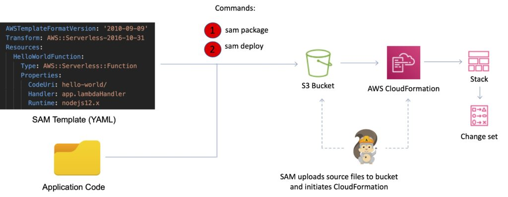

# AWS Lambda
`AWS Lambda` lets you run code as functions without provisioning or managing servers. With serverless computing, your application still runs on servers, but all the server management is done by AWS. 

- Lambda-based applications are composed of `functions` triggered by `events`.
- You cannot log in to the compute instances that run Lambda functions or customize the operating system or language runtime.
- You specify the amount of memory you need allocated to your Lambda functions.
- AWS Lambda allocates CPU power proportional to the memory you specify using the same ratio as a general purpose EC2 instance type.
- Lambda assumes an IAM role when it executes the function.
- AWS Lambda stores code in `Amazon S3` and encrypts it at rest.
- Lambda scales concurrently executing functions up to your default limit (`1000`).
- Lambda functions are serverless and independent, `1 event = 1 function`.

## Use cases of Lambda Functions

- Using Lambda functions with AWS services as event sources.
- On-demand Lambda function invocation over HTTPS using Amazon API Gateway (custom REST API and endpoint).
- On-demand Lambda function invocation using custom applications (mobile, web apps, clients) and AWS SDKs, AWS Mobile SDKs, and the AWS Mobile SDK for Android.
- Scheduled events can be configured to run code on a scheduled basis through the AWS Lambda Console.

## Lambda Functions basics

```javascript
function handler (event, context) {

}
```

- The **context** object in a Lambda function provides metadata about the function and the current invocation, including a unique identifier for the request, awsRequestId, which can be used to correlate logs from a specific invocation.
- Consist of code and any associated dependencies.
- Configuration information is associated with the function.
- You specify the configuration information when you create the function.
- API provided for updating configuration data.
- Functions can access:
    - AWS services or non-AWS services.
    - AWS services running in VPCs (e.g. RedShift, Elasticache, RDS instances).
    - Non-AWS services running on EC2 instances in an AWS VPC.
- There is a maximum execution timeout.
    - Max is `15 minutes (900 seconds)`, default is `3 seconds`.
    - You pay for the time it runs.
    - Lambda terminates the function at the timeout.

## Invoking Lambda Functions
- You can invoke Lambda functions directly with the Lambda console, the Lambda API, the AWS SDK, the AWS CLI, and AWS toolkits.
- You can also configure other AWS services to invoke your function, or you can configure Lambda to read from a stream or queue and invoke your function.
- When you invoke a function, you can choose to invoke it **synchronously** or **asynchronously**.

**Synchronous Invocation**
When you invoke a function synchronously, Lambda runs the function and waits for a response.
To invoke a function synchronously with the AWS CLI, use the `invoke` command.

```console
$ aws lambda invoke –function-name my-function –payload ‘{ “key”: “value” }’ response.json { “ExecutedVersion”: “$LATEST”, “StatusCode”: 200 }
```
**Asynchronous Invocation**
For asynchronous invocation, Lambda places the event in a queue and returns a success response without additional information. A separate process reads events from the queue and sends them to your function. To invoke a function asynchronously, set the `invocation type` parameter to `Event`.

```console
$ aws lambda invoke --function-name my-function --invocation-type Event --payload '{ "key": "value" }' response.json { "StatusCode": 202 }
```

If Lambda can’t add the event to the queue, the error message appears in the command output.

## Event source mappings
Lambda is an event-driven compute service where AWS Lambda runs code in response to events such as changes to data in an S3 bucket or a DynamoDB table.

An event source is an AWS service or developer-created application that produces events that trigger an AWS Lambda function to run.

You can use event source mappings to process items from a stream or queue in services that don’t invoke Lambda functions directly.

Applications need permissions to invoke Lambda functions.

Services that Lambda reads events from:

```
Amazon Kinesis
Amazon DynamoDB
Amazon Simple Queue Service (SQS)
```

> The configuration of the event source mapping for stream-based services (DynamoDB, Kinesis), and Amazon SQS, is made on the Lambda side.
> For other services such as Amazon S3 and SNS, the function is invoked `asynchronously`, and the configuration is made on the source (S3/SNS) rather than Lambda.

## Lambda versions and Lambda Layers

### Lambda Versions
Versioning means you can have multiple versions of your function. Versions are immutable (code cannot be edited). Each version has its own ARN.

The function version includes the following information:

- The function code and all associated dependencies.
- The Lambda runtime that executes the function.
- All the function settings, including the environment variables.
- A unique `Amazon Resource Name (ARN)` to identify this version of the function.

A **qualified** `ARN` has a version suffix. An **unqualified** ARN does not have a version suffix. You cannot create an alias from an unqualified ARN.

### Lambda Aliases
- Lambda aliases are pointers to a specific Lambda version.
- Using an alias you can invoke a function without having to know which version of the function is being referenced.
- Aliases are mutable.
- Aliases enable stable configuration of event triggers / destinations.
- Aliases also have static ARNs but can point to any version of the same function.
- Aliases can also be used to split traffic between Lambda versions (blue/green).
- Aliases enable blue / green deployment by assigning weights to Lambda version (doesn’t work for $LATEST, you need to create an alias for $LATEST).

The following example AWS CLI command points an alias to a new version, weighted at 5% (original version at 95% of traffic):

```console
aws lambda update-alias --function-name myfunction --name myalias --routing-config '{"AdditionalVersionWeights" : {"2" : 0.05} }'
```

## Reserved Concurrency
You can set a reserved concurrency at the function level to guarantee a set number of concurrent executions will be available for a critical function.

You can reserve up to the Unreserved account concurrency value that is shown in the console, minus 100 for functions that don’t have reserved concurrency.

To throttle a function, set the reserved concurrency to zero. This stops any events from being processed until you remove the limit.

## Provisioned Concurrency
When provisioned concurrency is allocated, the function scales with the same burst behavior as standard concurrency.

After it’s allocated, provisioned concurrency serves incoming requests with very low latency.

When all provisioned concurrency is in use, the function scales up normally to handle any additional requests.

Application Auto Scaling takes this a step further by providing autoscaling for provisioned concurrency.

With Application Auto Scaling, you can create a target tracking scaling policy that adjusts provisioned concurrency levels automatically, based on the utilization metric that Lambda emits.

Provisioned concurrency runs continually and is billed in addition to standard invocation costs.

## Dead Letter Queue (DLQ)
A dead-letter queue saves discarded events for further processing. A dead-letter queue acts the same as an on-failure destination in that it is used when an event fails all processing attempts or expires without being processed.

However, a dead-letter queue is part of a function’s version-specific configuration, so it is locked in when you publish a version. On-failure destinations also support additional targets and include details about the function’s response in the invocation record.

You can setup a DLQ by configuring the ‘DeadLetterConfig’ property when creating or updating your Lambda function.

You can provide an SQS queue or an SNS topic as the ‘TargetArn’ for your DLQ, and AWS Lambda will write the event object invoking the Lambda function to this endpoint after the standard retry policy (2 additional retries on failure) is exhausted.

## Lambda Layers
You can configure your Lambda function to pull in additional code and content in the form of layers.

A layer is a ZIP archive that contains libraries, a custom runtime, or other dependencies.

With layers, you can use libraries in your function without needing to include them in your deployment package.

A function can use up to 5 layers at a time.

Layers are extracted to the /opt directory in the function execution environment.

Each runtime looks for libraries in a different location under /opt, depending on the language.

## Lambda@Edge
`Lambda@Edge` allows you to run code across AWS locations globally without provisioning or managing servers, responding to end users at the lowest network latency.

The functions run in response to CloudFront events, without provisioning or managing servers. You can use Lambda functions to change CloudFront requests and responses at the following points:

```
After CloudFront receives a request from a viewer (viewer request).
Before CloudFront forwards the request to the origin (origin request).
After CloudFront receives the response from the origin (origin response).
Before CloudFront forwards the response to the viewer (viewer response).
```

> Lambda@Edge functions can only be created in the `us-east-1` Region. If you want to deploy such functions, they must be done in this specific region.

## Lambda and Amazon VPC
You can connect a Lambda function to private subnets in a VPC.

Lambda needs the following VPC configuration information so that it can connect to the VPC:

- Private subnet ID.
- Security Group ID (with required access).

Lambda uses this information to setup an `Elastic Network Interface (ENI)` using an available IP address from your private subnet.

Lambda functions provide access only to a single VPC. If multiple subnets are specified, they must all be in the same VPC.

Lambda functions configured to access resources in a particular VPC will not have access to the Internet as a default configuration. If you need access to the internet, you will need to create a `NAT` in your VPC to forward this traffic and configure your security group to allow this outbound traffic.

> Exam tip: If a Lambda function needs to connect to a VPC and needs Internet access, make sure you connect to a private subnet that has a route to a NAT Gateway (the NAT Gateway will be in a public subnet).

Lambda uses your function’s permissions to create and manage network interfaces. To connect to a VPC, your function’s execution role must have the following permissions:

```console
ec2:CreateNetworkInterface
ec2:DescribeNetworkInterfaces
ec2:DeleteNetworkInterface
```

These permissions are included in the `AWSLambdaVPCAccessExecutionRole` managed policy.

Only connect to a VPC if you need to as it can slow down function execution.

## Lambda Limits
- The Lambda function and target group must be in the same account and in the same Region.
- The maximum size of the request body that you can send to a Lambda function is 1 MB.
- The maximum size of the response JSON that the Lambda function can send is 1 MB.
- WebSockets are not supported. Upgrade requests are rejected with an HTTP 400 code.
- By default, health checks are disabled for target groups of type lambda.

- Memory – minimum `128 MB`, maximum `10,240 MB` in `1 MB `increments.

- Ephemeral disk capacity (/tmp space) per invocation – `512 MB`.

- Size of environment variables maximum `4 KB`.

- Number of file descriptors – `1024`.

- Number of processes and threads (combined) – `1024`.

- Maximum execution duration per request – `900 seconds`.

- Concurrent executions per account – `1000 (soft limit)`.

- Function burst concurrency – `500 - 3000 (region dependent)`.

**Invocation payload:**

```console
Synchronous `6 MB`.
Asynchronous `256 KB`
Lambda function deployment size is `50 MB (zipped), 250 MB unzipped`.
```

## Charges
Priced based on:

- Number of requests.
- Duration of the request calculated from the time your code begins execution until it returns or terminates.
- The amount of memory allocated to the function.

# AWS SAM (Serverless Access Model)
A serverless application is a combination of Lambda functions, event sources, and other resources that work together to perform tasks. Note that a serverless application is more than just a Lambda function—it can include additional resources such as APIs, databases, and event source mappings.

The **AWS Serverless Application Model (AWS SAM)** is an open-source framework designed to streamline the building and deployment of serverless applications on AWS. By simplifying the process of creating and managing resources, it significantly reduces the complexity usually associated with traditional architectures.



## SAM Templates
These are configuration files, written in `YAML` or `JSON`, that specify the resources used in your AWS serverless application. They are an extension of `AWS CloudFormation templates`, providing a simplified syntax for defining serverless resources such as Lambda functions, API Gateway APIs, and DynamoDB tables.

There are several resource types:
```
AWS::Serverless::Function (AWS Lambda)
AWS::Serverless::Api (API Gateway)
AWS::Serverless::SimpleTable (DynamoDB)
AWS::Serverless::Application (AWS Serverless Application Repository)
AWS::Serverless::HttpApi (API Gateway HTTP API)
AWS::Serverless::LayerVersion (Lambda layers)
```

## SAM Command Line Interface (CLI)
The `SAM CLI` is a vital tool for local development and testing of serverless applications. It provides commands for all phases of the development lifecycle, from debugging your application locally to deploying your code in the AWS cloud. Provides a Lambda-like execution environment that lets developers locally build, test, and debug applications defined by SAM templates.

- Offers a shorthand syntax to express functions, APIs, databases, and event source mappings.
- SAM seamlessly transforms and expands this syntax into AWS CloudFormation syntax, facilitating faster and more efficient construction of serverless applications. 
- AWS SAM supports all AWS CloudFormation template items such as `Outputs`, `Mappings`, `Parameters`, providing developers with the comprehensive tooling needed to build robust and scalable serverless applications.

### Commands
```yaml
# Only two commands are required to package and deploy to AWS.

sam package
sam deploy

# OR

aws cloudformation package
aws cloudformation deploy
```

## SAM Template
The following example shows a YAML-formatted template fragment.

```yaml
Transform: AWS::Serverless-2016-10-31

Globals:
  set of globals

Description:
  String

Metadata:
  template metadata

Parameters:
  set of parameters

Mappings:
  set of mappings

Conditions:
  set of conditions

Resources:
  set of resources

Outputs:
  set of outputs
```

**Resources**: Defines AWS resources used in your application (e.g., Lambda functions, API Gateway endpoints, DynamoDB tables).

**Parameters**: Allows customization of your template by passing parameters during deployment (e.g., environment variables, resource names).

**Outputs**: Provides information about your deployed resources (e.g., API endpoint URL) that can be used by other AWS services or users.

**Mappings** (Opt): Optional section for specifying conditional values based on predefined keys (e.g., AMI IDs for different regions).

**Conditions**: Allows you to define conditions that control whether certain resources are created or how they're configured based on input parameters or other conditions.

**Transform**: Specifies transformations that AWS CloudFormation applies to the template, such as SAM transformations to expand SAM-specific syntax into standard CloudFormation syntax.

**Metadata** (Opt): Optional section for adding additional information about your template or resources, such as descriptions or tags.

Overall, AWS SAM templates provide a structured way to define and deploy serverless applications on AWS, leveraging AWS CloudFormation for infrastructure management while simplifying the definition of serverless resources.

## Key Benefits of AWS SAM

- Works seamlessly with popular integrated development environments (IDEs) like PyCharm, IntelliJ, and VS Code. Also integrates with a comprehensive suite of AWS serverless tools.

- Can leverage AWS CodeBuild, AWS CodeDeploy, and AWS CodePipeline to construct an efficient and reliable deployment pipeline for your serverless applications.

- With SAM CLI, you can locally build, test, and debug applications defined by SAM templates. This accelerates the development cycle by providing immediate feedback. The SAM CLI provides a Lambda-like execution environment that lets developers locally build, test, and debug applications defined by SAM templates.

- AWS SAM is an extension of AWS CloudFormation, which means you can use all the powerful, flexible features of CloudFormation in addition to serverless-specific capabilities.

- AWS SAM templates are designed with best practices in mind, incorporating built-in application lifecycle management features such as safe deployments and rollback capabilities

- AWS SAM enables you to deploy your infrastructure as configuration. This practice facilitates the implementation of additional best practices such as code reviews, which contribute to higher code quality and fewer deployment issues.

## Disadvantages of AWS SAM
- AWS SAM can be restrictive when it comes to API Gateway configuration. While it simplifies many aspects, it doesn’t offer the same level of flexibility as manual or Serverless Framework configurations.

- Compared to the Serverless Framework, AWS SAM has fewer plugins available.

## AWS SAM templates vs AWS CloudFormation templates

The primary differences between AWS SAM templates and AWS CloudFormation templates are the following:

• `Transform` declaration. The declaration `Transform: AWS::Serverless-2016-10-31` is required for AWS SAM templates. This declaration identifies an AWS CloudFormation template as an AWS SAM template.

• `Globals` section. The `Globals` section is unique to AWS SAM. It defines properties that are common to all your serverless functions and APIs. All the `AWS::Serverless::Function`, `AWS::Serverless::Api`, and `AWS::Serverless::SimpleTable` resources inherit the properties that are defined in the Globals section.

• `Resources` section. In AWS SAM templates the `Resources` section can contain a combination of AWS CloudFormation resources and AWS SAM resources.